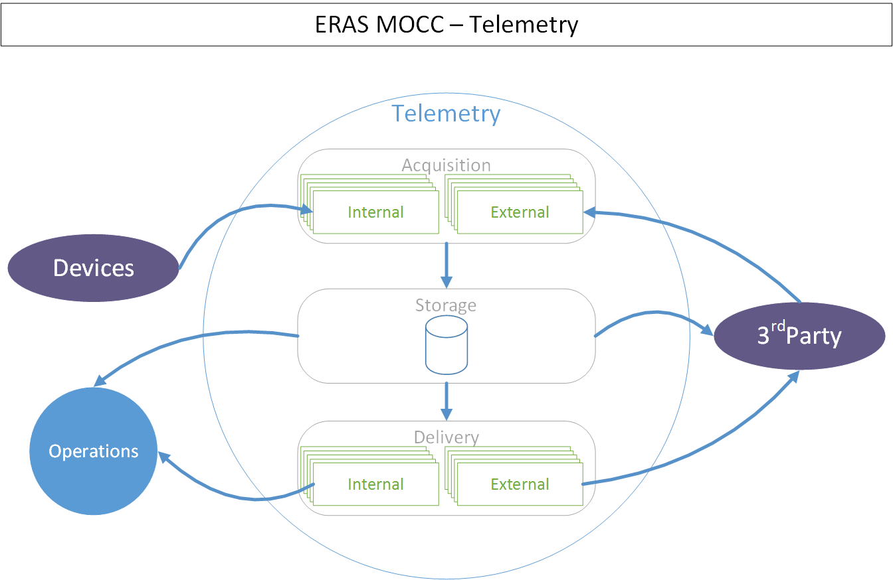

Mission Operations Control Center - High Level Design Documentation
===================================================================

:Author: Mario Tambos

.. contents::
   :local:
   :depth: 2

Change Record
-------------

2015.06.16 - Document created.

Introduction
------------

How to use this document
++++++++++++++++++++++++

The objectives of the present document are:

* provide the reader with an overview of how the Mission Operations Control
  Center is organized,
* facilitate communication between team members by stipulating a common
  vocabulary,
* aid development and maintenance by specifying and limiting the concerns of
  each of the Mission Operations Control Center's components.

This document should be the entry point of any new collaborator to the
:term:`ERAS` project looking to work with the :term:`MOCC`. From here, such
collaborator can choose to continue reading the :term:`MOCC`'s implementation,
infrastructure or management documents, depending on whether the reader is
interested in, respectively, developing software, aiding with the underlying
infrastructure or helping with the human resources side of the :term:`MOCC`.
Also relevant for the reader would be the documents specific to the subsystem
he/she wants to contribute to.

Purpose
+++++++

The Mission Operations Control Center (MOCC) is in charge of planning the
missions performed in European MaRs Analogue Station for Advanced Technologies
Integration (ERAS), and following said plan.

In this context, a **plan** is understood to be a sequence of activities,
together with the expected outcomes of these activities.
By **following a plan** is meant the execution of the plan, the control of its
progress as well as the counter-measures needed to correct eventual deviations
from the individual activity's expected outcomes.

Reference Documents
+++++++++++++++++++

- [1] ++ `C3 Prototype document v.4`_
- [2] ++ `Software Engineering Practices Guidelines for the ERAS Project`_
- [3] ++ `Dachstein 2012 Mission Report`_
- [4] ++ `Morocco MARS2013 Mission Report`_
- [5] ++ `V-ERAS Project Description (2014 Release)`_
- [6] ++ `V-ERAS-14 Mission Report`_

.. _`C3 Prototype document v.4`: http://www.erasproject.org/index.php?option=com_joomdoc&view=documents&path=C3+Subsystem/ERAS-C3Prototype_v4.pdf&Itemid=148
.. _`Software Engineering Practices Guidelines for the ERAS Project`: http://erasproject.org/?wpdmdl=353
.. _`Dachstein 2012 Mission Report`: http://www.oewf.org/dl/Dachstein2012_MissionReport_PUBLICv2.pdf
.. _`Morocco MARS2013 Mission Report`: http://www.oewf.org/dl/724b15d5b031dbd23fff2b5063903635.pdf
.. _`V-ERAS Project Description (2014 Release)`: http://erasproject.org/?wpdmdl=341
.. _`V-ERAS-14 Mission Report`: http://erasproject.org/?wpdmdl=353

Glossary
++++++++

.. glossary::

    ``AI``
        Artificial Intelligence

    ``ERAS``
        European Mars Analog Station

    ``EVA``
        Extra-Vehicular Activity

    ``GUI``
        Graphic User Interface

    ``IMS``
        Italian Mars Society

    ``MOCC``
        Mission Operations Control Center

    ``TBC``
        To Be confirmed

    ``TBD``
        To Be Defined

    ``UI``
        User Interface

Overview
++++++++

The :ref:`first section <sec_1>` of this document describes at the highest level
the organization of the :term:`MOCC`, its communication channels, subsystems and
their general responsibilities, as well as the assumptions made during the
design process. The :ref:`second section <sec_2>` describes the documents
associated with the present one. Finally, :ref:`Section 3. <sec_3>` deals with
miscellaneous factors that need to be addressed or acknowledged when
implementing or operating the :term:`MOCC`.

.. _sec_1:

1. The MOCC System and its Subsystems
-------------------------------------

High level architecture
+++++++++++++++++++++++

The :term:`MOCC` is divided in five subsystems with clearly separated
responsibilities, as shown in `Figure 1`_.

.. figure:: images/MOCC_Subsystems.png
  :name: Figure 1

  Figure 1. The MOCC architecture

The design's building blocks are **systems**, **subsystems**, **components** and
**communication channels**.

The :term:`MOCC` is considered to be a system in itself, which is divided in
subsystems. Any external services the MOCC may interface with are also
considered systems.

A component is a software artifact that performs certain function. Each
subsystem is built of components; no component belongs directly to the
:term:`MOCC` or to more than one subsystem, and there is no part of any
subsystem that is not a component.

Finally, communication channels represent all the media and supporting
infrastructure needed to allow the exchange of information between the systems,
subsystem and components.

The main philosophies behind the design are those of extensibility, separation
of concerns, and fault-tolerance: it should be easy to add a new component,
it should also be easy to determine where the new component belongs; and,
finally, any subsystem should remain functional in the event of failure of all
the other subsystems.

Entities
++++++++

The entities in the The :term:`MOCC` are classified according to two criteria.
The first is whether they are controlled by the :term:`MOCC`, or if they are
outside the :term:`MOCC`'s control. Controlled entities are called **internal**,
whereas non-controlled entities are called **external**.

The second criterion discriminates between so called *basic* and *composite*
entities. There are four types  of basic entities:

* Actors: crew and electromechanical devices able to perform actions.
* Observers: crew and electromechanical devices able to provide information.
* Analysts: :term:`AI` agents able to deduce information from observations.
* Users: crew operating the :term:`MOCC`.

On the other hand, composite entities encompass any and all entities that
fulfill functions of several basic entities (e.g. actor and observer), for
instance:

* Astronauts
* Rovers
* Satellites
* Etc.

Interfaces and Communication Channels
+++++++++++++++++++++++++++++++++++++

There are four kinds of interfaces to be considered:

* **External** interfaces, between internal and external entities, or
  vice-versa.
* **Subsystem** interfaces, between subsystems.
* **Component** interfaces, between components of a subsystem.
* **User** interfaces, between components and users.

Subsystems
++++++++++

The core of the :term:`MOCC`'s tasks is performed by two subsystems: the
**Planning** and the **Operations** subsystems, with the other three subsystems
fulfilling support roles.

The Planning Subsystem
~~~~~~~~~~~~~~~~~~~~~~

One of the two core subsystems of the :MOCC:, the Planning subsystem is in
charge of defining the scope and expected results of :term:`ERAS`'s missions.
The plans this subsystem creates are composed of a series of **steps**,
performed by actor-entities, and **parameters**. Each step along the way has an
**expected outcome**, which can be checked during the plan's execution. The
plans can be composed of serial steps, parallel steps, or any combination
thereof. By parameters is understood any piece of information relevant to the
plan's execution, beside the steps themselves, for instance, the plan's start
date, the plan's location, or actors involved.

Plans can be one-offs or periodical. In the case of one-off plans a fixed start
date is set;M in the case of periodical plans a period is set, e.g., once a day,
once every two weeks, etc.

The Planning subsystem comprises two types of components -- software and data
components. The software components are the **user interfaces** used to build
the plans, together with a set of :term:`AI` **assistants**. These assistants
should help the user with the plan building, by analyzing feasibility,
evaluating constraints, calculating duration and resources, etc. The data
components are **plan templates**, i.e., pre-built plans with free parameters
(e.g. no specific resources assigned, or start date set); and
**plan instantiations**, which are plans with all their parameters set.

`Figure 2`_ shows the internal structure of this subsystem. In few words, the
person in charge of building :term:`ERAS` 's plans will build plan templates
using the user interfaces, with the help of :term:`AI` assistants. When a
plan is needed, this person will then create a plan instantiation, using the
same :term:`UI` and assistants, by filling in the template's missing parameters.
In order to build the templates, the user shall use the information provided by
the Configurations Subsystem about the device's and crew member's capabilities,
as well as the macros. To allow this, the planning :term:`UI` s must pull this
information from the Configurations Subsystem.

.. figure:: images/MOCC_Planning.png
  :name: Figure 2

  Figure 2. The Planning Subsystem

The Operations Subsystem
~~~~~~~~~~~~~~~~~~~~~~~~

This system is the second key component of the :term:`MOCC`. Its tasks are to
**execute** a mission's plan, **control** its progress and **correct** any
eventual deviations from the plan. The Operations Subsystem's internal structure
is shown in `Figure 3`_, whereas the interactions between this subsystem's
components and the other subsystems in the :term:`MOCC` are shown in
`Figure 3.1`_, `Figure 3.2`_, `Figure 3.3`_ and `Figure 3.4`_.

.. figure:: images/MOCC_Operations.png
  :name: Figure 3

  Figure 3. The Operations Subsystem

.. figure:: images/MOCC_Operations-Planning.png
  :name: Figure 3.1

  Figure 3.1. Operations interaction with Planning

.. figure:: images/MOCC_Operations-Configurations.png
  :name: Figure 3.2

  Figure 3.2. Operations interaction with Configurations

.. figure:: images/MOCC_Operations-Telemetry.png
  :name: Figure 3.3

  Figure 3.3. Operations interaction with Telemetry

.. figure:: images/MOCC_Operations-Commands.png
  :name: Figure 3.4

  Figure 3.4. Operations interaction with Commands

Executing a plan involves sending commands to devices and crew. Control a plan's
execution involves collecting, analyzing and presenting telemetry from devices
and crew to the Operations Subsystem users. Finally, correcting deviations from
a plan involves:

* Detecting the deviation, based on the telemetry and the plan's step's expected
  outcomes.

* Devising corrective measures.
* Sending the appropriate corrective commands to devices and/or crew.

The **Execution** component is in charge of executing the mission plans. This
involves sending all automated commands to devices and crew members at the
correct time. For commands that cannot be automatically sent, the Execution
component should send a cue to one of the :term:`UI` in order for a user to
manually send the command. Part of the Execution component's task is to pull
from the Planning Subsystem information about the next plans to execute.
Moreover the Execution component needs to pull from the Configurations Subsystem
information about the TANGO device addresses and other interface requirements.
Finally, the automated commands are sent though the Commands Subsystem.

The **Control** component's task is to check during the plan whether the
expected outcomes from the plan in execution match the telemetry readings
obtained. If a deviation occurs, the Control component should send an alarm to
one of the :term:`UI`, in order to allow the users to perform the necessary
corrections. To carry its tasks, the Control component needs to pull from the
Configurations Subsystem information about the TANGO device addresses and other
interface requirements. The Control component must obtain the device's
telemetry readings from the Telemetry Subsystem, whereas the plan steps'
expected outcomes come from the Planning Subsystem.

The Operations Subsystem's **user interfaces** have four tasks:

* Show the progress of a plan execution.
* Present the user with the telemetry, and their analysis, collected during a
  plan's execution.

* Provide the means to send commands outside the plan to the devices and crew.
* Allow the user to build, review and execute corrective measures, in case of a
  plan deviation.

These :term:`UI` s get the information about the devices from the Configurations
Subsystem. They also interface with the Telemetry Subsystem to obtain telemetry
readings, as well as with the Commands Subsystem allow manually sending
commands. Finally, the :term:`UI` s have to interface with the Planning Subsystem
to show the plans and the plans' execution.

The :term:`AI` **assistants** in the Operations Subsystem are of two types:

* **Telemetry Assistants** perform analysis and prediction on subsets of all the
  telemetry collected. This is used to present summarized information to users,
  detect problems, project outcomes, etc.

* **Corrective Assistants** help the users build and execute corrective
  measures, in case of a plan deviation.

The assistants need to interface with the Configurations Subsystem, to obtain
devices' addresses and other interface requirements, and with the Telemetry
Subsystem, to obtain the devices' readings.

The building of corrective measures mentioned previously can be done by using a
plans from a previously built repository of **corrective plans**. This
repository should contain plans for correcting common deviations. One such
scenario would be as follows:

#. A mission's plan contain a step to drill rock.
#. One of the expected results of the step is that the drill bit's temperature
   will rise up to 60°C.

#. During operation, the drill bit's temperature rises to 80°C.
#. The user detects the deviation from the expected result (with help from a
   :term:`UI`, the Control component and possibly a :term:`AI` assistant).

#. To correct the deviation, the user selects a corrective plan for overheating
   drill bits from the repository, fills the needed parameters, and executes it.

These corrective plans should be built based on both the devices' and crew
members' properties, as well as on the original plan.

The Configurations Subsystem
~~~~~~~~~~~~~~~~~~~~~~~~~~~~

This subsystem is in charge of storing and making available information about
the devices and crew that can potentially be involved in a mission, as well as
**macros**. A macro is understood to be a series of steps performed by an actor.
The steps in the macro have no expected outcome, however, the whole macro does.
Macros differ from plans in that macros have neither a start date. The function
of the macros is twofold:

* Help the user build plans and corrective plans by providing a repository of
  common steps.

* Encapsulate the details of the devices.

The Configurations Subsystem's internal structure is shown in `Figure 4`_.

.. figure:: images/MOCC_Configurations.png
  :name: Figure 4

  Figure 4. The Configurations Subsystem

Therefore a macro is a higher level interface to the devices. For instance,
consider a situation where a user needs to setup an RF chain to receive
satellite telemetry. Without macros, the plan should include steps for setting
up every device in the chain, with the consequent need to know of the details of
those devices. With macros, the user could request an RF setup-macro and use
that instead, without having to have knowledge of how the devices in the chain
need to be setup.

The Configurations Subsystem comprises three components:

* The **Devices** component stores and provides information about the commands
  a device can receive and how those commands must be sent: channel the command
  must be sent through, input parameter's types and restrictions, etc.
  This component also handles information about the telemetry a device is able
  to provide, in the form of a device's **variables**. This comprises how to
  obtain these variables, and what format they have.

* The **Crew** component stores and provides information about the crew member's
  mission capabilities, e.g., crew member *A* can perform geological analysis,
  crew member *B* can perform mechanical repairs, crew member *C* can perform
  first aid, etc.

* Finally, the **Macros** component handles the design, storage and
  availability of macros. This component contains two subcomponents:

  * A **Designer**, which is a :term:`UI` that allows user to build macros.
  * A **Storage** subcomponent, which saves and makes available the macros in
    existence.

The Telemetry and Commands Subsystems
~~~~~~~~~~~~~~~~~~~~~~~~~~~~~~~~~~~~~

These subsystems are in charge of obtaining data from and delivering commands to
devices, respectively. Both have a similar internal structure, shown in
`Figure 5`_ and `Figure 6`_.

  Figure 5. The Telemetry Subsystem

.. figure:: images/MOCC_Commands.png
  :name: Figure 6

  Figure 6. The Commands Subsystem

Both subsystems have three components:

* **Acquisition**, which obtains data from devices, in the case of the Telemetry
  subsystem, and commands from other subsystems, in the case of the Commands
  subsystem.

* **Storage**, which keeps a historical record of the telemetry read and
  commands sent.

* **Delivery**, which sends commands to devices and crew, in the case of the
  Commands subsystem, and sends data to other subsystems, in the case of the
  Telemetry subsystem.

These subsystems differentiate between two kind of clients. **Internal** clients
are other subsystem in the :term:`MOCC`, whereas **external** clients are those
outside the :term:`MOCC`.

.. _sec_2:

2. Documents
------------

The high level documentation of the :term:`MOCC` System comprises 10 documents.
Five of those cover the whole system:

#. The present document, which gives an overview of all aspects of the whole
   system.

#. The :term:`MOCC` Implementation Document.
#. The :term:`MOCC` Infrastructure Document.
#. The :term:`MOCC` Management Document.

System-wide restrictions on software, infrastructure or human resources should
go in these documents.

The other five deal with each subsystem:

#. The Planning Subsystem Design Document.
#. The Operations Subsystem Design Document.
#. The Configurations Subsystem Design Document.
#. The Telemetry Subsystem Design Document.
#. The Commands Subsystem Design Document.

These last five documents expand on each aspect of the general documents,
explaining vague points and refining the granularity of the system-level design.
Subsystem-specific restrictions on software, infrastructure or human resources
should go in their corresponding subsystem document.

.. _sec_3:

3. Special Considerations
-------------------------

:term:`TBD`
