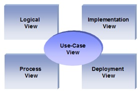
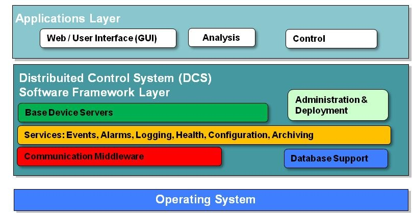

=========================================================
Software Architecture Document for the <XXX application>
=========================================================

:Author: Name Surname

Change Record
=============

.. If the changelog is saved on an external file (e.g. in servers/sname/NEWS),
   it can be included here by using (dedent to make it work):

   .. literalinclude:: ../../servers/servername/NEWS

Introduction
============

Purpose
-------

The Software Architecture Document (SAD) contains the description of the system in terms of its various architectural views, in order to highlight the different aspects of it. 

The description makes use of the well-known 4+1 view model.

Scope
-----

Describes the scope of this requirements specification.

Applicable Documents
--------------------

Reference Documents
-------------------

Glossary
--------

.. To create a glossary use the following code (dedent it to make it work):

  .. glossary::

     ``Term``
        This is a sample term

.. Use the main :ref:`glossary` for general terms, and :term:`Term` to link
   to the glossary entries.

Overview
--------

Make an overview in which you describe the rest of this document the and which chapter is primarily of interest for which reader.

Architectural Requirements 
==========================

This section describes the requirements which are important for developing the software architecture.

Non-functional requirements
---------------------------

Describe the architecturally relevant non-functional requirements, i.e. those which are important for developing the software architecture. Think of security, third-party products, system dependencies, distribution and reuse. Also environmental factors such as context, design, implementation strategy, team composition, development tools, use of legacy code may be addressed.
Usually, the non-functional requirements are already in place and can be referenced here. Provide a reference per requirement, and where the requirement is addressed.

Use Case View (functional requirements)
---------------------------------------

Refer to Use Cases or Use Case scenarios which are relevant with respect to the software architecture. The Use Cases referred to should contain central functionality, many architectural elements or specific delicate parts of the architecture. A Use Case template is available in Appendix A. If UML Use-Case notation is used in capturing the requirements, these models can be inserted and described in this section

Interface Requirements
======================

This section describes how the software interfaces with other software products
or users for input or output. Examples of such interfaces include library
routines, token streams, shared memory, data streams, and so forth.

User Interfaces
---------------

Describes how this product interfaces with the user.

GUI (Graphical User Interface)
~~~~~~~~~~~~~~~~~~~~~~~~~~~~~~

Describes the graphical user interface if present. This section should include
a set of screen dumps or mockups to illustrate user interface features.
If the system is menu-driven, a description of all menus and their components
should be provided.

CLI (Command Line Interface)
~~~~~~~~~~~~~~~~~~~~~~~~~~~~

Describes the command-line interface if present. For each command, a
description of all arguments and example values and invocations should be
provided.

API (Application Programming Interface)
~~~~~~~~~~~~~~~~~~~~~~~~~~~~~~~~~~~~~~~

Describes the application programming interface, if present. Foreach public
interface function, the name, arguments, return values, examples of invocation,
and interactions with other functions should be provided. If this package is a
library, the functions that the library provides should be described here
together with the parameters.

Hardware Interfaces
-------------------

A high level description (from a software point of view) of the hardware
interface if one exists. This section can refer to an ICD (Interface Control
Document) that will contain the detail description of this interface.

Software Interfaces
-------------------

A high level description (from a software point of view) of the software
interface if one exists. This section can refer to an ICD (Interface Control
Document) that will contain the detail description of this interface.

Communication Interfaces
------------------------

Describe any communication interfaces that will be required.

Performance Requirements
========================

Specifies speed and memory requirements.

Logical View 
============
Describe the architecturally significant logical structure of the system. Think of decomposition in terms of layers and subsystems. Also describe the way in which, in view of the decomposition, Use Cases are technically translated into Use Case Realizations

Layers
------
The ERAS software applicationg belong to the heterogeneous Distributed Control System (DCS) domain  which can be represented as a layered architecture. This is a very common design pattern used when developing systems that consist of many components across multiple levels of abstraction as in ERAS case. Normally, you should be developing components that belong to the Application layer

Subsystems
----------
Describe the decomposition of the system in subsystems and show their relation.

Use Case Realizations
---------------------
Give examples of the way in which the Use Case Specifications are technically translated into Use Case Realizations, for example, by providing a sequence-diagram.

Implementation View
===================
This section describes the technical implementation of the logical view.

Deployment View
===============
Describe the physical network and hardware configurations on which the software will be deployed. This includes at least the various physical nodes (computers, CPUs), the interaction between (sub)systems and the connections between these nodes (bus, LAN, point-to-point, messaging, etc.). Use a deployment diagram.

Development and Test Factors
============================

Hardware Limitations
--------------------

Describe any hardware limitations if any exist.

Software validation and verification
------------------------------------

Give a detail requirements plan for the how the software will be tested and
verified.

Planning
--------

Describe the planning of the whole process mentioning major milestones and
deliverables at these milestones.

Notes
=====

.. notes can be handled automatically by Sphinx

Appendix A: Use Case template
=============================

Use Cases drive the whole software process and bind together all the phases
from requirements capture to final delivery of the system and maintenance.
They are a very effective way of communicating with customers and among team
members. Before every discussion always provide the partners with a set of
relevant Use Cases.

During meetings, they stimulate focused discussions and help identifying
important details. It is important to keep in mind that Use Cases have to
describe WHAT the system has to do in response to certain external stimuli
and NOT HOW it will do it. The HOW is part of the architecture and of the
design.

What follows is the empty template:

Use Case: <Name>
================
<Short description>

Actors
------
<List of Actors>

Priority
--------
<Low, Normal, Critical>

Preconditions
-------------
<List of preconditions that must be fulfilled>

Basic Course
------------
<Step-by-step description of the basic course>

Alternate Course
----------------
<Step-by-step description of the alternate course>

Exception Course
----------------
<Step-by-step description of the exception course>

Postconditions
--------------
<List of postconditions (if apply)>

Notes
-----

