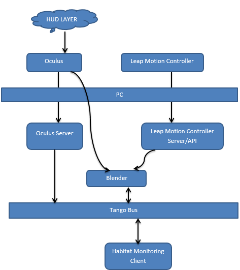

=========================================================
Software Architecture Document for the Heads Up Display
=========================================================

:Author: Aakash Rajpal

Change Record
=============
20th August 2016- Document Created

Introduction
============

Purpose
-------

The purpose of this project is to implement a Heads Up Display for the V-ERAS environment which displays data from the Habitat Monitor Client and use the gesture recognition provided by leap motion controller to make the Heads Up Display interactive.

Scope
-----

Describes the scope of this requirements specification.

Applicable Documents
--------------------
- [1] -- `Leap Motion Controller Installation for Python`_
- [2] -- `How to Pytango`_
- [3] -- `PyQt4 Reference Guide`_

.. _`Leap Motion Controller Installation for Python`: https://community.leapmotion.com/t/leap-motion-sdk-with-python-3-5-in-linux-tutorial/5249
.. _`How to PyTango`: http://www.tango-controls.org/resources/howto/how-pytango/
.. _`PyQt4 Reference Guide`: http://pyqt.sourceforge.net/Docs/PyQt4/

Reference Documents
-------------------
`Habitat Monitoring Client User Manual <https://eras.readthedocs.io/en/latest/servers/habitat_monitor/doc/README.html>`_

`Habitat Monitoring Client Software Architecture <https://eras.readthedocs.io/en/latest/servers/habitat_monitor/doc/sad.html>`_

`ERAS VR Software Architecture Document <https://eras.readthedocs.io/en/latest/servers/erasvr/doc/sad.html>`_

Glossary
--------

``HUD``
    Heads Up Display

``ERAS``
    European MaRs Analogue Station for Advanced Technologies Integration

``IMS``
    Italian Mars Society

``V-ERAS``
    Virtual European Mars Analog Station

``VR``
    Virtual Reality

``bpy``
    Blender Python API

Overview
--------

This document will guide you through the requirements of the project.

Architectural Requirements 
==========================
This section describes the requirements which are important for developing the software architecture.

Non-functional requirements
---------------------------

#. Implementation Constraints
       #. Language
            The application should be written in python.
       #. Operating System
            The application should be run on Ubuntu distributions.
       #. Software
            PyQt Library
            PyTango Library
            Tango server(pyTango),
            Python 2.x,
            Pep8,
            Blender 2.7x,
            Leap Linux 2.2.3SDK

#. Supportability
      #. Ease of Installation
           System requires installation of PyQt and Tango
           server.

Use Case View (functional requirements)
---------------------------------------

The goal of this project is to build an interactive HUD which receives data from the Habitat Monitoring client as requested from the user and displays the data on the V-ERAS environment.

Use Case: Activate the HUD by swipe up gesture.
===========================================================
The user activates the HUD by swiping in the upward direction which is detected by the leap motion controller. The user then needs to inform wheter to add a device or delete a device from the habitat monitoring client

.. image:: images/Usecase.png

Actors
------
Users running the V-ERAS simulation.
Leap Motion Controller.
Blender Game Engine Client.
Habitat Monitoring Server

Priority
--------
High

Preconditions
-------------
Leap Motion Server should be on and running. 
Habitat Monitor Server Should be on from terminal

Basic Course
------------
#. The User swipes in the upward direction in front of the Leap Motion Controller.
#. The HUD is displayed on the V-ERAS environment with connected message.
#. The User then uses his hands to signal whether he wants to add a device or delete one. ( 1.Add 2.Delete)
#. The Blender Client then sends the device address to Habitat Monitor Server.
#. The Server then polls the Device's Tango to recieve data and sends it back to Blender Client via Socket Connection
#. The HUD displays the appropriate data.

Alternate Course
----------------
None

Postconditions
--------------
The server returns the data requested or an empty array if no data is available.

User Interfaces
---------------

The User uses hand gestures such as swipe up,swipe down etc which are recognized by the Leap Motion Controller to interact with the HUD. The leap API on detecting a swipe performs certain actions pre-defined.

CLI (Command Line Interface)
~~~~~~~~~~~~~~~~~~~~~~~~~~~~

The Habitat Monitoring Client is modified to make it a Server to send data to the HUD. It is a small TCP pytango server modified from the Original HMC Code.
For Setup, It is the Same as Habitat Monitoring Client.
Install Everything as needed by the Habitat Monitoring Client.
To run the Server- Type in Terminal:
python BlenderHabitat.py

Performance Requirements
========================

- CPU with at least 4GB RAM.
- Discrete Graphics memory card required for Oculus Rift DK2
- CPU with with 2.5GHZ or more.
- CPU with minimum of Two USB 3.0 Ports and an HDMI port.
