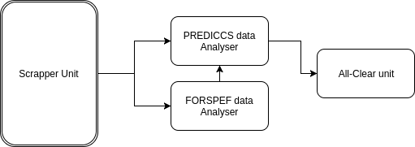

=====================================================
Software Design Study for Radiation Forecasting Server
=====================================================

:Author: Nived Narayanan

Change Record
=============

2017.06.21 - Document created.

Introduction
============

Purpose
-------

This document describes the software design study of radiation
forecasting server module.

Scope
-----

The scope of the Radiation forecasting server is to be able to issue
warning in case of an expected SEP event,to prevent the radiation exposure for the crew. 

Reference Documents
-------------------

- [1] -- `PREDICCS. <http://prediccs.sr.unh.edu/index.html#what>`_
- [2] -- `CACTUS. <http://www.sidc.oma.be/cactus/>`_
- [3] -- `FORSPEF. <http://tromos.space.noa.gr/forspef/main/>`_
- [4] -- `Software Engineering Practices Guidelines. <https://eras.readthedocs.org/en/latest/doc/guidelines.html>`_

Glossary
--------

.. glossary::

    ``ERAS``
        European Mars Analog Station

    ``IMS``
        Italian Mars Society

    ``FORSPEF``
        FORecasting Solar Particle Events and Flares TOOL

    ``SEP``
        Solar Energy Particles

Overview
--------

The module attempts to forecast a SEP event using both deterministic as well
as machine learning approaches.In the deterministic approach the data from
the sources are monitored at regular intervals and the alarm is triggered once
the values goes over the threshold. 

Design Considerations
=====================

Assumptions and dependencies
----------------------------

Scrapy,falcon,pymongo are the dependencies for the module.
Scrapy is used for web spiders for crawling the different sources
to fetch data for both the deterministic as well as the machine learning
approach.falcon framework is used for creating the REST service.pymongo
is used for working with the MongoDB database.

General Constraints
-------------------

The constraint for the module are the data sources. Data sources 

Software Architecture
=====================

The module can be divided into five main sections
    1) Data Scrapper Unit
    2) Alarm unit 
    3) All-Clear signal Unit
    4) REST service 
    5) Web based GUI

A brief software architecture diagram is presented here :

Software Design
===============

Unit 1 : Data Scrapper Unit
--------------------------------

Definition
----------

The unit scraps data from various sources and stores in the MongoDB
database

Responsibilities
----------------

The responsibility of this module is to scrap data from 
different sources(FORSPEF,PREDICCS,CACTUS) to create a common database.

Constraints
-----------

The module is constrained on the correctness of the data retrieved.

Composition
-----------

The unit utilises Scrapy for web spiders and pymongo for working with
the MongoDB database.

Uses/Interactions
-----------------

This is meant to be an automated module.The mongod daemon must be turned
on for the Unit to access the MongoDB database.The Unit is used by the Alarm 
and All-Clear units for their operations.

=====

Unit 2 : Alarm Unit
--------------------------------

Definition
----------

The unit sends the alarm both in a higher time frame(in days) and in
a lower time frame(in hours).

Responsibilities
----------------

The responsibility of this module is to produce alarms whenever there
is a SEP event forecasted by the sources. For the higher time frame alarm
the unit is also required to deliver an expected time for the event to strike
using the velocity information provided by the sources.

Constraints
-----------

An assumption taken for the unit is that there won't  be two separate events in one hour.
Which is a relevant assumption since the CME velocity is in the range of 300-3000 km/s 
and so the change in time will be more than 1 hour between the arrival of the fastest
and slower particle.[227.6million kms/3000*9]

Composition
-----------
 
The module is composed of two main methods alarm() and prediccs_alarm().
Whenever a new set of data arrives its validated by the alarm() method. 
The method will check FORSPEF data and checks if the SEP probability is 
above a certain threshold (TBA) then it will give the expected time of arrival 
from CACTUS data which will give the velocity. If the probability is below 
the threshold it will just pass.[Forcasts in a larger 
time frame (in days)]
The prediccs_alarm() method will also validate the incoming data and 
will trigger the All-Clear unit once it detects a SEP event.[Forcasts in a smaller 
time frame (in hours)]

Uses/Interactions
-----------------

The unit also depends on the data provided
by the Data scrapper unit for its operations.This unit compossed of the methods of
the StartClass() class and it triggers another method all_clear() which makes up the 
All-Clear unit.

======

Unit 3 : All-Clear Unit
--------------------------------

Definition
----------

The unit triggers the all-clear message once the SEP event has died out.

Responsibilities
----------------

The responsibility of this module is to produce all-clear signal by 
analysing the prediccs data taking into account the sensor error. 

Constraints
-----------

The module is constrained on the correctness of the data retrieved.

Composition
-----------

prediccs_alarm() method would trigger the all_clear() method which is to indicate the end of the SEP event. 

Uses/Interactions
-----------------

This is meant to be an automated module.The mongod daemon must be turned
on for the Unit to access the MongoDB database.Use service mongod start to 
start the mongod daemon before running the script.

=======

Unit 4 : REST service
--------------------------------

Definition
----------

It provides the REST API for the Radiation forecast Server.

Responsibilities
----------------

The responsibility of this module is to provide the informations
such as the alarm,all-clear and all such relevant information as response
to the get request.

Constraints
-----------

For each get request it sends the alarm,all-clear(if any) as the response.

Composition
-----------

Falcon web framework is used for the REST API. 

Uses/Interactions
-----------------

The module takes inputs from the Alarm and the All-Clear units.

Unit 5 : Web based GUI
-----------------------

Definition
----------

GUI interface for the package

Responsibilities
----------------

The responsibility of the module is to give a streaming data plot 
and issue alarm information as given by the REST Service.

Composition
-----------

Plotly.js library is used for the plots and flask for hosting the service.

