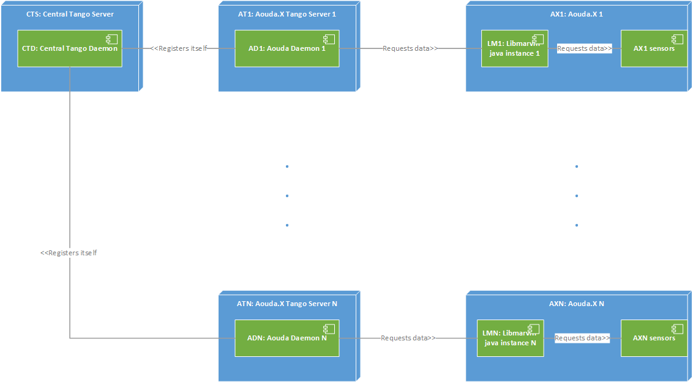

.. sectnum:: :start: 1

=======================================================
Aouda.X Tango Device Server User and Maintenance Manual
=======================================================

:Author: Mario Tambos

.. contents:: :local:

Change Record
=============

2015.08.07 - Document created.

Introduction
============

Purpose
-------

This document describes the installation, use and maintenance of the Aouda.X
Java Server.

Applicable Documents
--------------------

.. _[1]:

- [1] -- `C3 Prototype document v.4`_

.. _[2]:

- [2] -- `Software Architecture Document for the Aouda.X Tango Device Server`_

.. _[3]:

- [3] -- `Software Engineering Practices Guidelines for the ERAS Project`_

.. _[4]:

- [4] -- `TANGO distributed control system`_

.. _[5]:

- [5] -- `Tango Setup`_

.. _[6]:

- [6] -- `Adding a new Server in Tango`_

.. _`C3 Prototype document v.4`: <http://www.erasproject.org/index.php?option=com_joomdoc&view=documents&path=C3+Subsystem/ERAS-C3Prototype_v4.pdf&Itemid=148>
.. _`Software Architecture Document for the Aouda.X Tango Device Server`: ./sad.html
.. _`Software Engineering Practices Guidelines for the ERAS Project`: <https://eras.readthedocs.org/en/latest/doc/guidelines.html>
.. _`TANGO distributed control system`: <http://www.tango-controls.org/>
.. _`Tango Setup`: https://eras.readthedocs.org/en/latest/doc/setup.html
.. _`Adding a new Server in Tango`: https://eras.readthedocs.org/en/latest/doc/setup.html#adding-a-new-server-in-tango

Glossary
--------

.. glossary::

    ``API``
        Application Programming Interface

    ``AS``
        Aouda Device Server

    ``ERAS``
        European Mars Analog Station

    ``IMS``
        Italian Mars Society

    ``TBC``
        To Be Confirmed

    ``TBD``
        To Be Defined

Overview
========

Hardware Architecture
---------------------

:term:`TBD`

Software Architecture
---------------------

The software components involved can be divided in three categories:

#. The Central Tango Daemon: It keeps track of the existing Tango Device
   Servers. For details refer to :ref:`[4] <[4]>` and
   :ref:`[5] <[5]>`.
#. The Aouda Device Server (:term:`AS`): Serves as an interface between the
   Tango Bus and the API provided by libmarvin-java. This component can either
   run on the Aouda.X on-board computer or run on any other machine. In both
   cases it communicates with the suit (using libmarvin-java) via TCP.
#. libmarvin-java: Collects data from the Aouda.X suit's sensors and provides a
   cleaner API to them. It is assumed that each suit will use this library to
   supply its sensor information to external clients.

Deployment Diagram
------------------

The diagram below shows the software's deployment diagram, as explained in the
previous section.

Installation Guide
==================

Installing the Central Tango Daemon on the Central Tango Server
---------------------------------------------------------------
You can install this component following :ref:`[5] <[5]>`. Tango's
libraries must be installed in all computers. The only possible exceptions are
the Aouda.X on-board computers, only if these computers are not running any
Tango device servers.

Downloading, Compiling, and Setting-up
--------------------------------------

Downloading
~~~~~~~~~~~

To obtain the ERAS repository simply run::

    hg clone https://bitbucket.org/italianmarssociety/eras ~/eras

to clone the repository to your home directory, and then run::

    cp -R ~/eras/servers/aouda ~/aouda

to copy the relevant folder to your home directory.

Prerequisites
~~~~~~~~~~~~~

* Java >= 7 (JRE for using, JDK for compiling)
* TangORB.jar (included in the Tango installation, if installed using apt-get)
* log4j-1.2.jar
* libmarvin-java.jar (provided)
* protobuf-java-2.6.1.jar (provided)
* slf4j-api-1.7.6.jar (provided)

Both the JRE7 and log4j can be installed using: ::

    apt-get instal openjdk-7-jre liblog4j1.2-java

or, if it is needed to re-compile the sources: ::

    apt-get instal openjdk-7-jdk liblog4j1.2-java

Compiling
~~~~~~~~~

Already compiled .class files are provided together with the source code.
However, if re-compiling is necessary, it can be done by opening a terminal and
running: ::

   export CLASSPATH=/usr/share/java/TangORB.jar:/usr/share/java/log4j-1.2.jar:~/aouda/AoudaOBDHJava:~/aouda/AoudaOBDHJava/libmarvin-java.jar:~/aouda/AoudaOBDHJava/protobuf-java-2.6.1.jar:~/aouda/AoudaOBDHJava/slf4j-api-1.7.6.jar:$CLASSPATH
   cd ~/aouda/AoudaOBDHJava
   make clean
   make

The above exported CLASSPATH contains the default paths in a Ubuntu system.
If you use another operative system, or if you have installed java, lib4j and/or
Tango using a method other than apt-get, you may need to alter the CLASSPATH
provided.

Registering the Aouda.X device server
~~~~~~~~~~~~~~~~~~~~~~~~~~~~~~~~~~~~~

On a Python or IPython console write, replacing **[n]** with an appropriate
number: ::

   import PyTango
   dev_info = PyTango.DbDevInfo()
   dev_info.server = "AoudaOBDHJava_start/[n]"
   dev_info._class = "AoudaOBDHJava"
   dev_info.name = "C3/aouda/[n]"
   db = PyTango.Database()
   db.add_device(dev_info)

User Manual
===========

Running and Configuration
-------------------------

You can start the Aouda.X device server by running: ::

 cd ~/aouda
 ./AoudaOBDHJava_start

The AoudaOBDHJava_start will setup the CLASSPATH, the TANGO_HOST environment
variable as well as start the C3/aouda/1 device server, which will try to
establish a connection to the sensors listening in the localhost host, using the
port 9990 for control and the port 9991 for data. You can modify these settings
by altering the AoudaOBDHJava_start script. If you need to:

* modify the CLASSPATH, alter the first line between **-cp** and **$CLASSPATH**;
* modify the TANGO_HOST variable, alter the first line after **-DTANGO_HOST=**;
* start a different Aouda.X device server, alter the **1** after
  **AoudaOBDHJava.AoudaOBDHJava**;
* connect to sensors in a different host, alter the **localhost** after
  **--host**;
* connect to a different control port, alter the **9990** after **--control**;
* connect to a different data port, alter the **9991** after **--data**.
