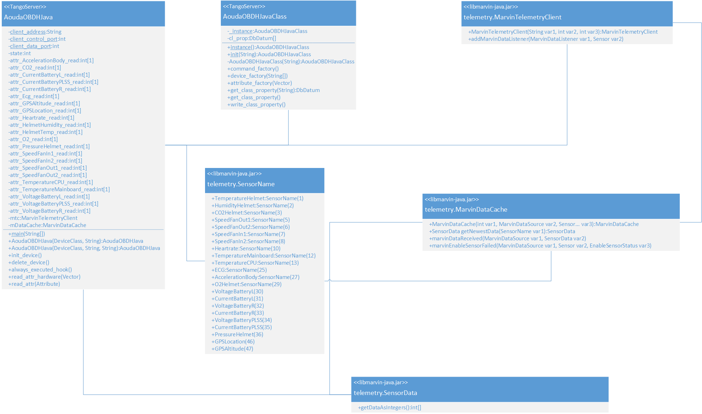
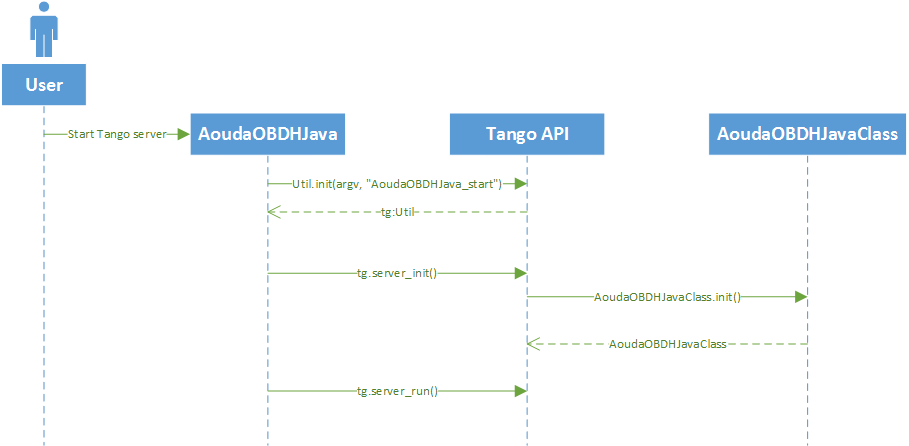
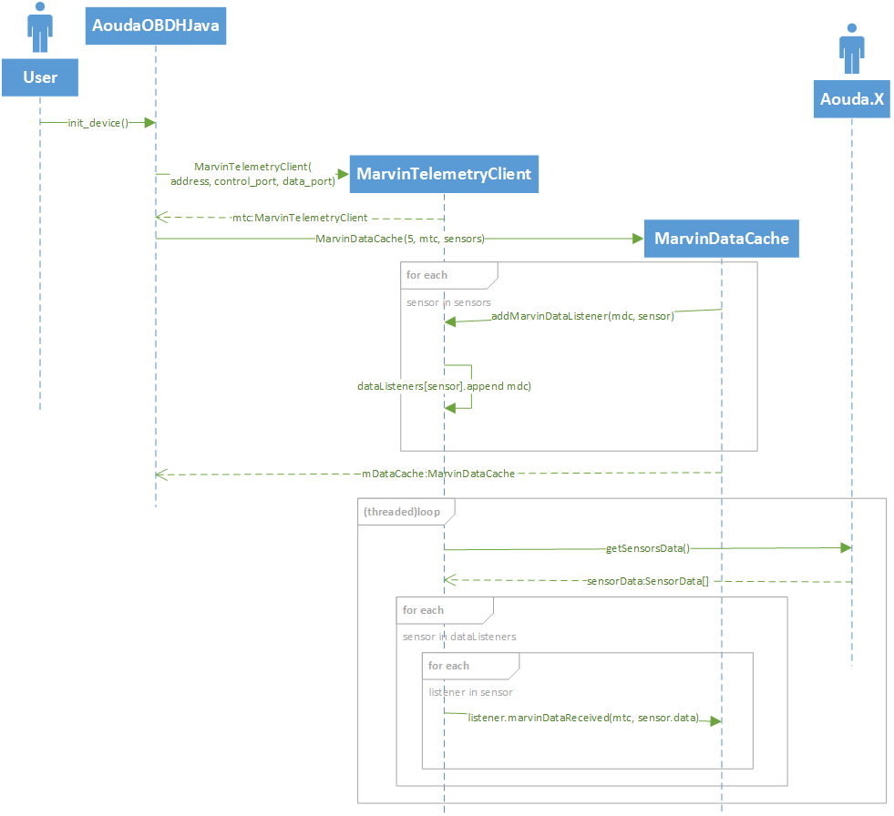
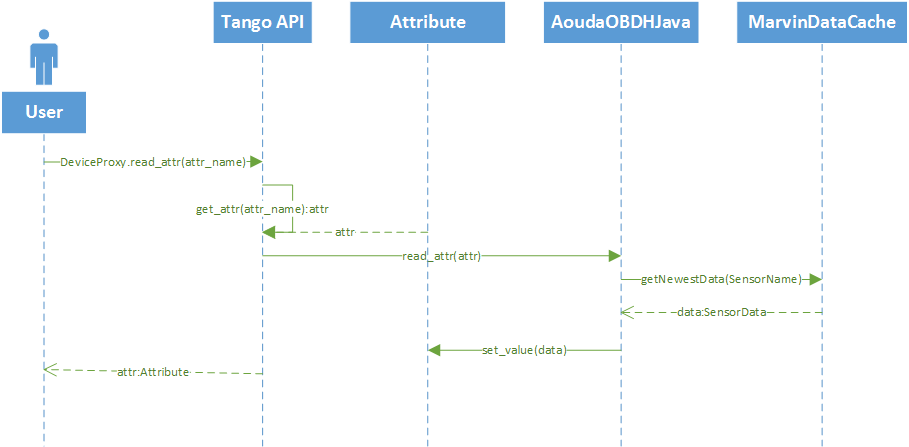

.. sectnum:: :start: 2

===========================================================
Software Architecture Document for the Aouda.X Tango Server
===========================================================

:Author: Mario Tambos

.. contents::
   :local:
   :depth: 2

Change Record
=============

2015.08.07 - Document created.

Introduction
============

Purpose
-------

This Tango device server acts as a proxy between the Tango Bus and the
electronics in the actual Aouda.X suit. The suit provides a Java API, bundled in
the libmarvin-java.jar file, with which this device server interfaces to get
sensor's readings and set the electronics parameters.

Reference Documents
-------------------

- [1] -- `C3 Prototype document v.4`_
- [2] -- `Software Engineering Practices Guidelines for the ERAS Project`_

.. _`C3 Prototype document v.4`: http://www.erasproject.org/index.php?option=com_joomdoc&view=documents&path=C3+Subsystem/ERAS-C3Prototype_v4.pdf&Itemid=148
.. _`Software Engineering Practices Guidelines for the ERAS Project`: https://eras.readthedocs.org/en/latest/doc/guidelines.html

Glossary
--------

.. glossary::

    ``ERAS``
        European Mars Analog Station

    ``IMS``
        Italian Mars Society

    ``EVA``
        Extra-Vehicular Activity

    ``TBD``
        To Be Defined

    ``TBC``
        To Be confirmed

Architectural Requirements
==========================

Non-functional requirements
---------------------------

:term:`TBD`

Use Case View (functional requirements)
---------------------------------------

:term:`TBD`

Implementation View
===================

The Aouda.X Tango device server implements two classes, **AoudaOBDHJava** and
**AoudaOBDHJavaClass**. The first one is in charge of initializing and running
the server, as well as answering requests made through the Tango Bus. The second
class, AoudaOBDHJavaClass, is in charge of providing all the meta-information
about the device, i.e., commands and attributes available, and their
characteristics. A class diagram with the interactions between these two classes
and the ones defined in the libmarvin-java package is shown below.

Sequence Diagrams
=================

Tango Device Server Initialization
----------------------------------

The following sequence diagram illustrates the process of starting the Aouda.X
Tango Device Server from the command line.

Aouda.X Data Acquisition
------------------------

The diagram below explains how the sensor data is obtained from the Aouda.X
suit. At the moment of the device's initialization, both a telemetry client and
a data cache are created. The telemetry client concurrently polls the physical
sensors on the suit, and stores the telemetry read into the data cache.

Request for Sensor's Data
-------------------------

This sequence diagram shows how a request for data made through the Tango Bus is
processed. The immediate source of the data returned is not the physical sensors
on the Aouda.X suit, but rather the internal data cache.

Deployment View
===============
:term:`TBD`

Development and Test Factors
============================

Standards Compliance
--------------------

The guidelines defined in [2] should be followed.
