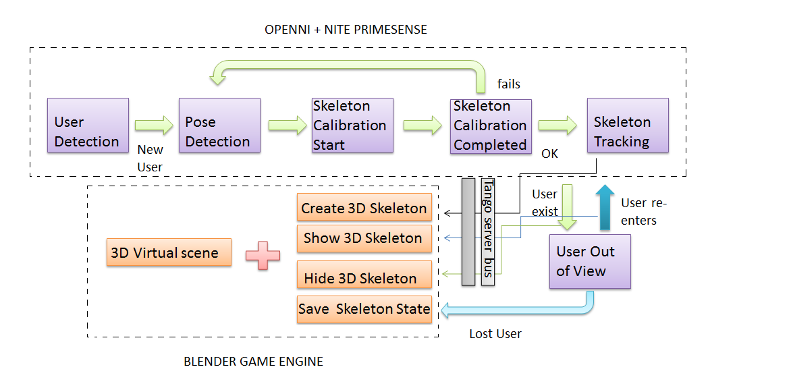

=======================================================================================
Software Architecture Document for the Full body and hands gesture tracking application
=======================================================================================

:Author: Abhishek Singh

.. contents::
   :local:
   :depth: 2

Change Record
=============

20\ :sup:`th`\  May, 2014 - Document created.

Introduction
============

Purpose
-------

Full body and hands gesture tracking application will integrate the whole body motion and hands gesture tracking of astronauts to ERAS virtual station.Which eventually gives a visible representation of astronaut's avatar moving in virtual ERAS station environment.

It uses 3D skeleton tracking technique using a depth camera known as a Kinect sensor(Kinect Xbox 360) with the ability to approximate human poses to be captured, reconstructed and displayed 3D skeleton in the virtual scene using OPENNI, NITE Primesense and Blender game engine. The proposed technique will perform the bone joint movement detections in real time with correct position tracking and display a 3D skeleton in a virtual environment with abilities to control 3D character movements.

Skeleton Tracking is done using Kinect sensor and OpenNI/NITE framework. Kinect sensor generates a depth map in real time, where each pixel corresponds to an estimate of the distance between the Kinect sensor and the closest object in the scene at that pixel’s location. Based on this map, application is developed to accurately track different parts of the human body in three dimensions.

The following flow chart gives a pictorial view of the working steps of body tracker application. 

   Figure 1.1 Pictorial view of body tracker application 

Scope
-----

Describes the scope of this requirements specification.

Applicable Documents
--------------------

- [1] -- `C3 Prototype document v.4`_
- [3] -- `Software Engineering Practices Guidelines for the ERAS Project`_
- [4] -- `ERAS 2013 GSoC Strategic Plan`_
- [5] -- `Software Requirements Specification for Full body and hands gesture tracking application`_
- [6] -- `Software Design Study for Full body and hands gesture tracking application`_
- [7] -- `TANGO distributed control system`_
- [8] -- `PyTANGO - Python bindings for TANGO`_
- [9] -- `Tango Setup`_
- [10] -- `Adding a new Server in Tango`_

.. _`C3 Prototype document v.4`: <http://www.erasproject.org/index.php?option=com_joomdoc&view=documents&path=C3+Subsystem/ERAS-C3Prototype_v4.pdf&Itemid=148>
.. _`PAMAP2 Physical Activity Monitoring`: <http://archive.ics.uci.edu/ml/datasets/PAMAP2+Physical+Activity+Monitoring>
.. _`Software Engineering Practices Guidelines for the ERAS Project`: <https://eras.readthedocs.org/en/latest/doc/guidelines.html>
.. _`ERAS 2013 GSoC Strategic Plan`: <https://bitbucket.org/italianmarssociety/eras/wiki/Google%20Summer%20of%20Code%202014>
.. _`Software Requirements Specification for the Heart Rate Monitor`: <https://eras.readthedocs.org/en/latest/servers/health_monitor/doc/swrs.html>
.. _`Software Design Study for the Heart Rate Monitor`: <https://eras.readthedocs.org/en/latest/servers/health_monitor/doc/swds.html>
.. _`TANGO distributed control system`: <http://www.tango-controls.org/>
.. _`PyTANGO - Python bindings for TANGO`: <http://www.tango-controls.org/static/PyTango/latest/doc/html/index.html>
.. _`Tango Setup`: https://eras.readthedocs.org/en/latest/doc/setup.html
.. _`Adding a new Server in Tango`: https://eras.readthedocs.org/en/latest/doc/setup.html#adding-a-new-server-in-tango

Reference Documents
-------------------

- [1] -- `C3 Prototype document v.4`_
- [2] -- `Software Engineering Practices Guidelines for the ERAS Project`_
- [3] -- `ERAS 2014 GSoC Strategic Plan`_

.. _`C3 Prototype document v.4`: http://www.erasproject.org/index.php?option=com_joomdoc&view=documents&path=C3+Subsystem/ERAS-C3Prototype_v4.pdf&Itemid=148
.. _`Software Engineering Practices Guidelines for the ERAS Project`: https://eras.readthedocs.org/en/latest/doc/guidelines.html
.. _`ERAS 2014 GSoC Strategic Plan`: https://bitbucket.org/italianmarssociety/eras/wiki/Google%20Summer%20of%20Code%202014

Glossary
--------
.. glossary:: 
      ``IMS``
          Italian Mars Society
      
      ``ERAS``
          European MaRs Analogue Station for Advanced Technologies Integration

      ``VR``
          Virtual Reality

      ``TBD``
          To be defined

      ``TBC``
          To be confirmed
          
 

Overview
--------

Make an overview in which you describe the rest of this document the and which chapter is primarily of interest for which reader.

Architectural Requirements 
==========================

This section describes the requirements which are important for developing the software architecture.

Non-functional requirements
---------------------------

#. Implementation Constraints
       #. Language
            The application should be written in python.
       #. Operating System
            The application should be run on Ubuntu distributions.
       #. Hardware
            Kinect sensor(Kinect Xbox 360), a modern PC/Laptop are required
       #. Software
	    OpenNI/NITE library, 
            Blender game engine, 
            Tango server(pyTango), 
            Python 2.x, 
            Python Unit-testing framework, 
            Coverage, 
            Pep8, 
            Pylakes, 
	    IDE(Vim)

#. Ease of configuration
      TBD

#. Supportability
      #. Ease of Installation
           System requires installation of OpenNI, NITE, blender and Tango server.
      #. Planned Maintainance
           System should have proper tests which should be updated and run timely.	

#. Reliability
      #. Error Handling
           System should be able to handle errors properly, without crashing the system and should report the error to user.
      #. Ease of Recovery
           TBD

#. Usability
      #. Speed of Use
           TBD
      #. Required User Ability
	   System requires user to have proper understanding of provided user manual. It also 
           requires user to stand in psi pose for sometime to initiate the skeleton tracking. 
      #. Documentation
           System should provide proper documentation for users and developers.

Use Case View (functional requirements)
---------------------------------------

#. Application should be able track full skeleton of the user.
#. It should also be able to track hands gestures of the user.
#. It should publish tracked data to tango server.
#. It should be able to read data from tango server.
#. Reference frame of Tracked data read from tango server should be converted into blender refrence frame.
#. Traked data of bone-joints should be mapped with bone joints of astronaut's avatar present in blender model.
#. Motion of Avatar present in virtual world is controlled by the user in the real world.

Interface Requirements
======================

This section describes how the software interfaces with other software products
or users for input or output. Examples of such interfaces include library
routines, token streams, shared memory, data streams, and so forth.

User Interfaces
---------------

User will interact with the tracker module which captures body motion of user with the help of Kinect xbox 360 sensor

GUI (Graphical User Interface)
~~~~~~~~~~~~~~~~~~~~~~~~~~~~~~

Describes the graphical user interface if present. This section should include
a set of screen dumps or mockups to illustrate user interface features.
If the system is menu-driven, a description of all menus and their components
should be provided.

CLI (Command Line Interface)
~~~~~~~~~~~~~~~~~~~~~~~~~~~~

Describes the command-line interface if present. For each command, a
description of all arguments and example values and invocations should be
provided.

API (Application Programming Interface)
~~~~~~~~~~~~~~~~~~~~~~~~~~~~~~~~~~~~~~~

Describes the application programming interface, if present. Foreach public
interface function, the name, arguments, return values, examples of invocation,
and interactions with other functions should be provided. If this package is a
library, the functions that the library provides should be described here
together with the parameters.

Hardware Interfaces
-------------------

The hardware used is Kinect xbox 360. OpenNI/NITE library is used to support kinect programming.

Software Interfaces
-------------------

A high level description (from a software point of view) of the software
interface if one exists. This section can refer to an ICD (Interface Control
Document) that will contain the detail description of this interface.

Communication Interfaces
------------------------

Tango sever will be used for cross communication.

Performance Requirements
========================

Specifies speed and memory requirements.

Logical View 
============
Describe the architecturally significant logical structure of the system. Think of decomposition in terms of layers and subsystems. Also describe the way in which, in view of the decomposition, Use Cases are technically translated into Use Case Realizations

Layers
------
The ERAS software applicationg belong to the heterogeneous Distributed Control System (DCS) domain  which can be represented as a layered architecture. This is a very common design pattern used when developing systems that consist of many components across multiple levels of abstraction as in ERAS case. Normally, you should be developing components that belong to the Application layer

.. image:: layered.jpg

Subsystems
----------
Describe the decomposition of the system in subsystems and show their relation.

Use Case Realizations
---------------------
Give examples of the way in which the Use Case Specifications are technically translated into Use Case Realizations, for example, by providing a sequence-diagram.

Implementation View
===================
This section describes the technical implementation of the logical view.

Deployment View
===============
Describe the physical network and hardware configurations on which the software will be deployed. This includes at least the various physical nodes (computers, CPUs), the interaction between (sub)systems and the connections between these nodes (bus, LAN, point-to-point, messaging, etc.). Use a deployment diagram.

Development and Test Factors
============================

Hardware Limitations
--------------------

System requires a Kinect Sensor(Kinect Xbox 360) and a modern PC/Laptop

Software validation and verification
------------------------------------

Give a detail requirements plan for the how the software will be tested and
verified.

Planning
--------

The whole project is divided into three phases:

*Phase I*   : Skeleton Tracking 

*Phase II*  : Integrating tracker with Tango server and prototype development of a glue object 

*Phase III* : Displaying 3D Skeleton in 3D virtual scene

**Deliverables**

* An application that tracks full body movement and hand gesture for effective control of astronaut's avatar movement with following features.
* Application will detect the movement and display the user's skeleton in 3D virtual environment in real time and the positions of the joints are presented accurately.
* It can detect many users’ movements simultaneously.
* Bones and joints can be displayed in 3D model in different colors with the name of user on top of head joint.
* It can display the video of RGB and depth during the user movement.
* Users can interact with 3D virtual scene with rotation and zoom functions while user can also see avatar in a variety of perspectives.
* It can display 3D virtual environment in a variety of formats(3DS and OBJ). Also, virtual environment can be adjusted without interpretation of the motion tracking.
* Proper automated test support for the application with automated unit test for each module.
* Proper documentation on the work for developers and users.

Notes
=====

.. notes can be handled automatically by Sphinx

Appendix A: Use Case template
=============================

Use Cases drive the whole software process and bind together all the phases
from requirements capture to final delivery of the system and maintenance.
They are a very effective way of communicating with customers and among team
members. Before every discussion always provide the partners with a set of
relevant Use Cases.

During meetings, they stimulate focused discussions and help identifying
important details. It is important to keep in mind that Use Cases have to
describe WHAT the system has to do in response to certain external stimuli
and NOT HOW it will do it. The HOW is part of the architecture and of the
design.

What follows is the empty template:

Use Case: <Name>
================
<Short description>

Actors
------
<List of Actors>

Priority
--------
<Low, Normal, Critical>

Preconditions
-------------
<List of preconditions that must be fulfilled>

Basic Course
------------
<Step-by-step description of the basic course>

Alternate Course
----------------
<Step-by-step description of the alternate course>

Exception Course
----------------
<Step-by-step description of the exception course>

Postconditions
--------------
<List of postconditions (if apply)>

Notes
-----

