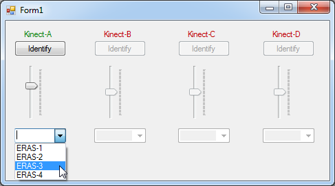

================================================================
Software Architecture Document for the Body Tracker application
================================================================

:Author: Vito Gentile

Change Record
=============

XX\ :sup:`XX`\  XXXXX, 2015 - Document created.

Introduction
============

Purpose
-------

The main goal of this module is to provide the full body tracking of
astronauts, in order to interact with the ERAS virtual station. Using data
provided by this module, an astronaut's avatar can move inside virtual
ERAS station environment, by reproducing body movements of a real user
inside a Motivity treadmill.

This module is based on the 3D skeleton tracking technique described in [1].
The Microsoft Kinect device generates a depth map in real time, where each
pixel represents the distance between the Kinect sensor and the closest object
in the scene at that pixel location. Based on this map, the Microsoft API
implements the aforementioned skeletal tracking algorithm to accurately
track different human body parts in 3D. This technique allows to estimate
the position of 20 skeletal joints, which can be used on the Blender game
engine to properly animate a 3D avatar model.

.. note::

      This module supports and has been tested with the Xbox 360 version of Microsoft Kinect.

This module supports up to four Kinects simultaneously connected to a single
machine.

An algorithm to estimate user's step using skeletal joint data is included
in this module, in order to estimate and reproduce navigation paths that
an astronaut defines by walking inside a Motivity treadmill.

Previous versions of the skeletal tracking module were implemented in C++
using OpenNI/NITE framework, and then C# using the Microsoft Kinect SDK.
The new version of this module is based on PyKinect [2], which uses the
Microsoft API but make possible to use Python.

The following flow chart gives a pictorial view of the working steps of body
tracker application.

.. figure:: images/SkeletalTrackerArchitecture.png

   Figure 1. System architecture. One main server with MS Windows is used for
   manage up to 4 Kinects. Data from these devices are sent to the Tango bus,
   that makes them available for any other ERAS software module. 

Scope
-----

TBC

Applicable Documents
--------------------

TBD

Reference Documents
-------------------

- [1] -- `Real-Time Human Pose Recognition in Parts from a Single Depth Image`: <http://research.microsoft.com/apps/pubs/default.aspx?id=145347>
- [2] -- `PyKinect`: <https://github.com/Microsoft/PTVS/wiki/PyKinect>
- [3] -- `Kinect for Windows Sensor Components and Specifications`: <https://msdn.microsoft.com/en-us/library/jj131033.aspx?f=255&MSPPError=-2147217396>

Glossary
--------
.. glossary::
      ``IMS``
          Italian Mars Society

      ``ERAS``
          European MaRs Analogue Station for Advanced Technologies Integration

      ``V-ERAS``
          Virtual ERAS

      ``VR``
          Virtual Reality

      ``TBD``
          To be defined

      ``TBC``
          To be confirmed

For better understanding this document, a clear distinction between different kinds
of users that interact with the system is needed.
      ``Astronaut`` or ``Virtual Astronaut``
          An user that interacts with the system using different devices and
          tools, such as Kinect, Oculus Rift, Motivity and so on, in order
          to explore the virtual Martian environment

      ``Developer``
          An user that interacts with the system in order to change its
          behavior. A developer can use programming languages to edit the source
          code of any ERAS software module

      ``System manager``
          An user that interacts with the system in order to install and
          configure it, or to assist and/or monitor a Virtual Astronaut 
          during his/her interactions with the system

Overview
--------

TBD

Make an overview in which you describe the rest of this document and which
chapter is primarily of interest for which reader.

Architectural Requirements
==========================

Non-functional requirements
---------------------------

Previous version of skeletal tracking module have been based on open source
solutions. However, using the Microsoft API provided with the `Kinect SDK v1.8`: <https://www.microsoft.com/en-us/download/details.aspx?id=40278>
has shown better performance, so it has been decided to use this software
solution.

In order to exploit Microsoft API power, a server with Microsoft Windows
7 is needed. It means that a licence for using this operating system is mandatory.

Furthermore, the development process is based on the use of Microsoft Visual
Studio 2012 IDE, and it also requires a licence.

The application should be written in Python, using PyKinect for interfacing
with Microsoft API. It requires CPython 2.7 installed.

Communication among this and other modules is based on the availability of
a Tango bus.

Use Case View (functional requirements)
---------------------------------------

This module should track skeletal joints from a virtual astronaut, and make
these data available for any other ERAS module.

An algorithm to estimate user's step using skeletal joint data should be
developed and included in this module, in order to estimate and reproduce
navigation paths that an astronaut defines by walking inside a Motivity treadmill.

This module shouble be able to track hand gestures too.

An usable GUI (Graphical User Interfaces) should be provided, to allow system
managers and maintainers to manage multiple Kinects.

Interface Requirements
======================

This section describes how the software interfaces with other software products
or users for input or output.

User Interfaces
---------------

GUI (Graphical User Interface)
~~~~~~~~~~~~~~~~~~~~~~~~~~~~~~

A graphical user interface is provided to system managers, in order to
manage multiple Kinects connected to the ERAS system. This GUI can be
executed under Windows on a desktop PC, on the same machine that manages
skeletal data (the "main server" in Figure 1).

The interface is similar to the one shown in the following pictures:

.. figure:: images/multiplekinectmanagerGUIallactive.jpg

   Figure 2. GUI with a single Kinect available, but not yet connected to Tango

   Figure 3. GUI with 4 Kinects in use

Available Kinects are those with name highlighted in green. When a Kinect is
available, a system manager can decide to assign it to a Tango server, by
selecting the server name from the drop down menu.

When multiple Kinects are available, there is the need to bind Kinect names
to each actual physical device. By clicking on *Identify*, the motorized tilt
of the corresponding Kinect is activate. By observing which Kinect is moving,
it is possible to associate the device with the letter assigned by the software.

A sliding cursor is also available to adjust the tilt angle.

CLI (Command Line Interface)
~~~~~~~~~~~~~~~~~~~~~~~~~~~~

TBD

Describes the command-line interface if present. For each command, a
description of all arguments and example values and invocations should be
provided.

API (Application Programming Interface)
~~~~~~~~~~~~~~~~~~~~~~~~~~~~~~~~~~~~~~~

TBD

Describes the application programming interface, if present. Foreach public
interface function, the name, arguments, return values, examples of invocation,
and interactions with other functions should be provided. If this package is a
library, the functions that the library provides should be described here
together with the parameters.

Hardware Interfaces
-------------------

The system needs/supports the following hardware components:
- Up to 4 Microsoft Kinect for Xbox 360 devices
- A Kinect Power/USB Adapter for each Kinect device
- A modern PC/Laptop with the following minimal hardware configuration:
	 - 32-bit (x86) or 64-bit (x64) processor
	 - Dual-core 2.66-GHz or faster processor
	 - Dedicated USB 2.0 bus for each Kinect
	 - 2 GB RAM or more

Software Interfaces
-------------------

TBC

A high level description (from a software point of view) of the software
interface if one exists. This section can refer to an ICD (Interface Control
Document) that will contain the detail description of this interface.

Communication Interfaces
------------------------

The skelatal joints and other data tracked by this module are sent to a Tango
bus. The Tango server does not necessarily have to be installed in the same
machine that manages all the Kinects. However this machine must be able to
sent data to the Tango bus.

Every other module can read skeletal data from the Tango bus. For instance,
the Blender Game Engine can use position of skeletal joints to update the
pose of a 3D astronaut model.

Performance Requirements
========================

The system must track astronaut's skeletal joints in real-time. This allows
the virtual astronaut to synchronize its body movements and gestures to
what he/she sees and feels.

Logical View
============

TBD

Describe the architecturally significant logical structure of the system. Think
of decomposition in terms of layers and subsystems. Also describe the way in
which, in view of the decomposition, Use Cases are technically translated into
Use Case Realizations

Layers
------

TBD

The ERAS software applicationg belong to the heterogeneous Distributed Control
System (DCS) domain  which can be represented as a layered architecture.
This is a very common design pattern used when developing systems that consist
of many components across multiple levels of abstraction as in ERAS case.
Normally, you should be developing components that belong to the Application
layer

Subsystems
----------

TBD

Describe the decomposition of the system in subsystems and show their relation.

Use Case Realizations
---------------------

TBD

Give examples of the way in which the Use Case Specifications are technically
translated into Use Case Realizations, for example, by providing a
sequence-diagram.

Implementation View
===================

TBD

This section describes the technical implementation of the logical view.

Deployment View
===============

TBD

Describe the physical network and hardware configurations on which the software
will be deployed. This includes at least the various physical nodes
(computers, CPUs), the interaction between (sub)systems and the connections
between these nodes (bus, LAN, point-to-point, messaging, etc.).
Use a deployment diagram.

Development and Test Factors
============================

Hardware Limitations
--------------------

 * Depth camera included in Microsoft Kinect works at no more than 30 frame per second. This limits the speed of an astronaut's movements: too fast gestures can result in tracking and/or recognition errors
 * Microsoft Kinect may not work well outdoor, due to the IR-based technology used by this device: sunlight can interfere with IR rays used by Kinect, and invalidate depth and skeletal data
 * Fields of view (see [3]) of multiple Kinect should never intersect, because it can invalidate depth and skeletal data

Software validation and verification
------------------------------------

TBD

Give a detail requirements plan for the how the software will be tested and
verified.

Planning
--------

The development of this module is divided in the following phases:

 * Implementation of a Python tracker based on PyKinect, which can track skeletal joints and send them on the Tango bus
 * Implementation of a GUI for system managers, to support simultaneous use of multiple Kinects
 * Definition and implementation of an algorithm to estimate user's step using skeletal joint data, in order to reproduce navigation paths defined by any astronaut walking inside a Motivity treadmill, or using Motigravity
 * Integration of touchless gesture recognition [TBD]

Appendix A: Use Case template
=============================

TBD

Use Cases drive the whole software process and bind together all the phases
from requirements capture to final delivery of the system and maintenance.
They are a very effective way of communicating with customers and among team
members. Before every discussion always provide the partners with a set of
relevant Use Cases.

During meetings, they stimulate focused discussions and help identifying
important details. It is important to keep in mind that Use Cases have to
describe WHAT the system has to do in response to certain external stimuli
and NOT HOW it will do it. The HOW is part of the architecture and of the
design.

What follows is the empty template:

Use Case: <Name>
================
<Short description>

Actors
------
<List of Actors>

Priority
--------
<Low, Normal, Critical>

Preconditions
-------------
<List of preconditions that must be fulfilled>

Basic Course
------------
<Step-by-step description of the basic course>

Alternate Course
----------------
<Step-by-step description of the alternate course>

Exception Course
----------------
<Step-by-step description of the exception course>

Postconditions
--------------
<List of postconditions (if apply)>

Notes
-----

