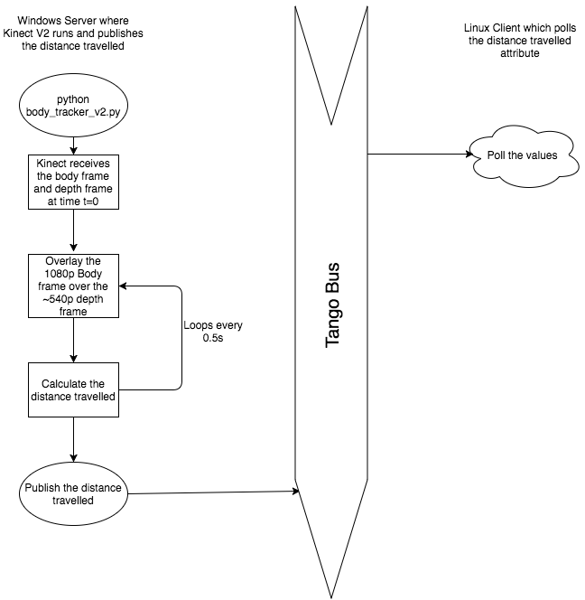

========================================================================
Software Architecture Document for Body Tracker using Kinect v2
========================================================================

:Author: Karan Saxena

Change Record
=============

- 23 August 2016

Introduction
============

Purpose
-------

The purpose of this project is to provide the distance travelled by the user using nothing but Kinect v2 sensor.
In this project Kinect v2 has been used along with PyKinect2 to get data from the Kinect device.
The data that is being retrieved from kinect include
- Full HD RGB image of the user (color and body frame)
- Depth frame

Scope
-----

Describes the scope of this requirements specification.

Reference Documents
-------------------

Glossary
--------

``C3``
    Command, Control, Communication

``ERAS``
    European MaRs Analogue Station for Advanced Technologies Integration

``IMS``
    Italian Mars Society

``V-ERAS``
    Virtual European Mars Analog Station

``VR``
    Virtual Reality

Overview
--------

This document will guide you through the requirements of the project.

Architectural Requirements 
==========================

- Kinect 2
- The user must have a Windows 8 or higher.
- PyTango and tango on Windows machine.
- Linux Machine with Tango and Pytango.
- USB 3.0 port is mandatory.

Non-functional requirements
---------------------------

TBA.

Use Case View (functional requirements)
---------------------------------------

This project can bu used to further develop advanced applications using Kinect v2 sensor as it provides the postion and depth of
skeleton which can be used to plot the person on a virtual environment. It also has infrared vision and audio capabilities.

Performance Requirements
========================

- System with USB 3.0 is a must with windows 8 or above.
- Discrete Graphics memory is a plus.
- CPU wih with 2.5GHZ or more.
