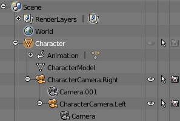
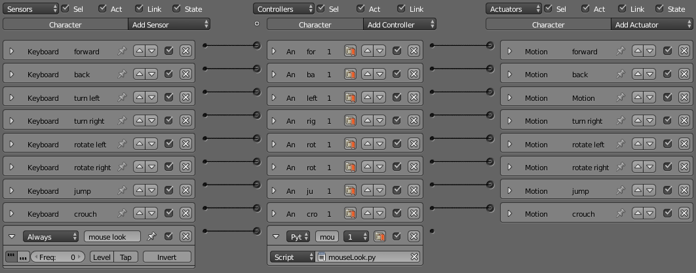
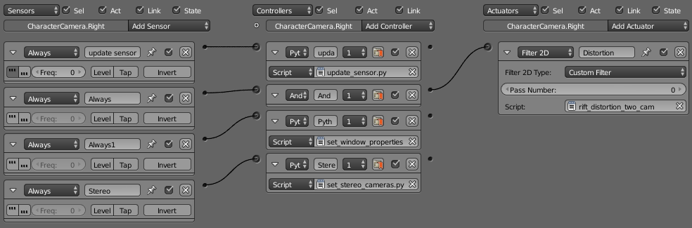
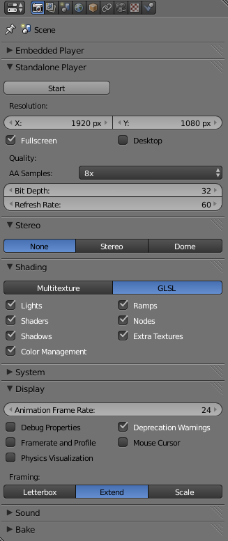

=========================================================
Setup guide for pyOVR and the Blender integration
=========================================================

:Author: Alexander Demets

Setup guide for pyOVR
=====================

Generate libovr.so
------------------
Currently the default makescript for the Oculus SDK compiles the whole LibOVR package as a static library. For the *ctypes*-integration of LibOVR's C-API in Python, we need it as a dynamic library (shared object). To do this, the original makefile has to be replaced with a custom one.

First download and unzip the OculusSDK v0.3.2 (currently newest available for Linux) from the `Oculus Developer Platform`_. 
To install all dependencies for compilation of the Oculus SDK, run following commands in the terminal::

        tar xvzf ovr_sdk_linux_0.3.2.tar.gz
        cd OculusSDK
        ./sh ConfigurePermissionsAndPackages.sh

And copy the custom makefile from your cloned *ERAS* repository over to the **LibOVR** folder, and compile with *make*::
        
        cp -b path/to/eras/servers/erasvr/pyOVR/Makefile_for_LibOVR/Makefile LibOVR/Makefile
        cd LibOVR
        make

.. note::
       
       **Carefull!** Copy the new Makefile into the *LibOVR* folder, **not** the *OculusSDK* folder. The *-b* argument for **cp** makes a backup copy for the original Makefile.   

Configure pyOVR
---------------

At this point, there should be a *libovr.so* in the according platform folder of *LibOVR/Lib*. Of course the Python bindings have to know the location of the *libovr.so* file. So switch over to the *pyOVR* folder, and do **one** of those things:

**1st option** (Copy *libovr.so* into *pyOVR* folder)::
        
        cp OculusSDK/LibOVR/Lib/.../libovr.so eras/servers/erasvr/pyOVR/libovr.so

**2nd option** (Edit path directly in *pyOVR/pyOVR.py*)::

        LIBOVR_PATH = path/to/OculusSDK/LibOVR/Lib/.../libovr.so

Run Tests for pyOVR
-------------------
      
Now that everything is setup, you can run the test scripts::
        
        python3 pyOVR/Testsimple.py
        python3 pyOVR/TestRiftDevice.py

If successfull, you will see the Oculus Rift identified, and its sensor data put out continuously::

        user@ubuntu:~/Development/eras/servers/erasvr/pyOVR$ python3 TestSimple.py
        OVR::DeviceManagerThread - running (ThreadId=0x7f950163d700).
        OVR::DeviceManager - initialized.
        *** SensorFusion Startup: TimeSeconds = 1408388773.073210
        OVR::Linux::HIDDevice - Opened '/dev/hidraw1'
        Manufacturer:'Oculus VR, Inc.'  Product:'Tracker DK' Serial#:'AAAAAAAAAAAA'
        OVR::SensorDevice - Closed '/dev/hidraw1'
        OVR::Linux::HIDDevice - HID Device Closed '/dev/hidraw1'
        OVR::Linux::HIDDevice - HIDShutdown '/dev/hidraw1'
        b'Oculus Rift DK1'
        OVR::Linux::HIDDevice - Opened '/dev/hidraw1'
        Manufacturer:'Oculus VR, Inc.'  Product:'Tracker DK'  Serial#:'AAAAAAAAAAAA'
        Sensor created.
        +1.00 +0.00 +0.00 +0.00
        +1.00 +0.08 -0.00 +0.00
        +1.00 +0.08 -0.00 +0.00
        +1.00 +0.08 -0.00 +0.00
        +1.00 +0.08 -0.00 +0.00
        +1.00 +0.08 -0.00 +0.00
        +1.00 +0.08 -0.00 +0.00
        +1.00 +0.08 -0.00 +0.00
        +1.00 +0.08 -0.00 +0.00

Blender Integration
===================
Before attempint the Blender integration you have to make a simbolic link to the directory 
containing pyOVR from the directory containing the character controller blender file.
In the current status of our software archivse this should be something like this:
cd <archives root>/v-eras-blender/scenes
ln -s ../../eras/servers/erasvr/pyOVR pyOVR

The Blender integration is practically a *drop-in* **character controller** for your BGE project.
To test it out open the included *CharacterControllerOVR.blend* file in Blender v2.71+.

Overview of character controller 
--------------------------------

First of, that's how the object hierachy ob the character controller looks:

    Figure 1: Object Hierarchy for custom character controller.

The *Character* object is our rigidbody, and also defines the outer collision bounds. Its geometry is defined as invisible cylinder, and it's collision bounds are defined by a capsule (makes movement more fluid).

+----------------------------------------------+-----------------------------------------+-----------------------------------------------------------+
| .. image:: images/character_solid_yellow.png | .. image:: images/character_alpha.png   | .. image:: images/character_bounding_box_wireframe.png    |
|    :width: 30%                               |    :width: 30%                          |    :width: 30%                                            |
+----------------------------------------------+-----------------------------------------+-----------------------------------------------------------+
| Fig. 2: *Character* object, solid outer hulls| Fig. 3: Wireframe of *Character* object | Fig. 3: Actual collision data used for *Character* object |
+----------------------------------------------+-----------------------------------------+-----------------------------------------------------------+

The movement happens, by checking the sensor data (currently Keyboard & Mouse), and applying a force to the rigidbody *Character*.
The scripts and actuators are setup like that:

    Figure 5: Sensor/Actuator setup for Blender character controller

Looking at the setup the movement is mostly configured through Blender inbuild functions, only exception is the Mouse-look script. What it does is, it takes the relative movement of the Mouse its X-axis and *rotates* the whole *Character* rigidbody. This means **including** the two *Camera*-childs, which get rotated left/right like a fixed head to a body would do.
The Oculus sensor data is then applied to the *Camera.right* and *Camera.left* object, by using following setup:

    Figure 6: Sensor/Actuator setup for head rotation via sensor data and Barrel rendering.

The *update_sensor.py* script initializes the Rift and applies the sensor data to the camera objects. The *Filter2D* post-process applies the barrel distortion to the resulting image.

Integration in own Blender scene
--------------------------------

Integration of the character controller into a custom scene is very easy, just open your scene and go to::
        
        File > Link/Append > CharacterController.blend > choose "Character"

This will either link or append the character controller into your Blender scene. 

Render settings in Blender
--------------------------

These settings give good results, but can be modified as needed:

    Figure 7: Render settings for Blender scene.

Applicable Documents
--------------------

- [1] -- `Oculus Developer Platform`_
- [2] -- `Oculus SDK Overview v0.3.2`_
- [3] -- `Blender Python API`_

.. _`Oculus Developer Platform`: https://developer.oculusvr.com
.. _`Oculus SDK Overview v0.3.2`: http://static.oculusvr.com/sdk-downloads/documents/Oculus_SDK_Overview_0.3.2_Preview2.pdf
.. _`Blender Python API`: http://www.blender.org/documentation/blender_python_api_2_70_5/
