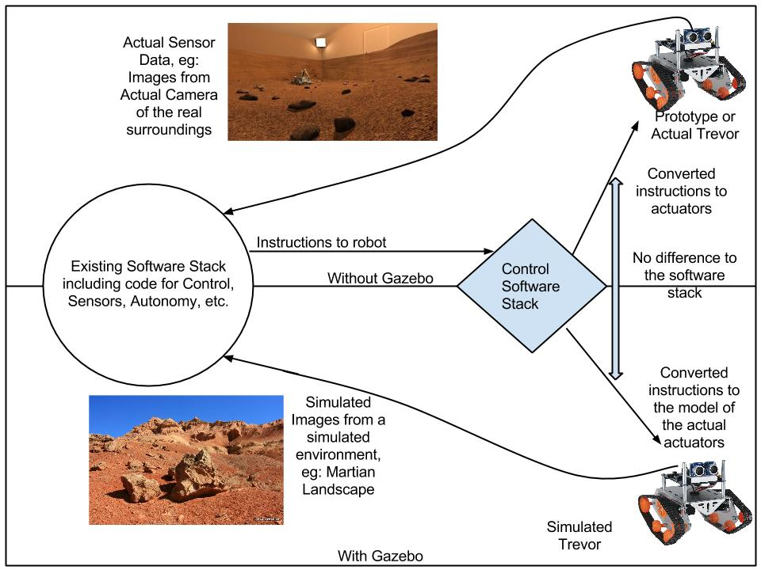
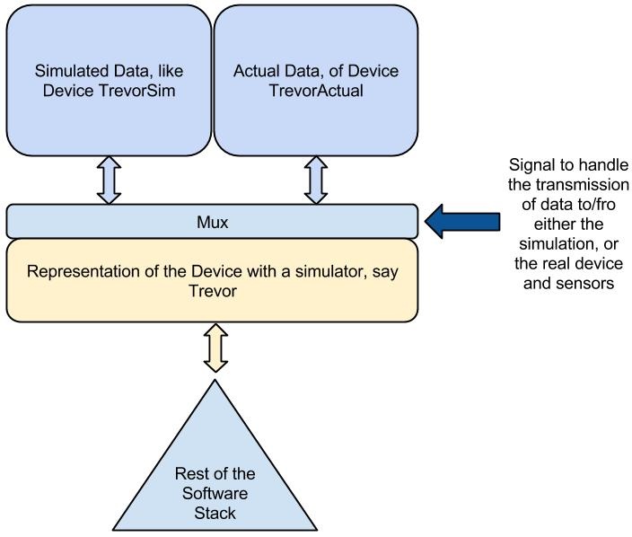

==============================================================================
Software Architecture Document for ROS, Gazebo integration with Tango Controls
==============================================================================

:Author: Kunal Tyagi

Change Record
=============

Introduction
============

Purpose
-------
This document is intended to detail for developers and Users of the ERAS Tango Controls and other ERAS C3 components what changes the control system would undergo during integration with ROS and Gazebo, and what new features it has (or will have) as well as known issues and work left. 

Scope
-----
This requirements specification is intended to cover a software library and associated documentation.

Applicable Documents
--------------------

Reference Documents
-------------------

Glossary
--------

``TANGO``
TANGO Control, an Object Oriented Distributed Control System using CORBA and Zeromq, used as primary Control System by ERAS

``ROS``
Robot Operating System, a set of software libraries and tools very useful in building and controlling devices, especially Robots

``Gazebo``
A robust physics engine with high-quality graphics, useful for more realistic simulations to test the behaviour of robot in different settings

Overview
--------
This package will provide high-level access via TANGO to simulate Trevor in Gazebo using C++ plugins with Python and TANGO bindings. It will also contain files required to correctly use the simulator.
The package may be expanded to include the files required for ROS integration also.

This document is divided into several parts.

1. For a typical __User__, the sections Interface Requirements, and Performance Requirements are of primary interest
2. For a __Beginner__, the section Logical View covers most of the information required to get started on their contributions.
3. For a __Developer__, Architectural Requirements and Implementation View are of high importance
4. For __Maintainers__, Deployment View and Development & Test Factors are a must-read apart from the aforementioned sections

PS: Start from 1 and make your way down towards any higher number

Architectural Requirements
==========================
Working knowledge of ROS, TANGO, Gazebo, as well as expertise in Build System, and Makefiles is a must

Non-functional Requirements
---------------------------
* ROS is independantly developed, and has an evolving build system. As a result, several features need to be modified with a new release of ROS, though most of the code is expected to work fine with only regular updates to API required to hanfle the upgrading process
* Gazebo is independantly developed, and has undergone several changes in its API, and expected to go many more. It is mostly developed by the same community as ROS, so changes will be uniformly spread over these 2 softwares. Also, Python API is in developement, so currently, only C++ API would be used here
* Security: ROS uses no authentication methods, so, TANGO developed in collboration with ESRF, would have to accomodate for this

Functional requirements _(use case view)_
-----------------------------------------
Include things like 
* availability of ROS-agnoistic packages
* overloading of some functions of ROS to publish/receive messages to enable the packages unknowingly using ROS format to achieve the same through TANGO device servers
* availability of messages to move the simulated Trevor

Interface Requirements
======================

User Interfaces
---------------
The user can(or rather would be able to) use ROS libraries with TANGO just as without TANGO, except with a few changes.

Similar usage with Gazebo is expected. It would likely be able to be used just like EUROPA, a standalone plugin for existing software stack. 

It would require modifications to be used without the sotware stack, but its presence would not affect the overall functionality of the software stack

GUI
---
No seperate GUI is provided except from the existing ones by ROS and Gazebo. Qt is heavily used by them

CLI
---
No seperate CLI is to be created due to no foreseeable use.

API
---
Maybe non-existant @TODO

Hardware Interfaces
-------------------
None

Software Interfaces
-------------------
None

Communication Interfaces
------------------------
None, apart from the exising interfaces for running TANGO

Performance Requirements
========================
Gazebo has two modes:

1. With GUI
2. Headless, without GUI

Running Gazebo headless impairs its visual functionality, however, all plugins work fine (testing to be done for camera plugins).

On the other hand, headlesss is suitable for machines with low computational power since extra computations must be done for rendering the simulation in the GUI mode, which would be done only for the sensors in case of a headless run.

Logical View
============
Gazebo is used to replace an actual device whose mathematical model is known and check if the simulation matches with the actual observations

It is not used for say, finding out the flow of fluid through some device, but rather used for simulating the device given the flow through a model as a replacement for the actual hardware.

Each feature of the robot is implemented through an independant plugin, eg: 

* Move the catterpillar drive robot
* Pan/Zoom the camera
* Actuate the gripper
* Report the temperature, humidity, etc.

The feature may be a sensor or an actuator. The actuators have a bare basic model (for GUI mode) covered by a high definition STL to reduce computational load on the simulator. The sensors on the other hand are sometime modeled by only a dot.

As a result, hardware-in-loop simulation is achieved easily by enabling or disabling the required plugins

Layers
------
1. Top Layer: 3D environment changing with time, allowing us to view the STL
2. The simpler models(like cylinders, spheres for more complex surfaces) covered by the STL
3. Mathematical model, used for solving differential equations required for modelling the above models and rendering the images for the top layer
4. Plugins to update the model parameters, pose (x,y,z; r,p,y), forces, torques, constraints, etc. of each of the models. The plugins would be in C++
5. A method to control the plugins, say via TANGO Events/Requests. The events/requests can be sent via a Python/Java/C++ interface
6. An independant user/autonomous program to send the required data for simulation and store/view/use the results

Sub-systems
-----------

Use Case Realizations
---------------------

Implementation View
===================

Deployment View
=================

Development & Test Factors
==========================

Hardware Limitations
--------------------

Software Validation & Verification
----------------------------------

Planning
--------

Notes
=====

Appendix A: Use Case template
=============================

Use Case: Name
----------------

Actors
~~~~~~

Priority
~~~~~~~~

Preconditions
~~~~~~~~~~~~~

Basic Course
~~~~~~~~~~~~

Alternate Course
~~~~~~~~~~~~~~~~

Exception Course
~~~~~~~~~~~~~~~~

Postconditions
~~~~~~~~~~~~~~

Notes
~~~~~
