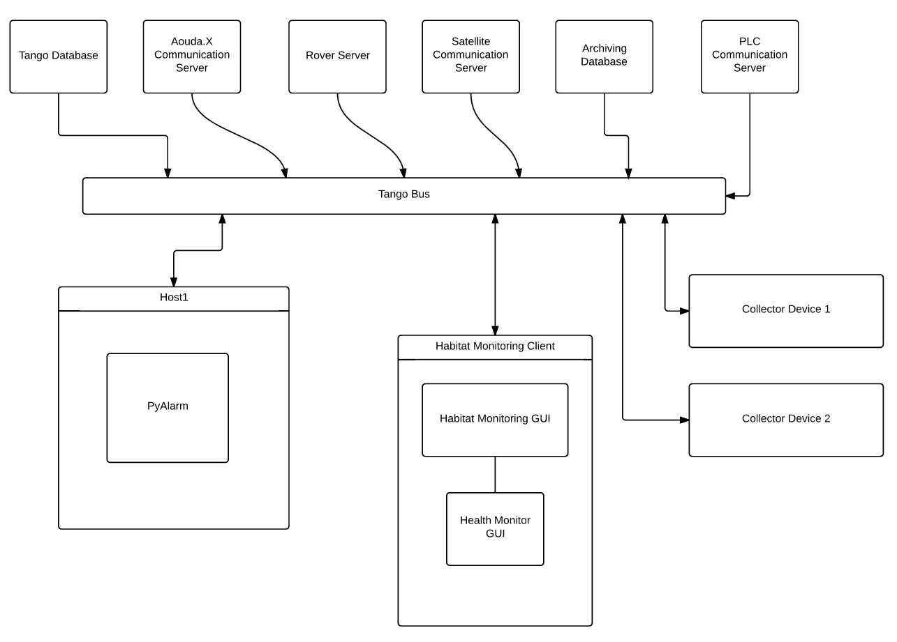
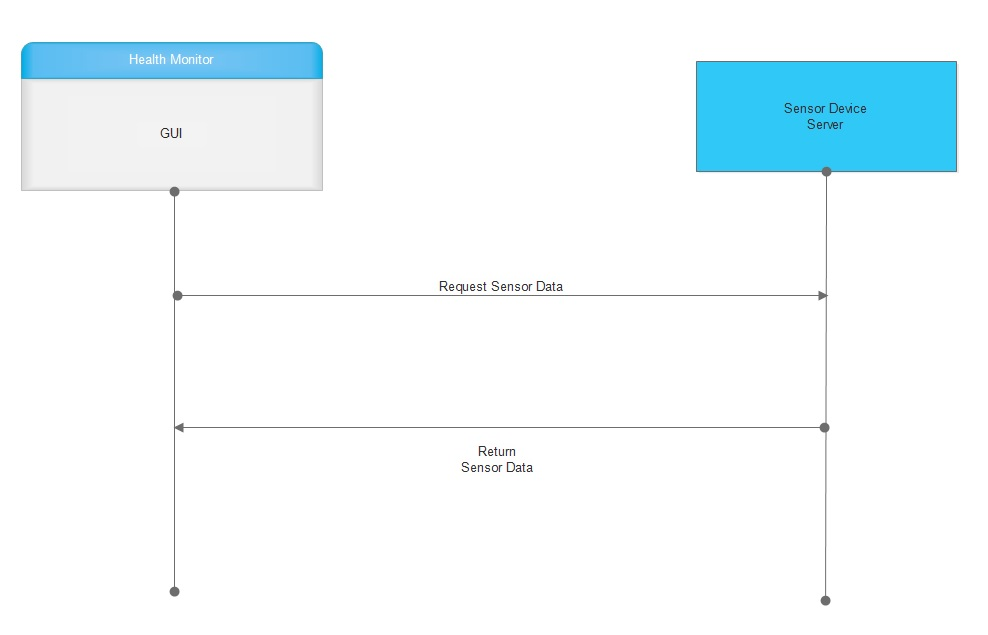
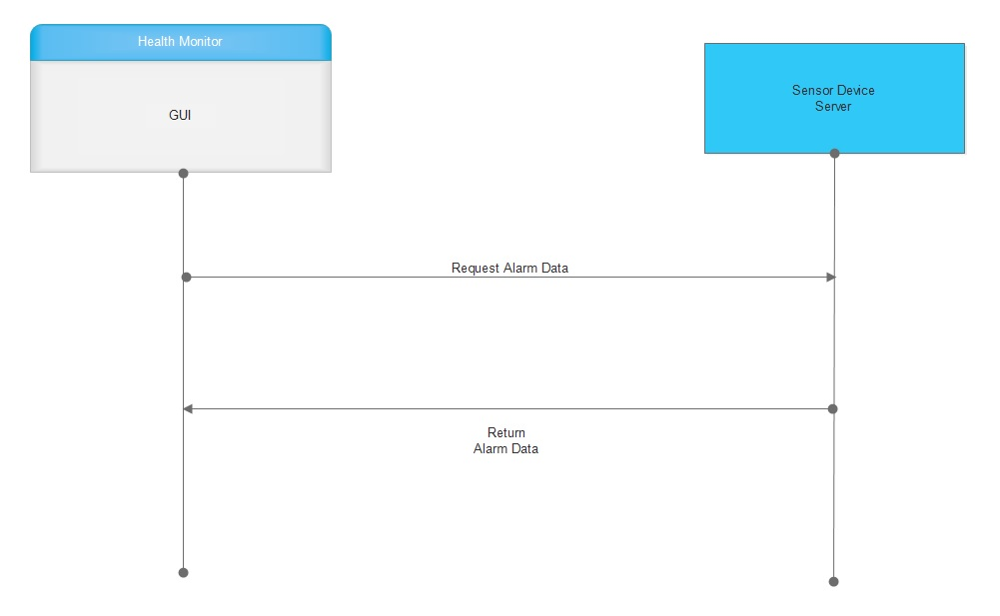
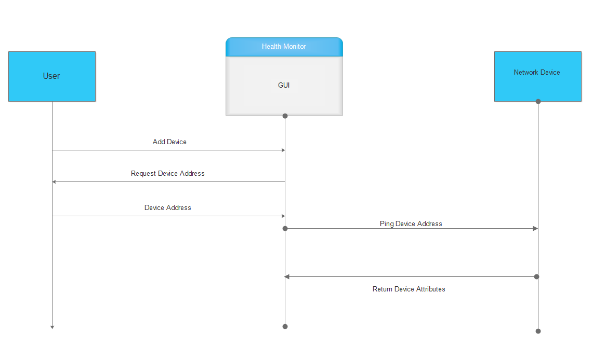
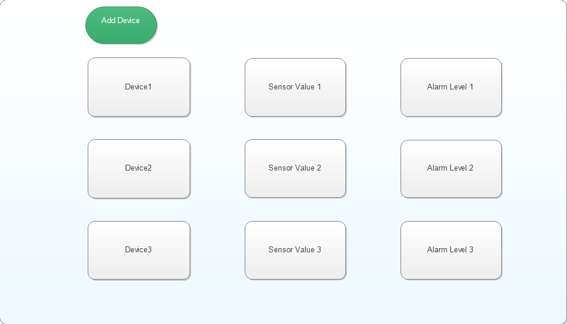
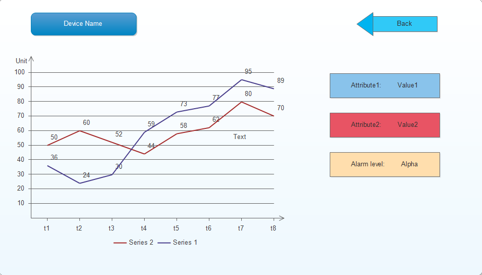

================================================================================
Software Architecture Document for the Habitat Monitoring and Alarming Interface
================================================================================

:Author: Ambar Mehrotra

Change Record
=============

25th May, 2015 - Document Created
.. If the changelog is saved on an external file (e.g. in servers/sname/NEWS),
   it can be included here by using (dedent to make it work):

   .. literalinclude:: ../../servers/servername/NEWS

Introduction
============

Purpose
-------
The Alarming and Monitoring interface will be able to manage all the relevant
information. The GUI will give the user a complete overview of the entire
habitat and how all the instruments are functioning.

The Habitat Monitoring GUI will fit inside the Habitat Monitoring Client which
is directly interfaced with the Tango System Bus. The GUI will be able to
directly coordinate with the various servers interfaced with the Tango System
Bus using the :term:`PANIC` :term:`API` to collect alarm details and device
servers for other data. 

The Health Monitor :term:`GUI` will be made as a popup or a sub-gui inside the
top level monitoring system. It will be dedicated to provide information about
health of the astronauts performing EVA through biosensors (ECG, air flow sensor
, etc.).

Scope
-----

Describes the scope of this requirements specification.

Applicable Documents
--------------------
- [1] -- `How to use Tango Controls`_
- [2] -- `How to PyTango`_
- [3] -- `PyQt4 Reference Guide`_

.. _`How to use Tango Controls`: http://www.tango-controls.org/how-use-tango-controls/
.. _`How to PyTango`: http://www.tango-controls.org/resources/howto/how-pytango/
.. _`PyQt4 Reference Guide`: http://pyqt.sourceforge.net/Docs/PyQt4/

Reference Documents
-------------------

- [1] -- `C3 Prototype document v.4`_
- [2] -- `Software Engineering Practices Guidelines for the ERAS Project`_
- [3] -- `Tango Setup`_
- [4] -- `Adding a new server in Tango`_
- [5] -- `Extending Alarm Handling in Tango`_

.. _`C3 Prototype document v.4`: http://erasproject.org/download/eras-command-control-and-communication-c3-prototype/
.. _`Software Engineering Practices Guidelines for the ERAS Project`: https://eras.readthedocs.org/en/latest/doc/guidelines.html
.. _`Tango Setup`: https://eras.readthedocs.org/en/latest/doc/setup.html
.. _`Adding a new server in Tango`: https://eras.readthedocs.org/en/latest/doc/setup.html#adding-a-new-server-in-tango
.. _`Extending Alarm Handling in Tango`: http://plone.tango-controls.org/Documents/papers/icalepcs-2011/at_managed_file.2011-10-17.7547904219

Glossary
--------
.. glossary::
      ``IMS``
          Italian Mars Society

      ``ERAS``
          European MaRs Analogue Station for Advanced Technologies Integration

      ``V-ERAS``
          Virtual-ERAS

      ``GUI``
          Graphic User Interface

      ``API``
          Application Programming Interface

      ``PANIC``
          Package for Alarms and Notification of Incidences from Controls

      ``TBD``
          To be defined

      ``TBC``
          To be confirmed

Overview
--------

Make an overview in which you describe the rest of this document the and which
chapter is primarily of interest for which reader.

Architectural Requirements 
==========================

This section describes the requirements which are important for developing the
software architecture.

Non-functional requirements
---------------------------

#. Implementation Constraints
       #. Language
            The application should be written in python.
       #. Operating System
            The application should be run on Ubuntu distributions.
       #. Software
            PyQt Library
            PyTango Library
            Tango server(pyTango),
            Python 2.x,
            Pep8,

#. Supportability
      #. Ease of Installation
           System requires installation of PyQt and Tango
           server.

Use Case View (functional requirements)
---------------------------------------

The goal of this project is to build a service that allows the central
monitoring of the entire habitat. A GUI will request the data from the database
using the :term:`PANIC` :term:`API`, summarize it and present it to an overseer
in a way that allows him/her to detect problems at a glance.

Request for sensor data
++++++++++++++++++++++++++
The Client requests a Network Device Server for the sensor data of the last T
seconds.

Actors
~~~~~~
Client: Habitat Monitoring :term:`GUI`.
Server: the Device TANGO server.

Priority
~~~~~~~~
High

Preconditions
~~~~~~~~~~~~~
The Server is running and its DevState is ON.
0
Basic Course
~~~~~~~~~~~~
#. The Client calls the appropriate method on the Server, passing T as
   argument.
#. The Server searchs its buffer for the appropriate records.
#. The Server returns the records found.

Alternate Course
~~~~~~~~~~~~~~~~
None

Postconditions
~~~~~~~~~~~~~~
The server returns the data requested or an empty array if no data is available.

Request for alarms
++++++++++++++++++
The Client request the Device Server the alarm data of the last T seconds.

Actors
~~~~~~
Client: Habitat Monitoring GUI.
Server: The network device TANGO server.

Priority
~~~~~~~~
High

Preconditions
~~~~~~~~~~~~~
The Server is running and its DevState is ON.

Basic Course
~~~~~~~~~~~~
#. The Client calls the appropriate method on the Server, passing T as
   argument.
#. The Server searchs the database for the appropriate records.
#. The Server returns the records found.

Alternate Course
~~~~~~~~~~~~~~~~
None

Postconditions
~~~~~~~~~~~~~~
The server returns the data requested or an empty array if no data is available.

User requests to add new device
+++++++++++++++++++++++++++++++
The user wants to add a new Tango Device on the network to monitor using the
:term:`GUI`.

Actors
~~~~~~
User: The user who wants to add a new Device.
Client: the Habitat Monitor TANGO client.
Device Server: Tango server running on the network.

Priority
~~~~~~~~
High

Preconditions
~~~~~~~~~~~~~
The Server is running and its DevState is ON.
The :term:`GUI` is running.

Basic Course
~~~~~~~~~~~~
#. The user requests the GUI to add a new Device.
#. The :term:`GUI` asks the user for the internal Tango Device address.
#. The user responds with the device address.
#. The :term:`GUI` queries the device for attributes.
#. The device returns the required attributes.
#. The GUI starts showing its data.

Alternate Course
~~~~~~~~~~~~~~~~
None

Exception Course
~~~~~~~~~~~~~~~~
None

Postconditions
~~~~~~~~~~~~~~
The Device data is shown on the screen or :term:`GUI` shows an error message if
the device is not found on the given address.

A User requests a device's detailed data
+++++++++++++++++++++++++++++++++++++++++
A user requests the detailed data for a given device and the GUI
complies.

Actors
~~~~~~
User: a user of the GUI.
GUI: a GUI with an embedded TANGO client.

Priority
~~~~~~~~
High

Preconditions
~~~~~~~~~~~~~
The Server is running and its DevState is ON.

Basic Course
~~~~~~~~~~~~
#. The User clicks on the icon of device.
#. The GUI hides the summarized view for device.
#. The GUI shows the detailed  view for device.

Alternate Course
~~~~~~~~~~~~~~~~
None

Exception Course
~~~~~~~~~~~~~~~~
None

Postconditions
~~~~~~~~~~~~~~
The selected device's detailed view is shown on the GUI.

Interface Requirements
======================

User Interfaces
---------------

Describes how this product interfaces with the user.

Bellow are two mockups that cover the two current Use Cases that concern the
GUI.

Graphical User Interface
++++++++++++++++++++++++

Overview
~~~~~~~~

Detailed View
~~~~~~~~~~~~~

Software validation and verification
------------------------------------

The :term:`GUI` will be implemented as a Tango Client that will fetch data from
the varios device servers and 

Planning
--------

The development of the GUI will be done in primarily the following phases.
 
 * Building the skeleton for the GUI. This is the primary portion of the project
 and will require the work on the following areas.
   * Allowing the GUI to add additional data channels.
   * Integration with the Tango Alarms System
   * Integrating the monitoring system with the plottings coming in from the
   various biometric devices using a generic mechanism.
 * Development of the Health Monitoring module as a sub-GUI of the habitat
 monitoring interface.

