.. sectnum:: :start: 2

=====================================================
Software Architecture Document for the Health Monitor
=====================================================

:Author: Mario Tambos

.. contents::
   :local:
   :depth: 2

Change Record
=============

2014.05.18 - Document created.
2014.08.20 - Updated document to reflect implementation.

Introduction
============

Purpose
-------

Crew monitoring is an integral part of any manned mission. Since automated
diagnosis tools are as yet not advanced enough, there is the problem
of providing a human overseer with enough information to allow her to spot
possible health problems as soon as possible.

Taking this into account this project is divided in three parts:

#. Investigation of consumer-level biomedic devices available in the market.
#. The implementation of a service to gather health metrics of all the crew.
   A priori this project will focus on the crew performing :term:`EVA`, since,
   through their suits, their health information is readily available.
#. The implementation of a :term:`GUI`, where the collected data shall be
   summarized and presented to an overseer for evaluation.

Scope
-----

Describes the scope of this requirements specification.

Reference Documents
-------------------

- [1] -- `C3 Prototype document v.4`_
- [2] -- `Software Engineering Practices Guidelines for the ERAS Project`_
- [3] -- `ERAS 2014 GSoC Strategic Plan`_

.. _`C3 Prototype document v.4`: http://www.erasproject.org/index.php?option=com_joomdoc&view=documents&path=C3+Subsystem/ERAS-C3Prototype_v4.pdf&Itemid=148
.. _`Software Engineering Practices Guidelines for the ERAS Project`: https://eras.readthedocs.org/en/latest/doc/guidelines.html
.. _`ERAS 2014 GSoC Strategic Plan`: https://bitbucket.org/italianmarssociety/eras/wiki/Google%20Summer%20of%20Code%202014

Glossary
--------

.. glossary::

    ``ERAS``
        European Mars Analog Station

    ``GUI``
        Graphic User Interface

    ``IMS``
        Italian Mars Society

    ``EVA``
        Extra-Vehicular Activity

    ``TBD``
        To Be Defined

    ``TBC``
        To Be confirmed

Overview
--------

Make an overview in which you describe the rest of this document the and which
chapter is primarily of interest for which reader.

Architectural Requirements
==========================

This section describes the requirements which are important for developing the
software architecture.

Non-functional requirements
---------------------------

* As mentioned before, it should be possible to view the developed GUI from
  inside a virtual environment.
* The framework selected for the GUI development should be multiplatform. It
  should also have as few prerequisites as possible.
* Biometric devices:
    * Their cost should not exceed us$200.
    * They should be easy to integrate with TANGO.
    * Tey should not be cumbersome.
    * If possible each device should integrate several functions.
* The data collector should gather data from any device deemed relevant. Any
  relevant device not available should be simulated.

Use Case View (functional requirements)
---------------------------------------

The goal of this project is to build a service that allows the central
monitoring of the crew's health. It will do this by collecting, processing and
presenting data from the crew space suits.
A data collector, implemented as a TANGO server, should gather the data from
all available space suits and store it in a database.
A GUI should then request the latest data from the database, summarize it and
present it to an overseer in a way that allows him/her to detect problems at
a glance. The GUI should also be able to be viewed from inside a
VR-environment. At the moment a possible solution to this is to stream a
computer screen/window to a surface texture in Blender, as shown in this
`video <https://www.youtube.com/watch?v=8IUU_XeXvSM>`_.

Additionally, it will be investigated what biometrics devices could be used
in VR-simulations to monitor the crew participating in it. For selected
devices a Tango server will be developed, from which then the collector will
also gather data.

Request for biometric data
++++++++++++++++++++++++++
The Client request the Server the biometric data of the last T seconds.

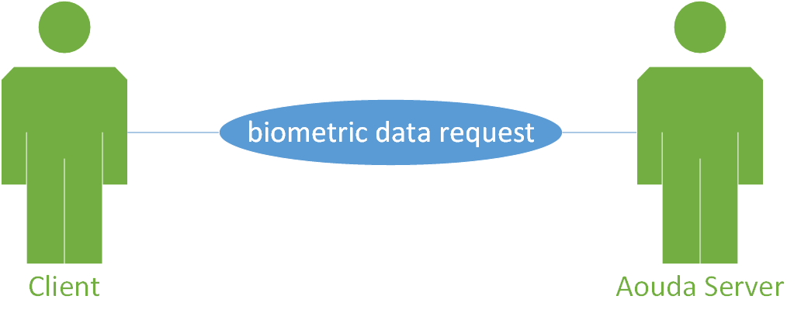

Actors
~~~~~~
Client: a TANGO client that makes the request.
Server: the Aouda TANGO server.

Priority
~~~~~~~~
High

Preconditions
~~~~~~~~~~~~~
The Server is running and its DevState is ON.

Basic Course
~~~~~~~~~~~~
#. The Client calls the appropriate method on the Server, passing T as
   argument.
#. The Server searchs its buffer for the appropriate records.
#. The Server returns the records found.

Alternate Course
~~~~~~~~~~~~~~~~
None

Postconditions
~~~~~~~~~~~~~~
The server returns the data requested or an empty array if no data is available.

Request for alarms
++++++++++++++++++
The Client request the Server the biometric data of the last T seconds.

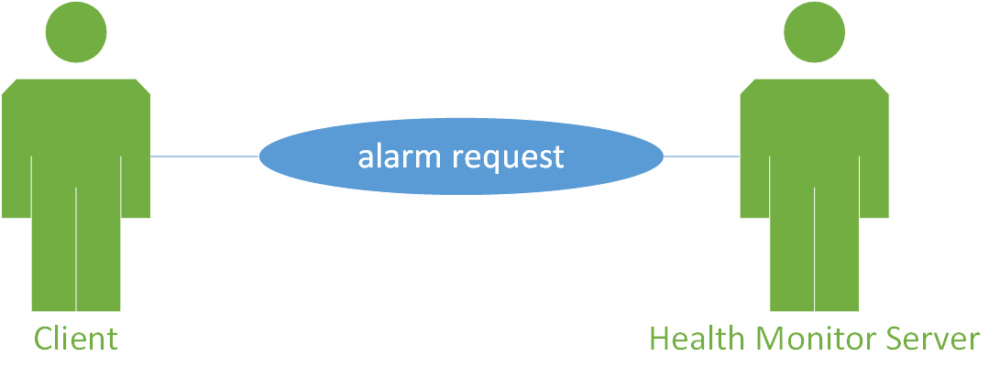

Actors
~~~~~~
Client: a TANGO client that makes the request.
Server: the Health Monitor TANGO server.

Priority
~~~~~~~~
High

Preconditions
~~~~~~~~~~~~~
The Server is running and its DevState is ON.

Basic Course
~~~~~~~~~~~~
#. The Client calls the appropriate method on the Server, passing T as
   argument.
#. The Server searchs the database for the appropriate records.
#. The Server returns the records found.

Alternate Course
~~~~~~~~~~~~~~~~
None

Postconditions
~~~~~~~~~~~~~~
The server returns the data requested or an empty array if no data is available.

Server requests new data
++++++++++++++++++++++++
The Server reads the data of each available Aouda suit from the Framework
Software Bus, ands stores it in the database.

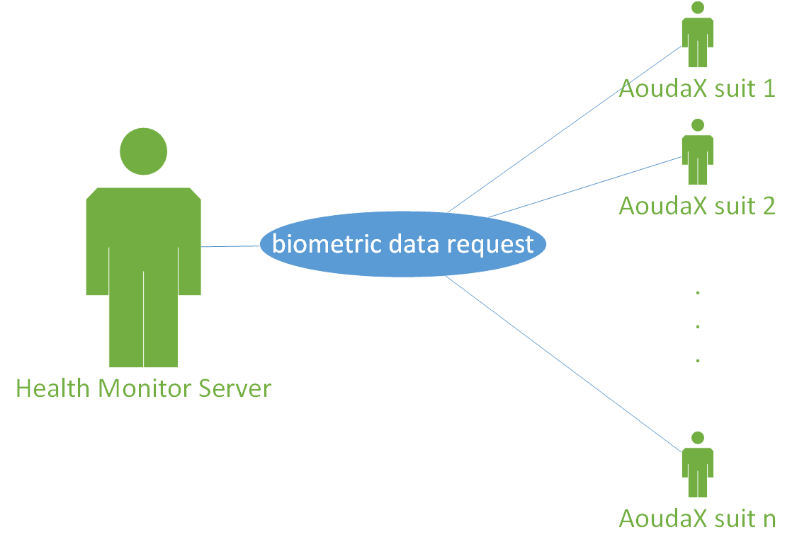

Actors
~~~~~~
Server: the Health Monitor TANGO server.
Aouda Server: Tango server that provides the Aouda Suit simmulated data.

Priority
~~~~~~~~
High

Preconditions
~~~~~~~~~~~~~
The Server is running and its DevState is ON.

Basic Course
~~~~~~~~~~~~
#. The Server request new data from each available Aouda Server.
#. The Aouda Servers returns the data available.
#. The Server stores the data of each suit.

Alternate Course
~~~~~~~~~~~~~~~~
None

Exception Course
~~~~~~~~~~~~~~~~
None

Postconditions
~~~~~~~~~~~~~~
The data from the suits is stored in the database.

The GUI shows overview of crew's biometrics
+++++++++++++++++++++++++++++++++++++++++++
The GUI gets all data from the previos T seconds, summarizes it and displays
it.

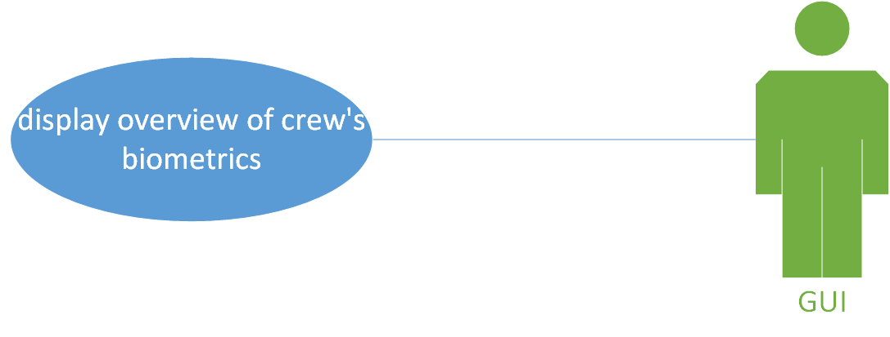

Actors
~~~~~~
GUI: a GUI with an embedded TANGO client.
Server: the Health Monitor TANGO server.

Priority
~~~~~~~~
High

Preconditions
~~~~~~~~~~~~~
The Server is running and its DevState is ON.

Basic Course
~~~~~~~~~~~~
1. The GUI calls the appropriate method on the Server, passing T as
   argument.
#. The Server searchs the database for the appropriate records.
#. The Server returns the records found.
#. For each available suit *s*:

   a. The GUI calls the appropriate method on itself,
      in order to summarize the biometrics of *s*.
   #. The GUI calls the appropriate method on itself,
      in order to display the summarized biometrics of *s*.

Alternate Course
~~~~~~~~~~~~~~~~
None

Exception Course
~~~~~~~~~~~~~~~~
None

Postconditions
~~~~~~~~~~~~~~
The crew biometric's overview is shown on the GUI.

A User requests a crewmember's detailed biometrics
++++++++++++++++++++++++++++++++++++++++++++++++++
A user requests the detailed biometrics for a given crewmember and the GUI
complies.

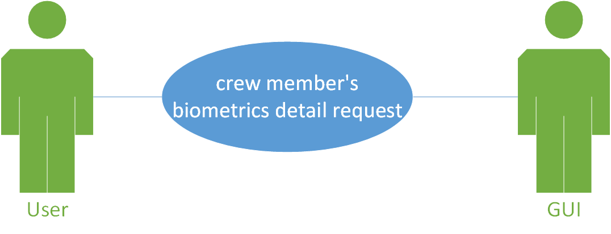

Actors
~~~~~~
User: a user of the GUI.
GUI: a GUI with an embedded TANGO client.

Priority
~~~~~~~~
High

Preconditions
~~~~~~~~~~~~~
The Server is running and its DevState is ON.

Basic Course
~~~~~~~~~~~~
#. The User clicks on the icon of crewmember *c*.
#. The GUI hides the summarized view for *c*.
#. The GUI shows the detailed  view for *c*.

Alternate Course
~~~~~~~~~~~~~~~~
None

Exception Course
~~~~~~~~~~~~~~~~
None

Postconditions
~~~~~~~~~~~~~~
The selected crewmember biometric's detailed view is shown on the GUI.

Interface Requirements
======================

User Interfaces
---------------

GUI (Graphical User Interface)
++++++++++++++++++++++++++++++

The GUI should use this interface to take information from the data collector,
avoiding direct acces to the data storage.

Bellow are two mockups that cover the two current Use Cases that concern the
GUI.

Overview
~~~~~~~~
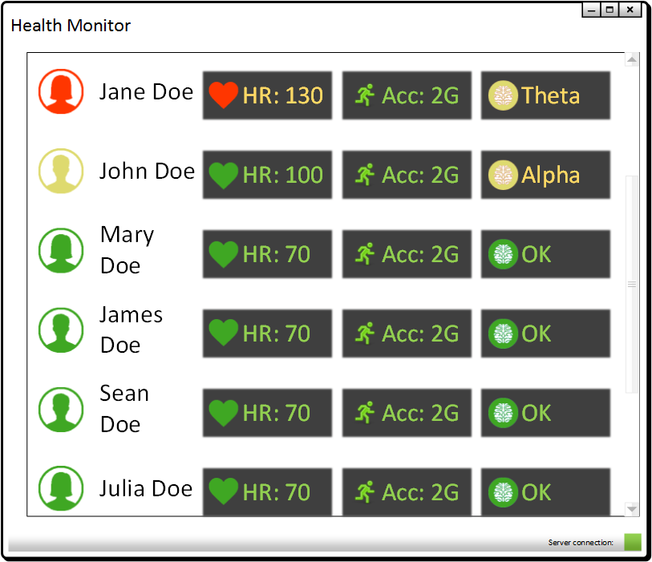

Detailed View
~~~~~~~~~~~~~
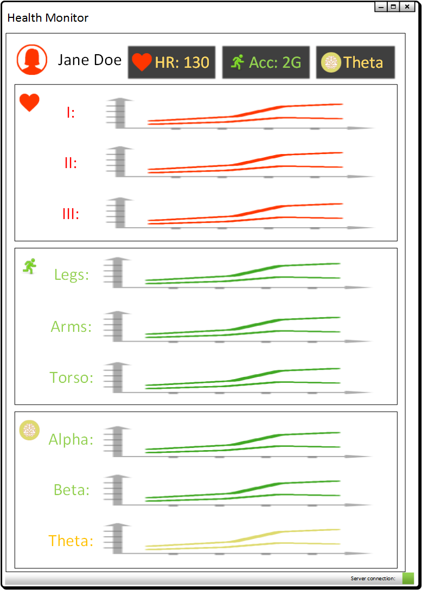

API (Application Programming Interface)
+++++++++++++++++++++++++++++++++++++++

:term:`TBD`

Hardware Interfaces
-------------------

Here should be referenced the hardware interfaces of the biometric devices.
Specifics are :term:`TBD`.

Software Interfaces
-------------------

The data collector module will be implemented as a Python TANGO server,
which will expose methods to request raw as well as summarized data.

Performance Requirements
========================

The software should allow the monitoring of health metrics in real-time,
therefore any preparation of the data should be quick enough as to be
non-noticeable.

Furthermore, the suit simulator should be able to run in a RasperryPi or
similar.

Specifics are :term:`TBD`.

Logical View
============

Layers & Subsystems
-------------------
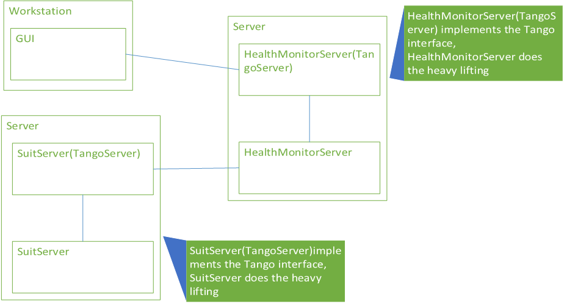

Use Case Realizations
---------------------

Request for biometric data
++++++++++++++++++++++++++

Sequence diagram
~~~~~~~~~~~~~~~~
.. image:: images/SeqClientRequestsBiometricData.png

Server requests new data
++++++++++++++++++++++++

Sequence diagram
~~~~~~~~~~~~~~~~
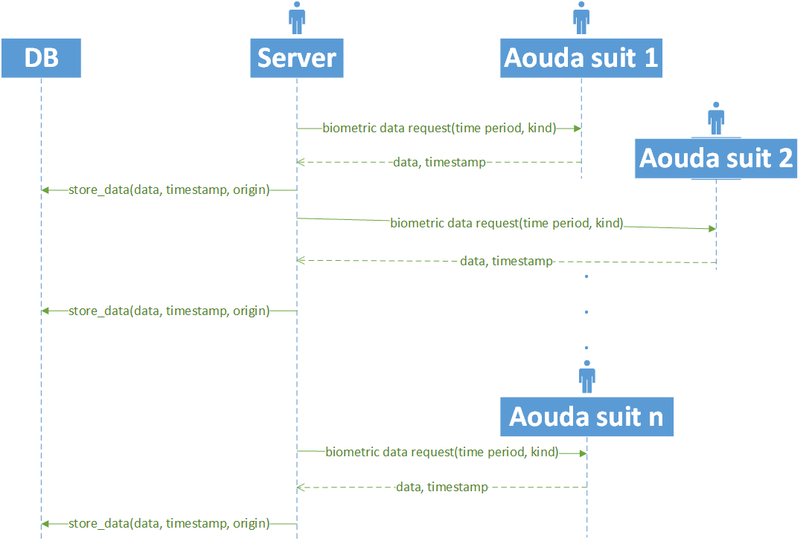

The GUI shows overview of crew's biometrics
+++++++++++++++++++++++++++++++++++++++++++

Sequence diagram
~~~~~~~~~~~~~~~~
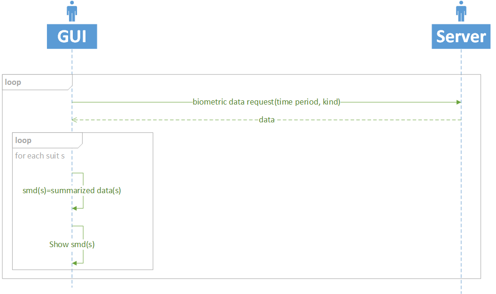

A User requests a crewmember's detailed biometrics
++++++++++++++++++++++++++++++++++++++++++++++++++

Sequence diagram
~~~~~~~~~~~~~~~~
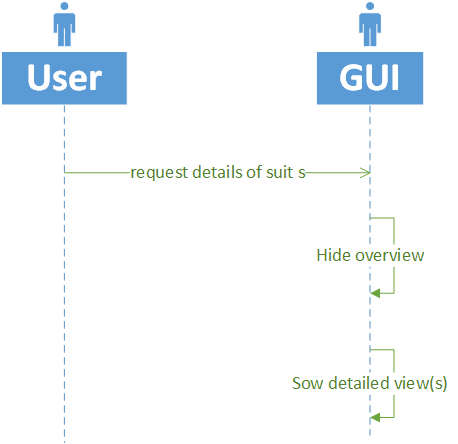

Implementation View
===================
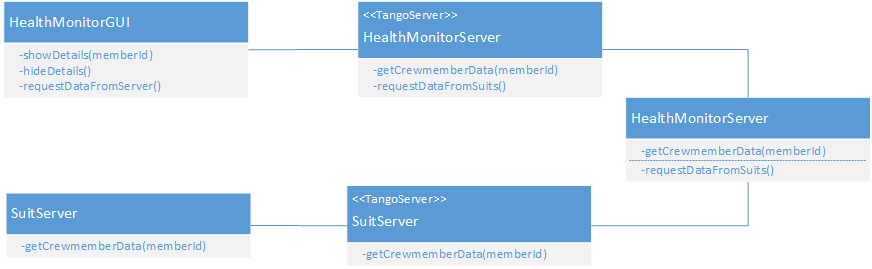

Deployment View
===============
:term:`TBD`

Development and Test Factors
============================

Standards Compliance
--------------------

The guidelines defined in [2] should be followed.

Planning
--------

The high-level schedule is defined in [3], with deliverables as follows:

* A TANGO server that implements the data collector.

* A GUI that presents summarized and detailed data of the crew's biometrics.

* A document describing the biometric devices selected for the project.

* A space suit simulator that integrates the real devices.

* Testing

    * Test environment to help diagnose the server's work.
    * A set of integration tests between the collector and the GUI.
    * A set of interface tests for the GUI.

* Documentation.

    * User requirements (this document).
    * Design Study document.
    * User Manual.

The time for this particular project is devided as follows:

+-------------------------------------------------------+----------+
| (1) Refine schedule with mentor                       | 1/2 week |
|                                                       |          |
| a. Discuss architecture depth.                        |          |
| #. Account for side requirements.                     |          |
| #. Define nice-to-haves.                              |          |
| #. Draft User requirements Document.                  |          |
+-------------------------------------------------------+----------+
| (2) Find appropriate biometric device(s)              | 1 weeks  |
+-------------------------------------------------------+----------+
| (3) Build space suite simulator                       | 3 weeks  |
|                                                       |          |
| a. Gather data (ECG, EEG, accelerometer, heart rate). |          |
| #. Build randomizer.                                  |          |
| #. Integrate with real devices                        |          |
+-------------------------------------------------------+----------+
| (4) Build data collector                              | 3 weeks  |
|                                                       |          |
| a. Define database.                                   |          |
| #. Define configuration variables.                    |          |
| #. Write Unit tests                                   |          |
+-------------------------------------------------------+----------+
| (5) Build GUI                                         | 2 weeks  |
|                                                       |          |
| a. Define basic interface.                            |          |
| #. Build XML-based interface customizer.              |          |
| #. Write interface tests.                             |          |
+-------------------------------------------------------+----------+
| (6) Write integration tests                           | 1 week   |
+-------------------------------------------------------+----------+
| (7) Finish writing documents                          | 1 week   |
+-------------------------------------------------------+----------+
| (8) Buffer time                                       |          |
|                                                       |          |
| a. Cover for unforeseeables.                          |          |
| #. Implement nice-to-haves.                           |          |
| #. Improve code readability.                          |          |
| #. Improve documents readability.                     |          |
+-------------------------------------------------------+----------+
