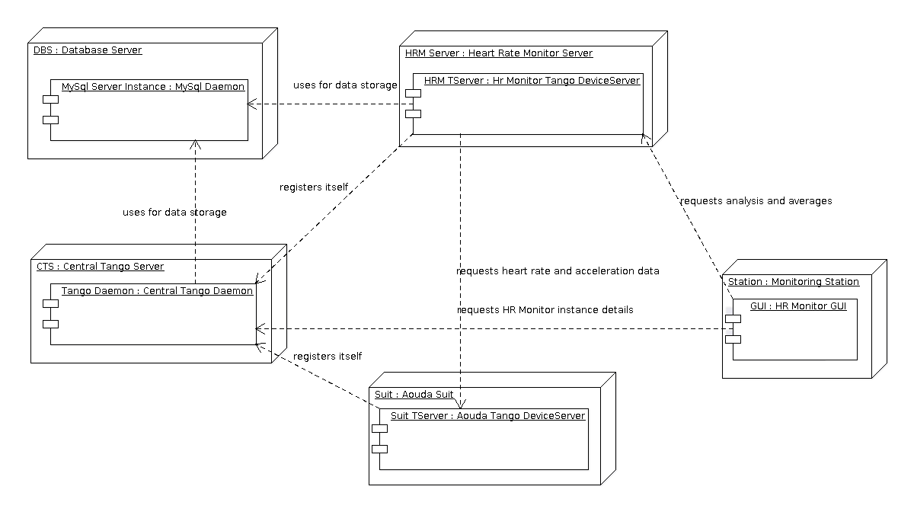
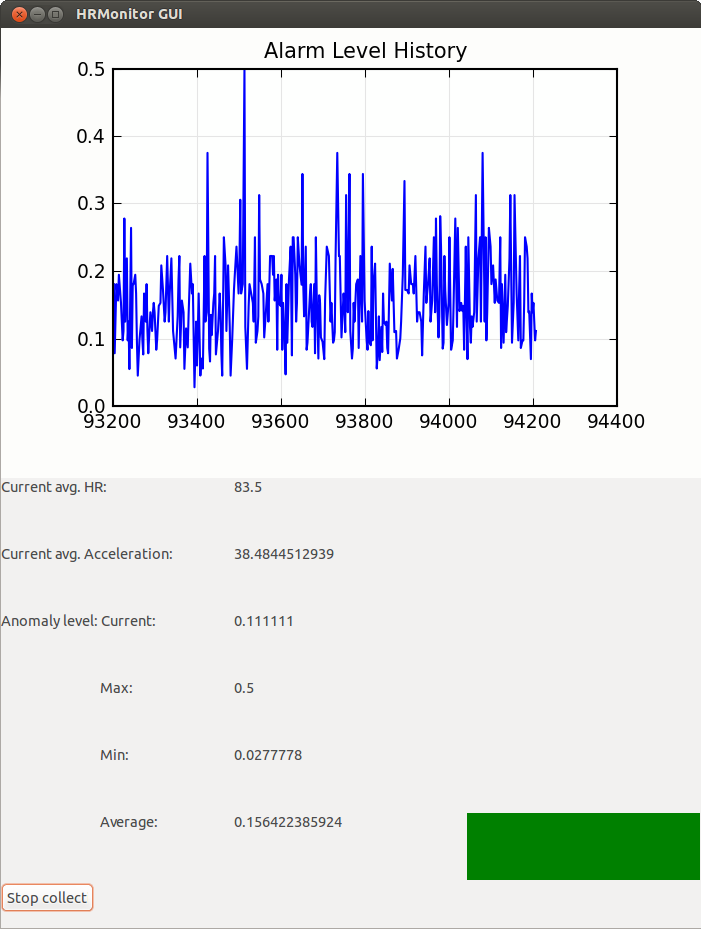
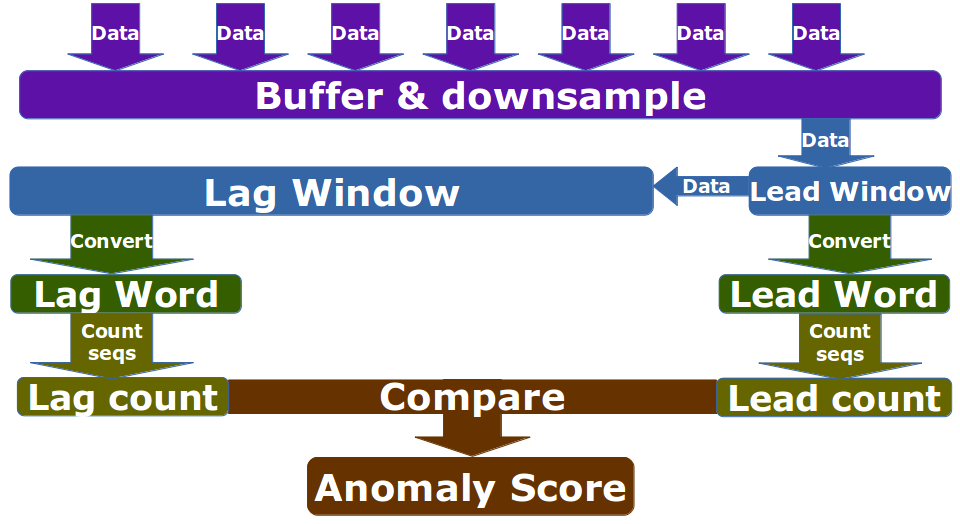

.. sectnum:: :start: 1

=======================================================
Heart Rate Monitor Software User and Maintenance Manual
=======================================================

:Author: Mario Tambos

.. contents:: :local:

Change Record
=============

2013.09.11 - Document created.

2013.09.17 - Update format with user manual template and corresponding content.

Introduction
============

Purpose
-------

This document describes the installation, use and maintenance of the Heart Rate
Monitor.

Applicable Documents
--------------------

- [1] -- `C3 Prototype document v.4`_
- [2] -- `PAMAP2 Physical Activity Monitoring`_
- [3] -- `Software Engineering Practices Guidelines for the ERAS Project`_
- [4] -- `ERAS 2013 GSoC Strategic Plan`_
- [5] -- `Software Requirements Specification for the Heart Rate Monitor`_
- [6] -- `Software Design Study for the Heart Rate Monitor`_
- [7] -- `TANGO distributed control system`_
- [8] -- `PyTANGO - Python bindings for TANGO`_
- [9] -- `Tango Setup`_
- [10] -- `wxPython Installation`_
- [11] -- `Adding a new Server in Tango`_
- [12] -- Wei, Li, et al. "Assumption-Free Anomaly Detection in Time Series." SSDBM. Vol. 5. 2005. APA

.. _`C3 Prototype document v.4`: <http://www.erasproject.org/index.php?option=com_joomdoc&view=documents&path=C3+Subsystem/ERAS-C3Prototype_v4.pdf&Itemid=148>
.. _`PAMAP2 Physical Activity Monitoring`: <http://archive.ics.uci.edu/ml/datasets/PAMAP2+Physical+Activity+Monitoring>
.. _`Software Engineering Practices Guidelines for the ERAS Project`: <https://eras.readthedocs.org/en/latest/doc/guidelines.html>
.. _`ERAS 2013 GSoC Strategic Plan`: <https://bitbucket.org/italianmarssociety/eras/wiki/Google%20Summer%20of%20Code%202013>
.. _`Software Requirements Specification for the Heart Rate Monitor`: <https://eras.readthedocs.org/en/latest/servers/hr_monitor/doc/swrs.html>
.. _`Software Design Study for the Heart Rate Monitor`: <https://eras.readthedocs.org/en/latest/servers/hr_monitor/doc/swds.html>
.. _`TANGO distributed control system`: <http://www.tango-controls.org/>
.. _`PyTANGO - Python bindings for TANGO`: <http://www.tango-controls.org/static/PyTango/latest/doc/html/index.html>
.. _`Tango Setup`: https://eras.readthedocs.org/en/latest/doc/setup.html
.. _`wxPython Installation`: http://wiki.wxpython.org/InstallingOnUbuntuOrDebian
.. _`Adding a new Server in Tango`: https://eras.readthedocs.org/en/latest/doc/setup.html#adding-a-new-server-in-tango

Glossary
--------

.. glossary::

    ``AD``
        Anomaly Detection

    ``API``
        Application Programming Interface

    ``ERAS``
        European Mars Analog Station

    ``GUI``
        Graphic User Interface

    ``HRM``
        Heart Rate Monitor

    ``IMS``
        Italian Mars Society

    ``TBC``
        To Be Confirmed

    ``TBD``
        To Be Defined

Overview
========

Hardware Architecture
---------------------

The different hardware components that need to be taken into account are
shown in the Deployment Diagram below.
As done at the moment all software components can be run in a single computer,
they can however also be run each in a different machine.
One key assumption is that one instance of the :term:`HRM`
will monitor one single Suit. In other words, one instance of the :term:`HRM`
is needed for each crew member during EVA.
This instances can be hosted in the same computer or in different ones, they
can also use different MySql instances or the same one. The only caveat is
that in the later case (shared MySql server instance), different databases
MUST be used.

Software Architecture
---------------------

The components involved can be divided in five categories:
   #. The central Tango Daemon:
      It keeps track of the existing Tango Device Servers. For details refer
      to [7] and [8].
   #. The MySql Server instance (or instances):
      At least one is used by the Tango Daemon. The :term:`HRM` also needs
      an instance, that can be the same one used by the Tango Daemon.
      Each instance of the :term:`HRM` needs a different database to store
      its data, that means having one database on one MySql Server instance
      for each :term:`HRM` instance, or using the same MySql Server instance
      for all :term:`HRM` instances, but creating and configuring different
      databases. For details see the `Installation Guide`_
   #. The Aouda Suit Device Server:
      Currently this component only simmulates the Suit taking data from one
      of the datasets in [2]. Provides data to the :term:`HRM`.
   #. The Heart Rate Monitor Device Server:
      The core of the project.
   #. The Heart Rate Monitor Graphic User Interface:
      Just a proof of concept at the moment. It allow the user to see some
      statistics provided by the :term:`HRM`. As it is, the :term:`GUI`
      can only connect to a single :term:`HRM` instance at a time, so one
      needs to start as many :term:`GUI`s as :term:`HRM` instances one wants
      to oversee.

Deployment Diagram
------------------

Installation Guide
==================

Prerequisites
-------------

* Python 2.7
* Tango Controls v7.2.2
* MySql Server
* Python modules:
   * numpy
   * scipy
   * pandas
   * matplotlib
   * PyTango v7.2.2
   * sqlalchemy
   * wxpython
   * wxmplot

Installing Prerequisites in Ubuntu System
~~~~~~~~~~~~~~~~~~~~~~~~~~~~~~~~~~~~~~~~~

Python 2.7
++++++++++

Python 2.7 comes pre-installed, but just in case you can install it with:

::

   sudo apt-get install python2.7

Tango Controls v7.2.2, PyTango and MySql
++++++++++++++++++++++++++++++++++++++++

You can install these three components following the `Tango Setup`_ guide.

Besides that, the HR Monitor just needs the MySql-Python connector:

::

   sudo apt-get install python-mysqldb

The first line will open the MySql console, the second will create the database
and the third will show you the existing database, to confirm everythong is OK.

Numpy, Scipy, Pandas and Matplotlib
+++++++++++++++++++++++++++++++++++

Since these three modules rely on C libraries, it's recommended to install
them using apt-get instead of easy_install/pip.
They should have been installed during the PyTango installation, but if not:

::

   sudo apt-get install python-numpy python-scipy python-matplotlib
   sudo pip install pandas

SqlAlchemy
++++++++++

You can install it from PyPi with:

::

   sudo apt-get install python-pip
   sudo pip install SQLAlchemy

wxPython and wxmplot
++++++++++++++++++++

You can install wxPython following the `wxPython Installation`_ guide.

To install wxmplot just open a Terminal and write:

::

   sudo easy_install -U wxmplot

Heart Rate Monitor Installation
-------------------------------

First you need to download the latest version of the software from :term:`TBD`.
The file contains, bar the prerequisites, all needed to run the :term:`HRM`,
the Aouda Server, including the simmulated data,
and the :term:`HRM` :term:`GUI`.
Once decompressed you need to (all paths are relative to the archive's root):

   #. Create a database for each :term:`HRM` you want to run:
      You can do this by opening a shell in the computer you have
      your MySql Server instance running and typing the following
      for each instance, which will create a database and show
      the list of databases for confirmation.
      ::

         mysql -u [user] -p[password]
         > create database [HRM instance name];
         > show databases;

   #. Configure each :term:`HRM` instance
      Now you need to configure each :term:`HRM` instance's connection string.
      To do it open each instance's configuration file (**src/hr_monitor.cfg**)
      and modify the *conn_str* variable as needed. A sample connection string
      is provided with the configuration file.
   #. Register both the Aouda and HR Monitor Tango Servers:
      To do it, just follow `Adding a new Server in Tango`_.
      In both cases the class name is 'PyDsExp', without quotation marks.
   #. Configure Aouda Server's Tango Device Name in each :term:`HRM`'s
      configuration file (**src/hr_monitor.cfg**); the variable you need
      to modify is *aouda_address*.
   #. Configure the :term:`HRM`'s Tango Device Name in the GUI configuration
      file (**src/gui/hr_monitor_gui.cfg**); the variable you need to modify is
      *monitor_address*.

Once all this is done, all is in place to start running the programs.

User Manual
===========

Application Start-up
--------------------

In the following we will assume a single instance of the :term:`HRM`,
Aouda Device Server and :term:`HRM` :term:`GUI`. For more instances just
repeat the steps for each instance.

First of all, you'll have to run the Aouda Tango Server. This server will
simmulate the Aouda Suit, making data available for the :term:`HRM`
instance to consume. To do this, just open a Terminal and type:

::

   cd /path/to/hr_monitor/src
   python aouda [instance name]

Once done, you can start the :term:`HRM` itself with:

::

   python hr_monitor [instance name]

The simmulation has data available for only 45 minutes. After that the Aouda
Server will shut down, so you'll need to start it up again.

Now if you want to see the alarm levels, you can do it by starting
the :term:`HRM` :term:`GUI`.
To do it type the following in a Terminal:

::

   export TANGO_HOST=[IP:Port of the Tango central server]
   cd /path/to/hr_monitor/src/gui
   python app.py

To start collecting data from the :term:`HRM` instance, press the
"Collect data" button.

Application Shut-down
---------------------

The :term:`HRM` :term:`GUI` can be shut down with its window's
close button (x). Both :term:`HRM` and Aouda Device Server must be shut down
with the key combination *Ctrl+C*. There's a pending bug that causes the
:term:`HRM` to need two presses of *Ctrl+C*.

GUIs
----

The :term:`HRM` :term:`GUI` is shown in the following image:

The top panel provides a history of the alarm level values.
The left panel shows different statistics over those values as also over
the heart rate and acceleration values.
The right panel shows during operation a color-coded severity of the latest
alarms; green for low, yelow for medium and red for high severity.
You can adjust the thresholds for the colors from the configuration file
(**src/gui/hr_monitor_gui.cfg**), the variables you need to modify are
*yellow_alrm_thrsh* and *red_alrm_thrsh*.
From the same configuration file you can also configure how often the
:term:`HRM` :term:`GUI` must poll its associated :term:`HRM` instance,
by modifying the *sleep_time* variable, in seconds.

Maintenance Manual
==================

For maintenance purposes it is higly recomended to first read [5] and [6].

Internals
---------

In short the anomaly detection progresses in the following steps:
   #. We combine heart rate and acceleration into a single feature:
      *HA = [heart rate]/[acceleration's magnitude]*
      Therefore our anomalies will be marked with a HA value very close to 0
      or very big, when the heart is beating too slow/quickly.
   #. We downsample to *[resolution]* seconds. So datapoints occurring at
      a higher frequency become a single one (their mean).
      It bears mentioning that by doing this we are not losing
      a lot of information.
   #. Then we follow [12]:

      #. Divide data into a lead window (current situation) of size
         *[word_size] * [window_factor] * [lead_window_factor]*,
         which collects the new datapoints, and a lag window (historical trend)
         of size
         *[word_size] * [window_factor] * [lag_window_factor]*,
         which collects the data overflowed from the lead window.
      #. Convert each window into a single
         *[word_size] * [window_factor]*
         length word, using a four char alphabet (using SAX algorithm).
      #. Count the 2 char combination's frequencies.
      #. Use as anomaly score the differences in the counts between the lead
         and lag window's words.

A schematic diagram of the preceding steps is shown in the following figure:

The *[variables]* are explained in some better detail in the
`Additional Configuration`_ section.

Application Program Interface (API)
-----------------------------------

The :term:`HRM` :term:`GUI` does not have any programmable interface.
The Aouda Device Server publishes one Tango Command and two Tango Attributes:

   #. DevVarDoubleStringA get_data(DevLong period):
      Returns an array with all datapoints from last query untilthe current
      date and time.
      The format is:
      [
      [hr1, acc_x1, acc_y1, acc_z1,
       hr2, acc_x2, acc_y2, acc_z2,
       ...
       hrN, acc_xN, acc_yN, acc_zN],
      [timestamp1, timestamp1, timestamp1, timestamp1,
       timestamp2, timestamp2, timestamp2, timestamp2,
       ...
       timestampN, timestampN, timestampN, timestampN],
      ]
   #. DevFloat heart_rate - scalar, read-only:
      Returns the instantaneous heart rate. The underlying device's
      sampling frequency is 9Hz.
   #. DevFloat acc_magn (scalar, read-only):
      Returns the instantaneous acceleration vector's magnitude.
      The underlying device is an accelerometer placed on the torso,
      with a +-16g range, 13 bit precission and 100Hz sampling frequency.

The :term:`HRM` publishes four Tango Commands:

   #. DevVoid register_datapoint(DevVarDoubleArray datapoint):
      Registers a new datapoint in the database and launches a new thread to
      analyze the data collected so far.
      datapoint must have the format [timestamp, hr, acc_x, acc_y, acc_z].
   #. DevFloat get_avg_hr(DevLong period):
      Returns average heart rate over the given [period] (in seconds).
   #. DevFloat get_avg_acc(DevLong period)
      Returns average acceleration over the given [period] (in seconds).
   #. DevVarDoubleStringArray get_current_alarms(DevLong period):
      Returns the alarm scores generated in the last [period] seconds.
      The return value format is
      [[alarm_lvl1, ..., alarm_lvlN], [timestamp1, ..., timestampN]]

Additionally, uppon start up the :term:`HRM` launches a thread that polls the
Aouda Server periodically, and then calls the register_datapoint method to
store the data returned. You can adjust the polling period by changing the
*polling_frequency* variable from the configuration file
(**src/hr_monitor.cfg**), in seconds.

Additional Configuration
------------------------

The :term:`HRM`'s configuration file (**src/hr_monitor.cfg**) exposes, aside
the values explained above, the following variables:

   #. [Detector]:

      #. word_size:
         It affects the length of features used to detect anomalies.
      #. window_factor:
         Also affects the length of the features, each feature comprises
         window_factor * word_size datapoints.
      #. lead_window_factor
         Affects the length of the lead window, which consists of
         window_factor * word_size datapoints *lead_window_factor datapoints.
      #. lag_window_factor
         Affects the length of the lag window, which consists of
         window_factor * word_size datapoints *lag_window_factor datapoints.
   #. [Monitor]:

      #. resolution:
         In milliseconds, it affects the data's sample frequency
         to be considered. If finer grained data is available it is
         down sampled to [resolution] ms frequency.

To better understand what the different variables mean, please refer to
the `Internals`_ section.
All of the above are set with values that should provide good analysis
results.
However, as this is a highly experimental field, you should feel free to
experiment with them in order to make the most of this tool.

Troubleshooting
===============

Since this is the first version of the product, it is difficult to foresee
what problems could be encountered during the execution of the project's
components.
The previous guides have been written trying to forestall any difficulties
during the initial set up and running.
If you happen to encounter problems, first please double check that
all prerequisites are met, and that you follow to the letter all instructions;
in the ideal case starting with a fresh installation.
Were the problem not resolved, or were you left with unaswered questions,
please don't hessitate to contact us.

