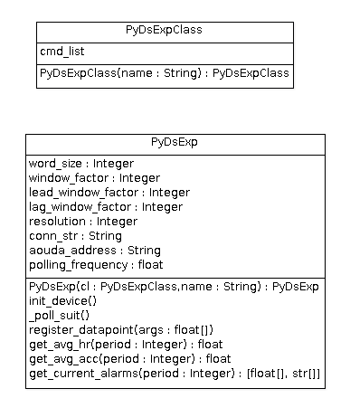
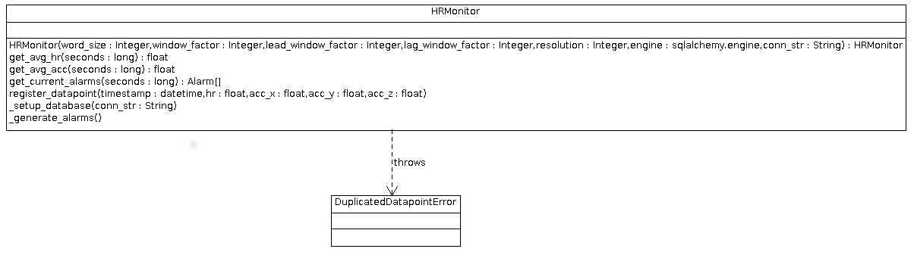
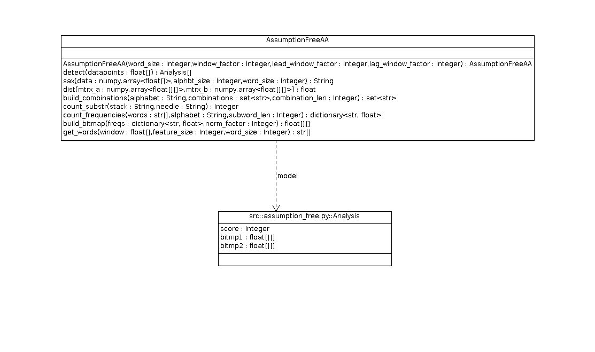
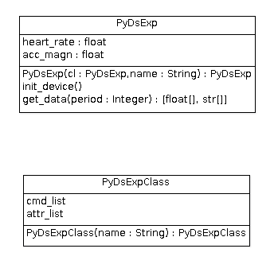
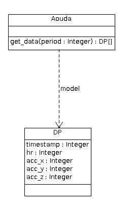
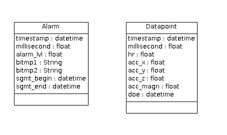

.. sectnum:: :start: 3

================================================
Software Design Study for the Heart Rate Monitor
================================================

:Author: Mario Tambos

.. contents:: :local:

Change Record
=============

2013.06.28 - Document created.

2013.09.18 - Updated to reflect current design. Some formatting changes.

Introduction
============

Scope
-----

This document describes the top level requirements for the Heart Rate Monitor
module, which in turn is part of the Crew Mission Assistant system.

Applicable Documents
--------------------

- [1] -- `C3 Prototype document v.4`_
- [2] -- `PAMAP2 Physical Activity Monitoring`_
- [3] -- `Software Engineering Practices Guidelines for the ERAS Project`_
- [4] -- `ERAS 2013 GSoC Strategic Plan`_
- [5] -- `Software Requirements Specification for the Heart Rate Monitor`_
- [6] -- `TANGO distributed control system`_
- [7] -- `PyTANGO - Python bindings for TANGO`_
- [8] -- A. Reiss and D. Stricker. Introducing a New Benchmarked Dataset for Activity Monitoring. The 16th IEEE International Symposium on Wearable Computers (ISWC), 2012.
- [9] -- A. Reiss and D. Stricker. Creating and Benchmarking a New Dataset for Physical Activity Monitoring. The 5th Workshop on Affect and Behaviour Related Assistance (ABRA), 2012.
- [10] -- Wei, Li, et al. "Assumption-Free Anomaly Detection in Time Series." SSDBM. Vol. 5. 2005. APA

.. _`C3 Prototype document v.4`: <http://www.erasproject.org/index.php?option=com_joomdoc&view=documents&path=C3+Subsystem/ERAS-C3Prototype_v4.pdf&Itemid=148>
.. _`PAMAP2 Physical Activity Monitoring`: <http://archive.ics.uci.edu/ml/datasets/PAMAP2+Physical+Activity+Monitoring>
.. _`Software Engineering Practices Guidelines for the ERAS Project`: <https://eras.readthedocs.org/en/latest/doc/guidelines.html>
.. _`ERAS 2013 GSoC Strategic Plan`: <https://bitbucket.org/italianmarssociety/eras/wiki/Google%20Summer%20of%20Code%202013>
.. _`Software Requirements Specification for the Heart Rate Monitor`: <https://eras.readthedocs.org/en/latest/servers/hr_monitor/doc/swrs.html>
.. _`TANGO distributed control system`: <http://www.tango-controls.org/>
.. _`PyTANGO - Python bindings for TANGO`: <http://www.tango-controls.org/static/PyTango/latest/doc/html/index.html>

Glossary
--------

.. glossary::

    ``AD``
        Anomaly Detection

    ``API``
        Application Programming Interface

    ``ERAS``
        European Mars Analog Station

    ``IMS``
        Italian Mars Society

    ``HRM``
        Heart Rate Monitor

    ``TBC``
        To Be Confirmed

    ``TBD``
        To Be Defined

Design Considerations
=====================

As stated in [5], the approach to the problem of monitoring the crew's
heart rate,is to use :term:`AD` techniques. Said techniques are however
not unique; nor has a priori search for heart rate :term:`AD` returned
any directly applicable results.
Therefore several other methods were investigated. After several tests,
using data from [2] (see also [8] and [9]), and analysis of their results,
the method described in [10] was selected.
The objective of the design was nevertheless to encapsulate the
anomaly detector itself in a single class, so it can both be used elsewere
if necessary and be replaced if some better method is discovered.

Assumptions and dependencies
----------------------------

The :term:`HRM` is to be programmed as a TANGO server, in the Python language.
As such its primary dependencies are:

* The Python language.
* The TANGO distributed control system (see [6]).
* The PyTango bindings (see [7]).
* NumPy and Pandas, respectively a scientific computation and a data analysis
  library for Python, to perform the
  :term:`AD` on the data.
* SqlAlchemy, a ORM for Python.

General Constraints
-------------------

* Guidelines defined in [3].
* Requirements described in [5].

Objectives
----------

* Provide some meaningful measure of the anormality level of a sequence of
  heart rate and acceleration readings, with respect to historic readings.
* Provide some measure of fault tolerance in the face of sensor errors.
* Keep the modules simple and easy to maintain.

Software Architecture
=====================

The :term:`HRM` will be divided into two main modules:
a TANGO Server, named HRMonitor, and an Anomaly Detector,
named AssumptionFreeAA.

In order to test the :term:`HRM` -- and avoid the current problems with the
Aouda.X suit -- an additional TANGO Server will be built, named Aouda,
from which the HRMonitor will get the simulated heart rate
and accelerometer data (in turn taken from [2] (see also [8] and [9])).

Use case and sequence diagrams showing the hig level interactions
between the modules can be seen in section 2.6. of [5].

Software Design
===============

A high level class diagram outlining the components can be seen below.

.. image:: images/CLSHighLevel.png

hr_monitor
----------

Classification
~~~~~~~~~~~~~~

Package, Class, Tango's DeviceServer implementation.

Responsibilities
~~~~~~~~~~~~~~~~

Is in charge of interacting with the Aouda Server, implementing all
necessary interfaces to integrate itself with the rest of the C3 Prototype and
acquiring the heart rate and accelerometer data.
It does not make any computation by itself, it only acts as a proxy between
the external world and the `hr_monitor.py`_.

Constraints
~~~~~~~~~~~

Retrieves data from `aouda`_ with format:

::

   [
         [hr1, acc_x1, acc_y1, acc_z1,
          hr2, acc_x2, acc_y2, acc_z2,
          ...
          hrN, acc_xN, acc_yN, acc_zN],
         [timestamp1, timestamp1, timestamp1, timestamp1,
          timestamp2, timestamp2, timestamp2, timestamp2,
          ...
          timestampN, timestampN, timestampN, timestampN],
   ]

Returns alarms data with format:

::

   [[alarm_lvl1, ..., alarm_lvlN], [timestamp1, ..., timestampN]]

Composition
~~~~~~~~~~~

The package's subcomponents are described below:

* PyDsExpClass
   * Type: class.
   * Function: defines DeviceServer's attributes and commands.
* PyDsExp
   * Type: class.
   * Function: implements interface defined in PyDsExpClass.

Uses/Interactions
~~~~~~~~~~~~~~~~~

* `hr_monitor.py`_: *hr_monitor* forwards its requests to this package
  for processing.
* `aouda`_: *hr_monitor* requests the suits' data from this package.

hr_monitor.py
-------------

Classification
~~~~~~~~~~~~~~

Package.

Responsibilities
~~~~~~~~~~~~~~~~

Interacts with data storage and `assumption_free.py`_.

Constraints
~~~~~~~~~~~

The response times should be keept in all cases at a minimum to avoid timeouts.
As minimum we will consider here the timeout time of Tango
synchronous requests.

Composition
~~~~~~~~~~~

The package's subcomponents are described below:

* HRMonitor
   * Type: class.
   * Function: takes charge of package's responsibilities.

Uses/Interactions
~~~~~~~~~~~~~~~~~

* `data_model.py`_: *hr_monitor.py* uses it to model the data, both suit's
  heart rate and acceleration redings and anomaly analysis results,
  and store it in a database.
* `assumption_free.py`_: *hr_monitor.py* sends to it newly acquired data
  for analysis and receives back the analysis results.
* `hr_monitor`_: *hr_monitor.py* receives from it forwarded requests and
  newly acquired data.

assumption_free.py
------------------

Classification
~~~~~~~~~~~~~~

Package.

Responsibilities
~~~~~~~~~~~~~~~~

Is in charge of applying the method described in [10] to the data provided by
`hr_monitor.py`_.

Constraints
~~~~~~~~~~~

* Each datapoint is a single dimensional vector.
* The analysis should contain both an anomaly score and its timestamp.

Composition
~~~~~~~~~~~

The package's subcomponents are described below:

* AssumptionFreeAA
   * Type: class.
   * Function: takes charge of package's responsibilities.
* AssumptionFreeAA.Analysis
   * Type: named tuple.
   * Function: encapsulates the analysis result.

Uses/Interactions
~~~~~~~~~~~~~~~~~

* `hr_monitor.py`_: *assumption_free.py* receives from it newly acquired data
  for analysis and sends back the analysis results.

aouda
-----

Classification
~~~~~~~~~~~~~~

Package, Class, Tango's DeviceServer implementation.

Responsibilities
~~~~~~~~~~~~~~~~

Is in charge of simmulating data generated by the Aouda Suit and
implementing all necessary interfaces to integrate itself with the rest of the
C3 Prototype.
It does not make any computation by itself, it only acts as a proxy between
the external world and the `aouda.py`_.

Constraints
~~~~~~~~~~~

Returns heart rate and acceleration data with format:

::

   [
         [hr1, acc_x1, acc_y1, acc_z1,
          hr2, acc_x2, acc_y2, acc_z2,
          ...
          hrN, acc_xN, acc_yN, acc_zN],
         [timestamp1, timestamp1, timestamp1, timestamp1,
          timestamp2, timestamp2, timestamp2, timestamp2,
          ...
          timestampN, timestampN, timestampN, timestampN],
   ]

Composition
~~~~~~~~~~~

The package's subcomponents are described below:

* PyDsExpClass
   * Type: class.
   * Function: defines DeviceServer's attributes and commands.
* PyDsExp
   * Type: class.
   * Function: implements interface defined in PyDsExpClass.

Uses/Interactions
~~~~~~~~~~~~~~~~~

* `hr_monitor`_: *aouda* receives requests for the suits' data from it.
* `aouda.py`_: *aouda* forwards its requests to this package for processing.

aouda.py
--------

Classification
~~~~~~~~~~~~~~

Package.

Responsibilities
~~~~~~~~~~~~~~~~

Is in charge of simulating the heart rate and accelerometer data generation
of the Aouda.X suit.

Constraints
~~~~~~~~~~~

The response times should be keept in all cases at a minimum to avoid timeouts.
As minimum we will consider here the timeout time of Tango
synchronous requests.

Composition
~~~~~~~~~~~

The package's subcomponents are described below:

* Aouda
   * Type: class.
   * Function: takes charge of package's responsibilities.
* Aouda.DP
   * Type: named tuple.
   * Function: encapsulates the heart rate and acceleration data.

Uses/Interactions
~~~~~~~~~~~~~~~~~

* `aouda`_: *aouda.py* receives from it forwarded requests for simmulated data.

data_model.py
-------------

Classification
~~~~~~~~~~~~~~

Package.

Responsibilities
~~~~~~~~~~~~~~~~

Is in charge of modeling the hear rate, acceleration and anomaly analysis data,
and of managing its storage.

Constraints
~~~~~~~~~~~

None.

Composition
~~~~~~~~~~~

The package's subcomponents are described below:

* Datapoint
   * Type: class.
   * Function: models a heart rate-acceleration datapoint.
* Alarm
   * Type: class.
   * Function: models a single anomaly analysis result.

Uses/Interactions
~~~~~~~~~~~~~~~~~

* `hr_monitor.py`_: *data_model.py* provides to it the classes necessary to
  model the data used.

