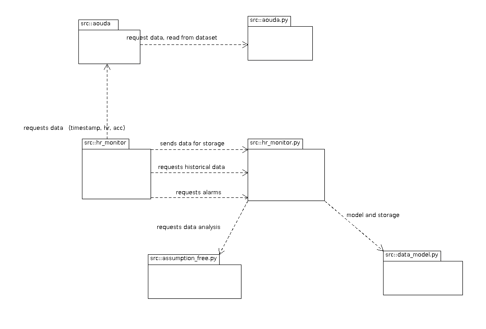
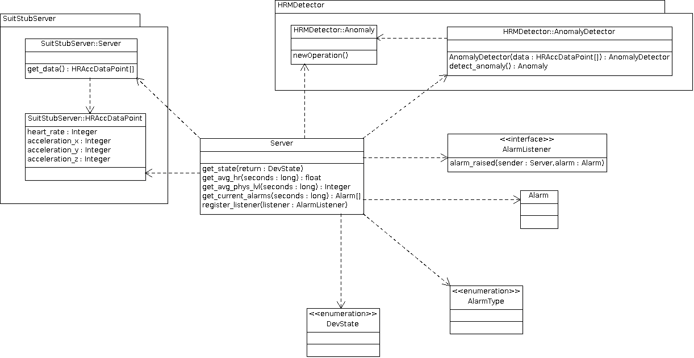
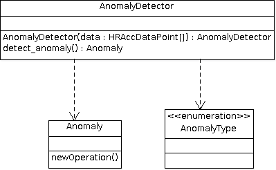
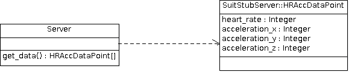

================================================
Software Design Study for the Heart Rate Monitor
================================================

:Author: Mario Tambos

1. Change Record
================

2013.06.28 - Document created.

2. Introduction
===============

2.1. Scope
----------

This document describes the top level requirements for the Heart Rate Monitor
module, which in turn is part of the Crew Mission Assistant system.

2.2. Applicable Documents
-------------------------

- [1] -- `C3 Prototype document v.4`_
- [2] -- `PAMAP2 Physical Activity Monitoring`_
- [3] -- `Software Engineering Practices Guidelines for the ERAS Project`_
- [4] -- `ERAS 2013 GSoC Strategic Plan`_
- [5] -- `Software Requirements Specification for the Heart Rate Monitor`_
- [6] -- `TANGO distributed control system`_
- [7] -- `PyTANGO - Python bindings for TANGO`_
- [8] -- `F1 score`_
- [9] -- A. Reiss and D. Stricker. Introducing a New Benchmarked Dataset for Activity Monitoring. The 16th IEEE International Symposium on Wearable Computers (ISWC), 2012.
- [10] -- A. Reiss and D. Stricker. Creating and Benchmarking a New Dataset for Physical Activity Monitoring. The 5th Workshop on Affect and Behaviour Related Assistance (ABRA), 2012.

.. _`C3 Prototype document v.4`: <http://www.erasproject.org/index.php?option=com_joomdoc&view=documents&path=C3+Subsystem/ERAS-C3Prototype_v4.pdf&Itemid=148>
.. _`PAMAP2 Physical Activity Monitoring`: <http://archive.ics.uci.edu/ml/datasets/PAMAP2+Physical+Activity+Monitoring>
.. _`Software Engineering Practices Guidelines for the ERAS Project`: <https://eras.readthedocs.org/en/latest/doc/guidelines.html>
.. _`ERAS 2013 GSoC Strategic Plan`: <https://bitbucket.org/italianmarssociety/eras/wiki/Google%20Summer%20of%20Code%202013>
.. _`Software Requirements Specification for the Heart Rate Monitor`: <https://eras.readthedocs.org/en/latest/servers/hr_monitor/doc/swrs.html>
.. _`TANGO distributed control system`: <http://www.tango-controls.org/>
.. _`PyTANGO - Python bindings for TANGO`: <http://www.tango-controls.org/static/PyTango/latest/doc/html/index.html>
.. _`F1 score`: <http://en.wikipedia.org/wiki/F1_score>

2.3. Glossary
-------------

.. glossary::

    ``AD``
        Anomaly Detection

    ``API``
        Application Programming Interface

    ``ERAS``
        European Mars Analog Station

    ``IMS``
        Italian Mars Society

    ``HRM``
        Heart Rate Monitor

    ``TBC``
        To Be Confirmed

    ``TBD``
        To Be Defined

3. Design Considerations
========================

As stated in [5], the approach to the problem of monitoring the crew's
heart rate,is to use :term:`AD` techniques. Said techniques are however
not unique; nor has a priori search for heart rate :term:`AD` returned
any directly applicable results.
Therefore I deem necessary to investigate the available algorithms in the area
of :term:`AD` in general, and make experiments to determine which one is more
appropriate for the problem at hand. Those experiments are to be performed
using [2] (see also [9] and [10]).
That said, at this moment **it is possible** to design the :term:`HRM`
in a way that will leave the anomaly detector itself encapsulated,
so it is easy to stub it or switch it for a better one if necessary.

3.1. Assumptions and dependencies
---------------------------------

The :term:`HRM` is to be programmed as a TANGO server, in the Python language.
As such its primary dependencies are:

* The Python language.
* The TANGO distributed control system (see [6]).
* The PyTango bindings (see [7]).
* Eventually a Machine Learning library with a Python API
  to perform the :term:`AD` on the data.

3.2. General Constraints
------------------------

* Guidelines defined in [3].
* Requirements described in [5].

3.4. Objectives
---------------

* Achieve high precision and recall scores;
  measured using the F1-score (see [8]).
* Provide some measure of fault tolerance in the face of sensor errors.
* Keep the modules simple and easy to maintain.

4. Software Architecture
========================

The :term:`HRM` will be divided into two main modules:
a TANGO Server, named HRMServer, and an Anomaly Detector, named HRMDetector.

**BEGIN: the following is :term:`TBC`**

In order to test the :term:`HRM` -- and avoid the current problems with the
Aouda.X suit -- an additional TANGO Server will be built, named SuitStubServer,
from which the HRMServer will get the simulated heart rate
and accelerometer data (in turn taken from [2] (see also [9] and [10])).

A fourth and final component, named TestRunner, will automate the testing
process by running both HRMServer and SuitStubServer and checking the results
against a fixed test data set.

**END**

Use case and sequence diagrams showing the hig level interactions
between the modules can be seen in section 6. of [5].

5. Software Design
==================

A high level class diagram outlining the components can be seen below.

5.1. Unit HRMServer
-------------------

5.1.1. Classification
---------------------

Package.

5.1.2. Responsibilities
-----------------------

The HRMServer is in charge of interacting with the Framework Software Bus,
implementing all the necessary interfaces to integrate itself with the rest of
the C4 Prototype, acquiring the heart rate and accelerometer data,
and overseeing the operation of the HRMDetector.

5.1.3. Constraints
------------------

The exact format of the heart rate, accelerometer data and alarms
is yet :term:`TBD`.

5.1.4. Composition
------------------

The package's subcomponents are described below:

* DevState
    * Type: enumeration
    * Function: describes the server's state.
* Alarm (:term:`TBD`)
    * Type: class.
    * Function: encapsulates the alarm's information.
* AlarmType (:term:`TBC`)
    * Type: enumeration.
    * Function: describes the type of the alarm.
* AlarmListener
    * Type: interface
    * Function: describes methods that a listener must implement in order to
      listen for alarm events.
* Server
    * Type: class.
    * Function: takes charge of package's responsibilities.

5.1.5. Uses/Interactions
------------------------

Besides its internal members, the package interacts with the packages
HRMDetector and SuitStubServer (see both units for clarification).

5.2. Unit HRMDetector
---------------------

5.2.1. Classification
---------------------

Package.

5.2.2. Responsibilities
-----------------------

The HRMDetector is in charge of storing the heart rate
and accelerometer data, building an statistical model over said data,
and of evaluating whether any new data point is anomalous.

5.2.3. Constraints
------------------

The exact format of the heart rate, accelerometer data and alarms
is yet :term:`TBD`.

5.2.4. Composition
------------------

The package's subcomponents are described below:

* Anomaly (:term:`TBD`)
    * Type: class.
    * Function: encapsulates the anomaly's information.
* AnomalyType (:term:`TBC`)
    * Type: enumeration.
    * Function: describes the type of the anomaly.
* AnomalyDetector
    * Type: class.
    * Function: takes charge of package's responsibilities.

5.2.5. Uses/Interactions
------------------------

Besides its internal members, the package interacts with the HRMDetector package
(see both units for clarification).

5.3. Unit SuitStubServer
------------------------

5.3.1. Classification
---------------------

Package.

5.3.2. Responsibilities
-----------------------

The SuitStubServer is in charge of simulating the heart rate and accelerometer
data generation of the Aouda.X suit.

5.3.3. Constraints
------------------

The exact format of the heart rate, accelerometer data and alarms
is yet :term:`TBD`.

5.3.4. Composition
------------------

The package's subcomponents are described below:

* HRAccDataPoint (:term:`TBD`)
    * Type: class.
    * Function: the suit's current heart rate and accelerometer data.
* Server
    * Type: class.
    * Function: takes charge of package's responsibilities.

5.3.5. Uses/Interactions
------------------------

Besides its internal members, the package interacts with the HRMServer package
(see both units for clarification).

5.4. Unit TestRunner
--------------------

5.4.1. Classification
---------------------

Script.

5.4.2. Responsibilities
-----------------------

The TestRunner is in charge of setting up a testing environment to check that
all modules work according to their specifications.

5.4.3. Constraints
------------------

The exact format of the heart rate, accelerometer data and alarms
is yet :term:`TBD`.

5.4.4. Composition
------------------

The TestRunner has a single component.

5.4.5. Uses/Interactions
------------------------

The TestRunner should interact with all packages.
