==============================================================
Software Requirements Specification for the Heart Rate Monitor
==============================================================

:Author: Mario Tambos

1. Change Record
================

2013.06.18 - Document created.

2013.06.26 - Fixed typos and formatting.

2013.06.26 - Removed unused sections.

2013.06.26 - Added Use Cases and Sequence diagrams.

2. Introduction
===============

2.1. Scope
----------

This document describes the top level requirements for the Heart Rate Monitor
module, which in turn is part of the Crew Mission Assistant system.

2.2. Reference Documents
------------------------

- [1]  -- `C3 Prototype document v.4`_
- [2] -- `PAMAP2 Physical Activity Monitoring`_
- [3] -- `Software Engineering Practices Guidelines for the ERAS Project`_
- [4] -- `ERAS 2013 GSoC Strategic Plan`_

.. _`C3 Prototype document v.4`: <http://www.erasproject.org/index.php?option=com_joomdoc&view=documents&path=C3+Subsystem/ERAS-C3Prototype_v4.pdf&Itemid=148>
.. _`PAMAP2 Physical Activity Monitoring`: <http://archive.ics.uci.edu/ml/datasets/PAMAP2+Physical+Activity+Monitoring>
.. _`Software Engineering Practices Guidelines for the ERAS Project`: <https://eras.readthedocs.org/en/latest/doc/guidelines.html>
.. _`ERAS 2013 GSoC Strategic Plan`: <https://bitbucket.org/italianmarssociety/eras/wiki/Google%20Summer%20of%20Code%202013>

2.3. Glossary
-------------

.. glossary::

    ``ERAS``
        European Mars Analog Station

    ``IMS``
        Italian Mars Society

    ``EVA``
        Extra-Vehicular Activity

    ``TBD``
        To Be Defined

    ``TBC``
        To Be confirmed

3. General Description
======================

3.1. Problem Statement
----------------------

Monitoring of the crew's health is a critical part of any mission.
Said monitoring includes, among other things, overseeing the heart rate of the
crew members, in order to take preventive actions
if it takes on abnormal values.
However, this task can prove difficult to accomplish, due to the fact that
a persons heart rate not only hasn't a constant "normal" value,
but also depends on a number of factors, for instance the level of
physical stress that the person endures at the moment.
In [1] it is stated that the current approach to solve this problem
is the use of a Feed-Forward Neural Network to predict the heart rate
from the body acceleration reported by the Aouda.X suit.
This can prove troublesome, given that regression techniques have difficulties
achieving high recall when the training set is skew, as in this case
(there are going to be far more normal than abnormal datapoints).

I believe using Anomaly Detection techniques would prove a more reliable method
of alert for this use, because these techniques are specifically designed
for the purpose, i.e. are not affected by imbalances in the cardinality
of the datapoint classes.

3.2. Functional Description
---------------------------

The goal of this module is to oversee the heart rate and physical activity
of each crew member performing :term:`EVA`, in order to raise alarms
if the reported crew member's heart rate is abnormal for his or her
current physical stress level.

3.3. Constraints
----------------

As described in [1], the available heart rate and accelerometer data from the
Aouda.X suit is too unreliable to be of any use for this module prototype.
Therefore the data found in [2] will be used instead as a way to simulate
a reliable data stream from the suit.

4. Interface Requirements
=========================

4.1. Software Interfaces
------------------------

4.1.1. Communication Interfaces
~~~~~~~~~~~~~~~~~~~~~~~~~~~~~~~

This module will be implemented as a Python TANGO server, which will expose
methods to request the heart rate, level of physical activity and
heart rate alarms, if they exist. Moreover the alarms should be optionally
declared as events, to enable push request from the server to the clients.

5. Development and Test Factors
===============================

5.1. Standards Compliance
-------------------------

The guidelines defined in [3] should be followed.

5.2. Planning
-------------

The schedule is as defined in [4], with deliverables as follows:

- TANGO server that implements the anomaly detector.
- Test environment to help diagnose the server's accuracy.
    - Train and test data sets.
    - Program to run the test suite.
- Documentation.
    - User requirements (this document).
    - Design Study document.
    - Justification for the use of the selected detection method.
    - Test document.
    - User Manual.

6. Use-Cases
============

6.1. Use Case: Request for Server DevState [:term:`TBC`]
--------------------------------------------------------
The Client request the Server its DevState

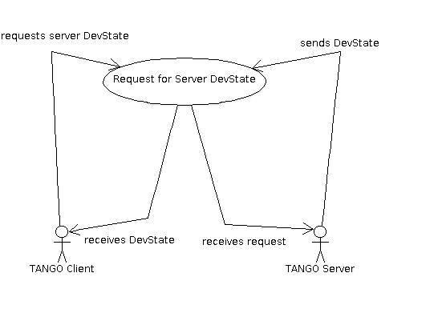

6.1.1. Actors
~~~~~~~~~~~~~
Client: a TANGO client that makes the request.
Server: the Heart Rate Monitor TANGO server.

6.1.2. Priority
~~~~~~~~~~~~~~~
Normal

6.1.3. Preconditions
~~~~~~~~~~~~~~~~~~~~
None

6.1.4. Basic Course
~~~~~~~~~~~~~~~~~~~
1. The Client calls the appropriate method on the Server.
2. The Server answers ON.

6.1.5. Alternate Course
~~~~~~~~~~~~~~~~~~~~~~~
None

6.1.6. Exception Course
~~~~~~~~~~~~~~~~~~~~~~~
1. The Client calls the appropriate method on the Server.
2. The Server notices an inconsistent internal state.
3. The Server answers FAULT.

6.1.7. Postconditions
~~~~~~~~~~~~~~~~~~~~~
None

6.1.8. Sequence diagram
~~~~~~~~~~~~~~~~~~~~~~~
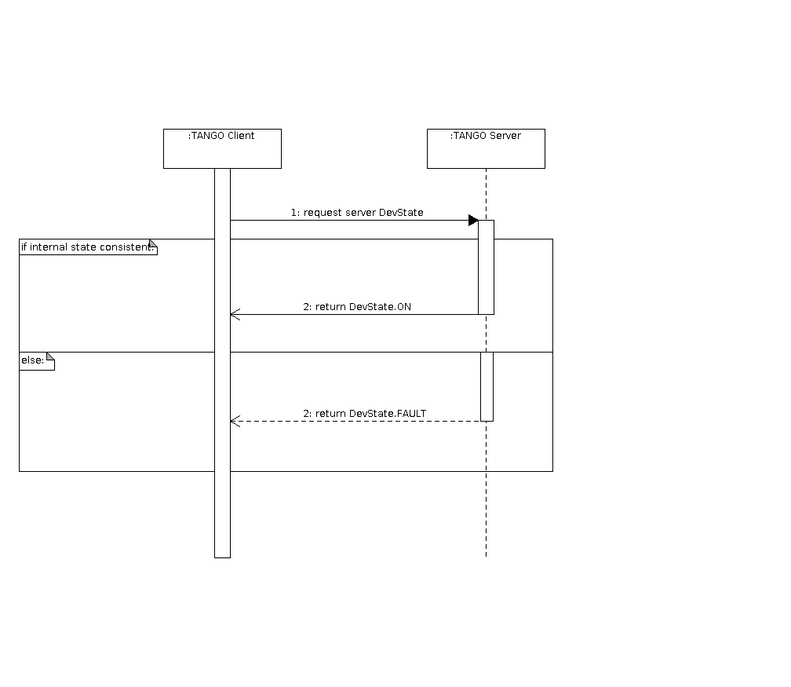

6.2. Use Case: Request for current average Heart Rate
-----------------------------------------------------
The Client request the Server the average Heart Rate
over the last T seconds.

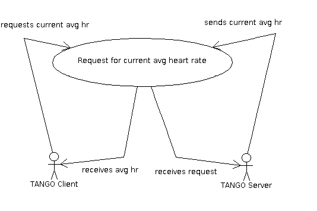

6.2.1. Actors
~~~~~~~~~~~~~
Client: a TANGO client that makes the request.
Server: the Heart Rate Monitor TANGO server.

6.2.2. Priority
~~~~~~~~~~~~~~~
Normal

6.2.3. Preconditions
~~~~~~~~~~~~~~~~~~~~
The Server is running and its DevState is ON.

6.2.4. Basic Course
~~~~~~~~~~~~~~~~~~~
1. The Client calls the appropriate method on the Server, passing T as argument.
2. The Server calculates the average heart rate over the last T seconds.
3. The Server returns the calculated value.

6.2.5. Alternate Course
~~~~~~~~~~~~~~~~~~~~~~~
None

6.2.6. Exception Course
~~~~~~~~~~~~~~~~~~~~~~~
1. The Client calls the appropriate method on the Server, passing T as argument.
2. The Server tries calculates the average heart rate.
3. No data is available.
4. The Server returns an error.

6.2.7. Postconditions
~~~~~~~~~~~~~~~~~~~~~
None

6.2.8. Sequence diagram
~~~~~~~~~~~~~~~~~~~~~~~
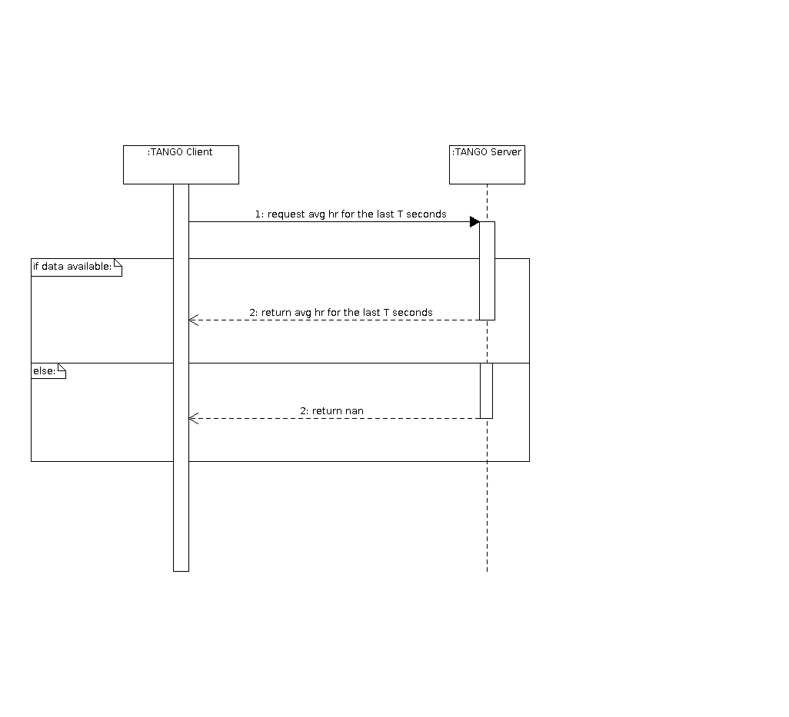

6.3. Use Case: Request for current average level of physical activity
---------------------------------------------------------------------
The Client request the Server the average level of physical activity
over the last T seconds.

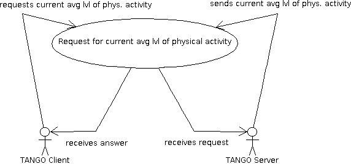

6.3.1. Actors
~~~~~~~~~~~~~
Client: a TANGO client that makes the request.
Server: the Heart Rate Monitor TANGO server.

6.3.2. Priority
~~~~~~~~~~~~~~~
Normal

6.3.3. Preconditions
~~~~~~~~~~~~~~~~~~~~
The Server is running and its DevState is ON.

6.3.4. Basic Course
~~~~~~~~~~~~~~~~~~~
1. The Client calls the appropriate method on the Server, passing T as argument.
2. The Server calculates the average level of physical activity over the
   last T seconds, based on accelerometer data.
3. The Server returns the calculated value.

6.3.5. Alternate Course
~~~~~~~~~~~~~~~~~~~~~~~
None

6.3.6. Exception Course
~~~~~~~~~~~~~~~~~~~~~~~

1. The Client calls the appropriate method on the Server, passing T as argument.
2. The Server tries calculates the average level of physical activity.
3. No data is available.
4. The Server returns an error.

6.3.7. Postconditions
~~~~~~~~~~~~~~~~~~~~~
None

6.3.8. Sequence diagram
~~~~~~~~~~~~~~~~~~~~~~~
.. image:: images/SeqRequestforcurrentavglvlofphysicalactivity.png

6.4. Use Case: Request for current alarms
-----------------------------------------
The Client request the Server the list of alarms raised over
the last T seconds.

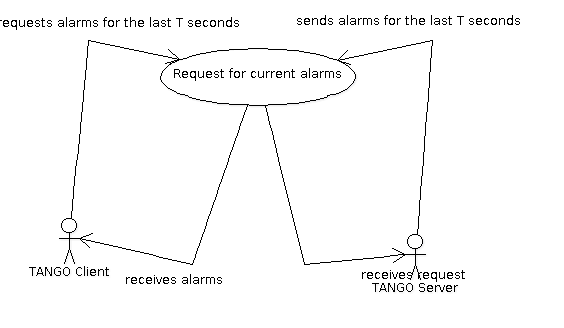

6.4.1. Actors
~~~~~~~~~~~~~
Client: a TANGO client that makes the request.
Server: the Heart Rate Monitor TANGO server.

6.4.2. Priority
~~~~~~~~~~~~~~~
High

6.4.3. Preconditions
~~~~~~~~~~~~~~~~~~~~
The Server is running and its DevState is ON.

6.4.4. Basic Course
~~~~~~~~~~~~~~~~~~~

1. The Client calls the appropriate method on the Server, passing T as argument.
2. The Server returns the list of alarms raised over the last T seconds.

6.4.5. Alternate Course
~~~~~~~~~~~~~~~~~~~~~~~
None

6.4.6. Exception Course
~~~~~~~~~~~~~~~~~~~~~~~
None

6.4.7. Postconditions
~~~~~~~~~~~~~~~~~~~~~
None

6.4.8. Sequence diagram
~~~~~~~~~~~~~~~~~~~~~~~
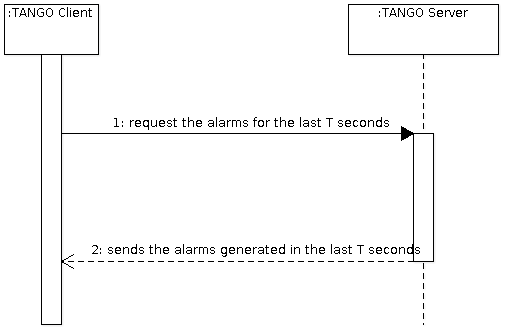

6.5. Use Case: Alarm event raised [:term:`TBC`]
-----------------------------------------------
The Server notices an abnormal ratio of heart rate to level of
physical activity that persists for more than T seconds, and raises an
alarm event to be handled by any client listening to it.

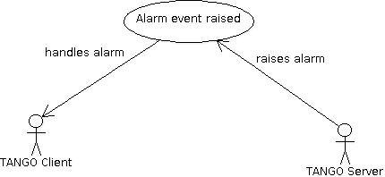

6.5.1. Actors
~~~~~~~~~~~~~
Client: a TANGO client that listens to alarm events.
Server: the Heart Rate Monitor TANGO server.

6.5.2. Priority
~~~~~~~~~~~~~~~
High

6.5.3. Preconditions
~~~~~~~~~~~~~~~~~~~~
The Server is running and its DevState is ON.

6.5.4. Basic Course
~~~~~~~~~~~~~~~~~~~
1. The Server notices an abnormal ratio of heart rate to level of
   physical activity that persists for more than T seconds.
2. The Server raises an alarm event.
3. The Client handles it.

6.5.5. Alternate Course
~~~~~~~~~~~~~~~~~~~~~~~
None

6.5.6. Exception Course
~~~~~~~~~~~~~~~~~~~~~~~
None

6.5.7. Postconditions
~~~~~~~~~~~~~~~~~~~~~
None

6.5.8. Sequence diagram
~~~~~~~~~~~~~~~~~~~~~~~
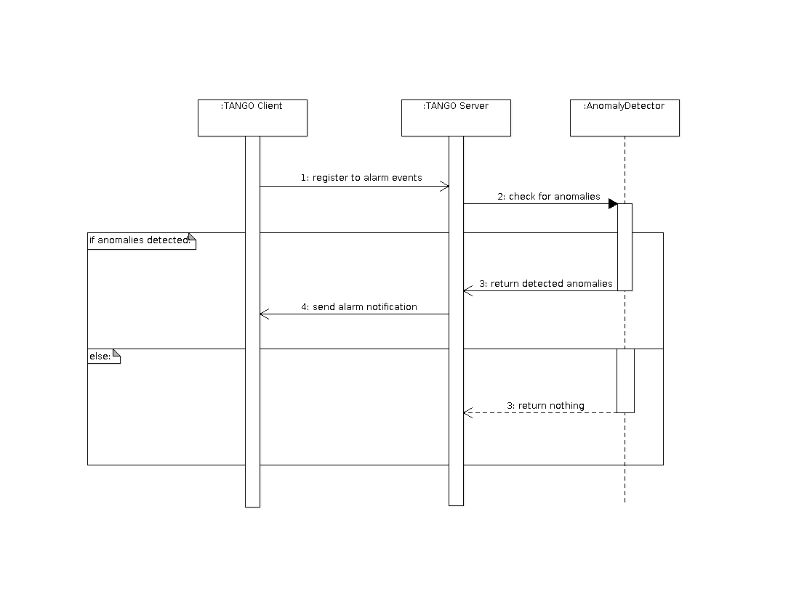

6.6. Use Case: Server aquires new data
--------------------------------------
The Server reads new data from the Framework Software Bus, ands sends it to the
Anomaly Detector for analysis.

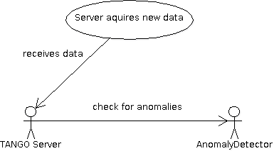

6.6.1. Actors
~~~~~~~~~~~~~
Server: the Heart Rate Monitor TANGO server.
Anomaly Detector: the module in charge of detecting anomalies.
Framework Software Bus: channel that interconnects all TANGO modules.

6.6.2. Priority
~~~~~~~~~~~~~~~
High

6.6.3. Preconditions
~~~~~~~~~~~~~~~~~~~~
The Server is running and its DevState is ON.

6.6.4. Basic Course
~~~~~~~~~~~~~~~~~~~
1. The Server request new data from the Framework Software Bus,
   passing as argument the suit's ID.
2. The Server sends the new heart rate and accelerometer data
   to the Anomaly Detector
3. The Anomaly Detector notices an anomaly and returns it to the Server.

6.6.5. Alternate Course
~~~~~~~~~~~~~~~~~~~~~~~
None

6.6.6. Exception Course
~~~~~~~~~~~~~~~~~~~~~~~
1. The Server request new data from the Framework Software Bus,
   passing as argument the suit's ID.
2. The Server sends the new heart rate and accelerometer data
   to the Anomaly Detector
3. The Anomaly Detector does not notice any anomalies.

6.6.7. Postconditions
~~~~~~~~~~~~~~~~~~~~~
None

6.6.8. Sequence diagram
~~~~~~~~~~~~~~~~~~~~~~~
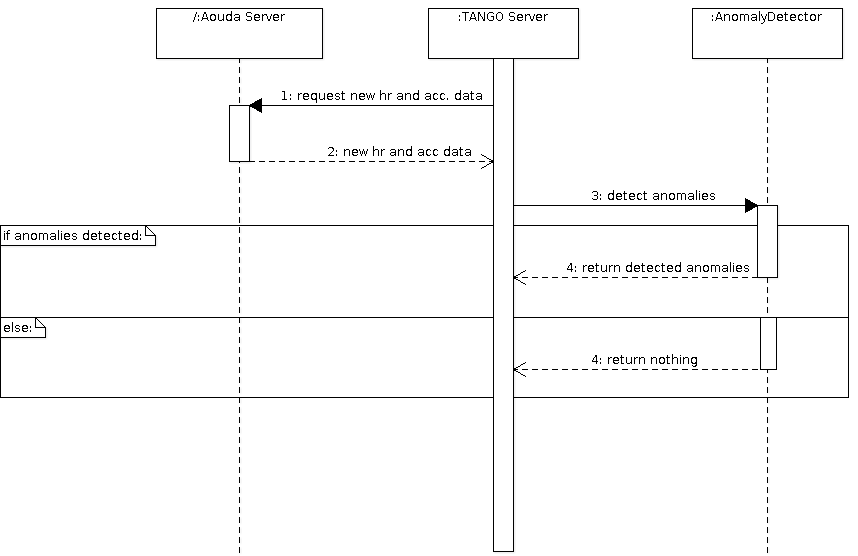

