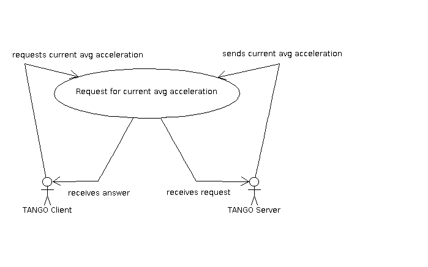
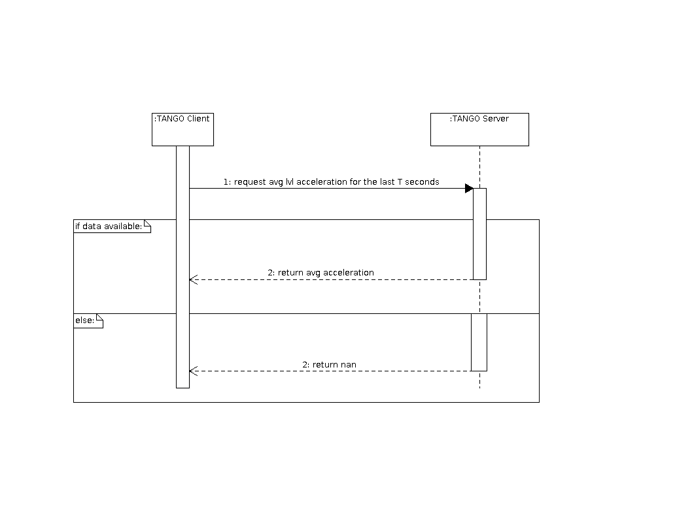
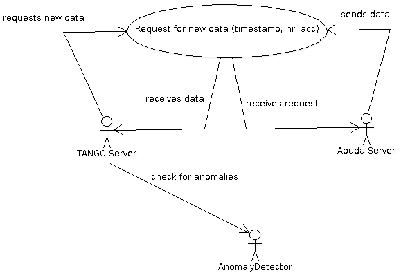
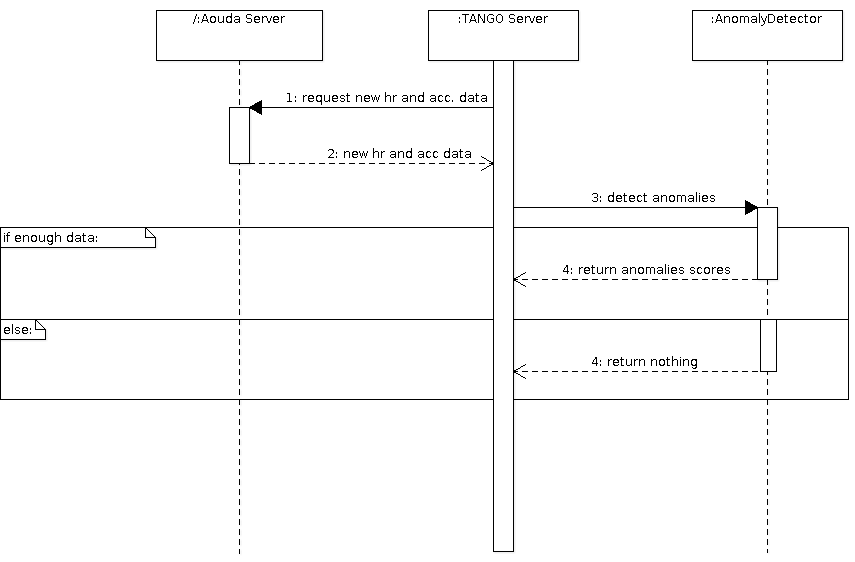

.. sectnum:: :start: 2

==============================================================
Software Requirements Specification for the Heart Rate Monitor
==============================================================

:Author: Mario Tambos

.. contents::
   :local:
   :depth: 2

Change Record
=============

2013.06.18 - Document created.

2013.06.26 - Fixed typos and formatting.

2013.06.26 - Removed unused sections.

2013.06.26 - Added Use Cases and Sequence diagrams.

2013.09.18 - Updated to reflect current requirements. Some formatting changes.

Introduction
============

Scope
-----

This document describes the top level requirements for the Heart Rate Monitor
module, which in turn is part of the Crew Mission Assistant system.

Reference Documents
-------------------

- [1] -- `C3 Prototype document v.4`_
- [2] -- `PAMAP2 Physical Activity Monitoring`_
- [3] -- `Software Engineering Practices Guidelines for the ERAS Project`_
- [4] -- `ERAS 2013 GSoC Strategic Plan`_
- [5] -- Wei, Li, et al. "Assumption-Free Anomaly Detection in Time Series." SSDBM. Vol. 5. 2005. APA

.. _`C3 Prototype document v.4`: <http://www.erasproject.org/index.php?option=com_joomdoc&view=documents&path=C3+Subsystem/ERAS-C3Prototype_v4.pdf&Itemid=148>
.. _`PAMAP2 Physical Activity Monitoring`: <http://archive.ics.uci.edu/ml/datasets/PAMAP2+Physical+Activity+Monitoring>
.. _`Software Engineering Practices Guidelines for the ERAS Project`: <https://eras.readthedocs.org/en/latest/doc/guidelines.html>
.. _`ERAS 2013 GSoC Strategic Plan`: <https://bitbucket.org/italianmarssociety/eras/wiki/Google%20Summer%20of%20Code%202013>

Glossary
--------

.. glossary::

    ``ERAS``
        European Mars Analog Station

    ``IMS``
        Italian Mars Society

    ``EVA``
        Extra-Vehicular Activity

    ``TBD``
        To Be Defined

    ``TBC``
        To Be confirmed

General Description
===================

Problem Statement
-----------------

Monitoring of the crew's health is a critical part of any mission.
Said monitoring includes, among other things, overseeing the heart rate of the
crew members, in order to take preventive actions
if it takes on abnormal values.
However, this task can prove difficult to accomplish, due to the fact that
a persons heart rate not only hasn't a constant "normal" value,
but also depends on a number of factors, for instance the level of
physical stress that the person endures at the moment.
In [1] it is stated that the current approach to solve this problem
is the use of a Feed-Forward Neural Network to predict the heart rate
from the body acceleration reported by the Aouda.X suit.
This can prove troublesome, given that regression techniques have difficulties
achieving high recall when the training set is skew, as in this case
(there are going to be far more normal than abnormal datapoints).

I believe using Anomaly Detection techniques would prove a more reliable method
of alert for this use, because these techniques are specifically designed
for the purpose, i.e. are not affected by imbalances in the cardinality
of the datapoint classes.

Functional Description
----------------------

The goal of this module is to oversee the heart rate and physical activity
of each crew member performing :term:`EVA`, in order to raise alarms
if the reported crew member's heart rate is abnormal for his or her
current physical stress level.

Constraints
-----------

As described in [1], the available heart rate and accelerometer data from the
Aouda.X suit is too unreliable to be of any use for this module prototype.
Therefore the data found in [2] will be used instead as a way to simulate
a reliable data stream from the suit.

Interface Requirements
======================

Software Interfaces
-------------------

Communication Interfaces
~~~~~~~~~~~~~~~~~~~~~~~~

This module will be implemented as a Python TANGO server, which will expose
methods to request the heart rate, level of physical activity and
heart rate alarms, if they exist. Moreover the alarms should be optionally
declared as events, to enable push request from the server to the clients.

Development and Test Factors
============================

Standards Compliance
--------------------

The guidelines defined in [3] should be followed.

Planning
--------

The schedule is as defined in [4], with deliverables as follows:

- TANGO server that implements the anomaly detector.
- Test environment to help diagnose the server's accuracy.
    - Train and test data sets.
- Documentation.
    - User requirements (this document).
    - Design Study document.
    - User Manual.

Use-Cases
=========

Request for current average Heart Rate
--------------------------------------
The Client request the Server the average Heart Rate
over the last T seconds.

.. image:: images/UCRequestforcurrentavgheartrate.png

Actors
~~~~~~
Client: a TANGO client that makes the request.
Server: the Heart Rate Monitor TANGO server.

Priority
~~~~~~~~
Normal

Preconditions
~~~~~~~~~~~~~
The Server is running and its DevState is ON.

Basic Course
~~~~~~~~~~~~
#. The Client calls the appropriate method on the Server, passing T as argument.
#. The Server calculates the average heart rate over the last T seconds.
#. The Server returns the calculated value.

Alternate Course
~~~~~~~~~~~~~~~~
None

Exception Course
~~~~~~~~~~~~~~~~
#. The Client calls the appropriate method on the Server, passing T as argument.
#. The Server tries calculates the average heart rate.
#. No data is available.
#. The Server returns an error.

Postconditions
~~~~~~~~~~~~~~
None

Sequence diagram
~~~~~~~~~~~~~~~~
.. image:: images/SeqRequestforcurrentavgheartrate.png

Request for current average acceleration
----------------------------------------
The Client request the Server the average level of physical activity
over the last T seconds.

Actors
~~~~~~
Client: a TANGO client that makes the request.
Server: the Heart Rate Monitor TANGO server.

Priority
~~~~~~~~
Normal

Preconditions
~~~~~~~~~~~~~
The Server is running and its DevState is ON.

Basic Course
~~~~~~~~~~~~
#. The Client calls the appropriate method on the Server, passing T as argument.
#. The Server calculates the average level of physical activity over the
   last T seconds, based on accelerometer data.
#. The Server returns the calculated value.

Alternate Course
~~~~~~~~~~~~~~~~
None

Exception Course
~~~~~~~~~~~~~~~~

#. The Client calls the appropriate method on the Server, passing T as argument.
#. The Server tries calculates the average level of physical activity.
#. No data is available.
#. The Server returns an error.

Postconditions
~~~~~~~~~~~~~~
None

Sequence diagram
~~~~~~~~~~~~~~~~

Request for current alarms
--------------------------
The Client request the Server the list of alarms raised over
the last T seconds.

.. image:: images/UCRequestforcurrentalarms.png

Actors
~~~~~~
Client: a TANGO client that makes the request.
Server: the Heart Rate Monitor TANGO server.

Priority
~~~~~~~~
High

Preconditions
~~~~~~~~~~~~~
The Server is running and its DevState is ON.

Basic Course
~~~~~~~~~~~~

#. The Client calls the appropriate method on the Server, passing T as argument.
#. The Server returns the list of alarms raised over the last T seconds.

Alternate Course
~~~~~~~~~~~~~~~~
None

Exception Course
~~~~~~~~~~~~~~~~
None

Postconditions
~~~~~~~~~~~~~~
None

Sequence diagram
~~~~~~~~~~~~~~~~
.. image:: images/SeqRequestforcurrentalarms.png

Server requests new data
------------------------
The Server reads new data from the Framework Software Bus, ands sends it to the
Anomaly Detector for analysis.

Actors
~~~~~~
Server: the Heart Rate Monitor TANGO server.
Anomaly Detector: the module in charge of detecting anomalies.
Aouda Server: Tango server that provides the Aouda Suit simmulated data.

Priority
~~~~~~~~
High

Preconditions
~~~~~~~~~~~~~
The Server is running and its DevState is ON.

Basic Course
~~~~~~~~~~~~
#. The Server request new data from the Aouda Server.
#. The Aouda Server returns the data available.
#. The Server sends the new heart rate and accelerometer data
   to the Anomaly Detector.
#. The Anomaly Detector has enough data to build an anomaly analysis
   and returns the anomalies scores to the Server.

Alternate Course
~~~~~~~~~~~~~~~~
None

Exception Course
~~~~~~~~~~~~~~~~
#. The Server request new data from the Aouda Server.
#. The Aouda Server returns the data available.
#. The Server sends the new heart rate and accelerometer data
   to the Anomaly Detector.
#. The Anomaly Detector has not enough data to build an anomaly analysis
   and returns nothing to the Server.

Postconditions
~~~~~~~~~~~~~~
None

Sequence diagram
~~~~~~~~~~~~~~~~

