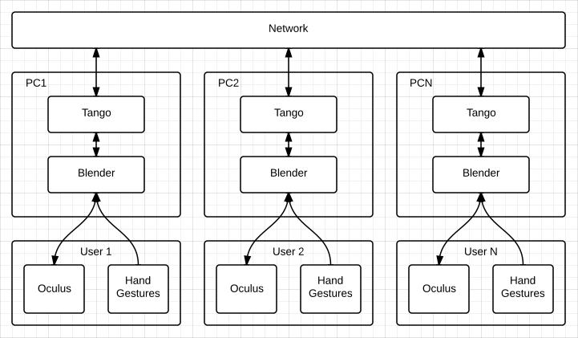

========================================================================
Software Architecture Document for the Multi-user integration for V-ERAS
========================================================================

:Author: Ezio Melotti

Change Record
=============

.. If the changelog is saved on an external file (e.g. in servers/sname/NEWS),
   it can be included here by using (dedent to make it work):

   .. literalinclude:: ../../servers/servername/NEWS

Introduction
============

Purpose
-------

The main goal of this project is to add support and integrate the Oculus
Rift VR headset with the Tango framework and with the Blender simulation.
Once a single user is able to participate in the simulation using the Oculus,
support for multiple users will be investigated and eventually added.

Scope
-----

This document will provide an high-level overview of how the multi-user
integration for V-ERAS will work.

Reference Documents
-------------------

N/A

Glossary
--------

.. To create a glossary use the following code (dedent it to make it work):

  .. glossary::

     ``Term``
        This is a sample term

.. Use the main :ref:`glossary` for general terms, and :term:`Term` to link
   to the glossary entries.

Overview
--------

Make an overview in which you describe the rest of this document the and which chapter is primarily of interest for which reader.

Architectural Requirements
==========================

This section describes the requirements which are important for developing the software architecture.

Non-functional requirements
---------------------------

Since Blender uses Python 3, the ``python3-pytango`` package is required.

Use Case View (functional requirements)
---------------------------------------

See Appendix A.

Interface Requirements
======================

This section describes how the software interfaces with other software products
or users for input or output. Examples of such interfaces include library
routines, token streams, shared memory, data streams, and so forth.

User Interfaces
---------------

Describes how this product interfaces with the user.

GUI (Graphical User Interface)
~~~~~~~~~~~~~~~~~~~~~~~~~~~~~~

N/A.

CLI (Command Line Interface)
~~~~~~~~~~~~~~~~~~~~~~~~~~~~

N/A.

API (Application Programming Interface)
~~~~~~~~~~~~~~~~~~~~~~~~~~~~~~~~~~~~~~~

See the API document (not available yet).

Hardware Interfaces
-------------------

Blender will communicate with the Oculus using a yet-to-be-defined module.

Software Interfaces
-------------------

Blender will communicate with Tango using PyTango.

Communication Interfaces
------------------------

The Tango software bus will be used by different machines to communicate.

Performance Requirements
========================

Specifies speed and memory requirements.

Logical View
============

Describe the architecturally significant logical structure of the system. Think of decomposition in terms of layers and subsystems. Also describe the way in which, in view of the decomposition, Use Cases are technically translated into Use Case Realizations

Layers
------

Blender will operate in the application layer and communicate with Tango on the DCS
layer.

.. image:: layered.jpg

Subsystems
----------

The 3 macro-subsystems are the user, the machine, and the network.

* The user will use the Oculus and have his movements tracked.

* On the machine Blender will read data from the Oculus (head position) and
  from the body movements and build a coherent simulation that will be visible
  with the Oculus.
  It will also share the state of the simulation with the other machines on
  the Tango bus to ensure that all the users will be viewing the same thing.

* The network and the Tango bus will be used to exchange information between
  the machines.

Use Case Realizations
---------------------
Give examples of the way in which the Use Case Specifications are technically translated into Use Case Realizations, for example, by providing a sequence-diagram.

Implementation View
===================
This section describes the technical implementation of the logical view.

Deployment View
===============
Describe the physical network and hardware configurations on which the software will be deployed. This includes at least the various physical nodes (computers, CPUs), the interaction between (sub)systems and the connections between these nodes (bus, LAN, point-to-point, messaging, etc.). Use a deployment diagram.

Development and Test Factors
============================

Hardware Limitations
--------------------

Latency might be an issue, since all the simulations on the different machines
need to be syncronized.

Software validation and verification
------------------------------------

Unittests will be used to test the software.

Planning
--------

Describe the planning of the whole process mentioning major milestones and
deliverables at these milestones.

Notes
=====

.. notes can be handled automatically by Sphinx

Appendix A: Use Case template
=============================

Use Cases drive the whole software process and bind together all the phases
from requirements capture to final delivery of the system and maintenance.
They are a very effective way of communicating with customers and among team
members. Before every discussion always provide the partners with a set of
relevant Use Cases.

During meetings, they stimulate focused discussions and help identifying
important details. It is important to keep in mind that Use Cases have to
describe WHAT the system has to do in response to certain external stimuli
and NOT HOW it will do it. The HOW is part of the architecture and of the
design.

What follows is the empty template:

Use Case: <Name>
================
<Short description>

Actors
------
<List of Actors>

Priority
--------
<Low, Normal, Critical>

Preconditions
-------------
<List of preconditions that must be fulfilled>

Basic Course
------------
<Step-by-step description of the basic course>

Alternate Course
----------------
<Step-by-step description of the alternate course>

Exception Course
----------------
<Step-by-step description of the exception course>

Postconditions
--------------
<List of postconditions (if apply)>

Notes
-----

