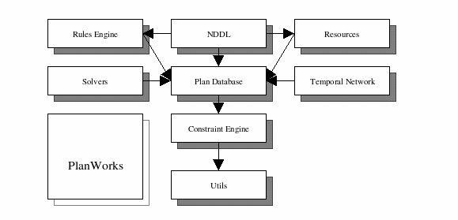

=========================================================
Utilisation of the EUROPA Scheduler/Planner.
=========================================================

:Author: Shridhar Mishra

Change Record
=============

.. If the changelog is saved on an external file (e.g. in servers/sname/
   NEWS),
   it can be included here by using (dedent to make it work):

- Created on 27 May 2015.
- Added layers involved in europa on 29 June 2015

Introduction
============

Purpose
-------
The main aim of this project will be making a  Astronaut’s Digital
Assistant which will take into account all the constraints and rules
that has been defined and plot a plan of action. It will also
schedule all the tasks for the astronaut such that job of the
astronaut becomes easy.

Scope
-----

TBA

Applicable Documents
--------------------

- [1] -- `C3 Prototype document v.4`_
- [2] -- `EUROPA`_
- [3] -- `Software Engineering Practices Guidelines for the ERAS Project`_
- [4] -- `TANGO distributed control system`_
- [5] -- `Py4J`_

.. _`C3 Prototype document v.4`: <http://www.erasproject.org/
                                  index.php?option=com_joomdoc&view=
                                  documents&path=C3+Subsystem/ERAS-
                                  C3Prototype_v4.pdf&Itemid=148>
.. _`EUROPA`: <code.google.com/p/europa-pso/>
.. _`Software Engineering Practices Guidelines for the ERAS Project`:
     <https://eras.readthedocs.org/en/latest/doc/guidelines.html>
.. _`TANGO distributed control system`: <http://www.tango-controls.org/>
.. _`Py4J`: <http://py4j.sourceforge.net/>

Reference Documents
-------------------

Glossary
--------

.. To create a glossary use the following code (dedent it to make
   it work):

  .. glossary::

``C3``
    Command, Control, Communication

``ERAS``
    European MaRs Analogue Station for Advanced Technologies Integration

``IMS``
    Italian Mars Society

``V-ERAS``
    Virtual European Mars Analog Station

``VR``
    Virtual Reality

.. Use the main :ref:`glossary` for general terms, and :term:`Term` to
   link
   to the glossary entries.

Overview
--------

.. Make an overview in which you describe the rest of this document the
   and which chapter is primarily of interest for which reader.

Architectural Requirements
==========================

Linux box connected to Tango bus, which in turn would be connected to
all the sensors and other devices.

.. This section describes the requirements which are important for
   developing the software architecture.

Non-functional requirements
---------------------------

- High speed secure network.

Use Case View (functional requirements)
---------------------------------------

It will be used for scheduling and planning of TREVOR using Pyeuropa.

Hardware Interfaces
-------------------

- Linux box with ubuntu 14.10.
- Temperature sensors  for astronauts.
- Other relevant sensors monitor health stats of astronaut.

Software Interfaces
-------------------
- Europa
- PyEuropa.
- Pytango.

Communication Interfaces
------------------------

All the necessary data for the planning and estimation will be collected
from a tango bus.
All the devices shall be connected to a single tango bus, hence data can
be collected and used effectively.

Performance Requirements
========================

The band width should be high enough to support real time data
accusation for processing of the data and coming up with a plan.

Layers
------
- The Utils module provides common C++ utility classes for error
checking, smart pointers etc. It also includes a very useful
debugging  utility.Many common programming practices in EUROPA
development are built on assets in this module.
- The Constraint Engine is the nexus for consistency management. It
provides a general-purpose component-based architecture for handling
dynamic constraint networks. It deals in variables and constraints.
It includes an open propagation architecture making it straightforward
to integrate specialized forms of local and global constraint
propagation.
- The Plan Database adds higher levels of abstractions for tokens and
objects and the interactions between them. This is the code embodiment
of the EUROPA planning paradigm. It supports all services for creation,
 deletion, modification and inspection of partial plans. It maintains
 the dynamic constraint network underlying a partial–plan by delegation
 to the Constraint Engine and leverages that propagation infrastructure
 to maintain relationships between tokens and objects.
- The Solvers module provides abstractions to support search in line
with the EUROPA planning approach. It includes a component-based
architecture for Flaw Identification, Resolution and heuristics as well
as an algorithm for chronological backtracking search. As additional
search algorithms are implemented they will be added to this module.
- The Rules Engine module provides the inference capabilities based on
domain rules described in the model. It is almost exclusively used to
execute NDDL rules but can be extended for custom rule formats.
- The Resources module provides specialized algorithms and data
structures to support metric resources (e.g. battery, power bus,
disk drive).
- The Temporal Network module provides specialized algorithms and data
structures to support efficient propagation of temporal constraints.
- The NDDL module provides a parser and compiler for NDDL (pronounced
noodle) which is a very high-level, object-oriented, declarative domain
and problem description language. This module defines the mapping from
the language to the code and consequently interfaces to a number of key
modules in the system.
- PlanWorks is a java application for visualization and debugging of
plans and planning. It is loosely coupled to the other EUROPA modules
through a JNI interface.

Subsystems
----------
- Linux box running core Europa.
- Sensors collecting real time data.
- Tango bus up and running.

Planning
--------

- Setup working copy of Europa on all the systems.

TBA

Notes
=====

.. notes can be handled automatically by Sphinx

