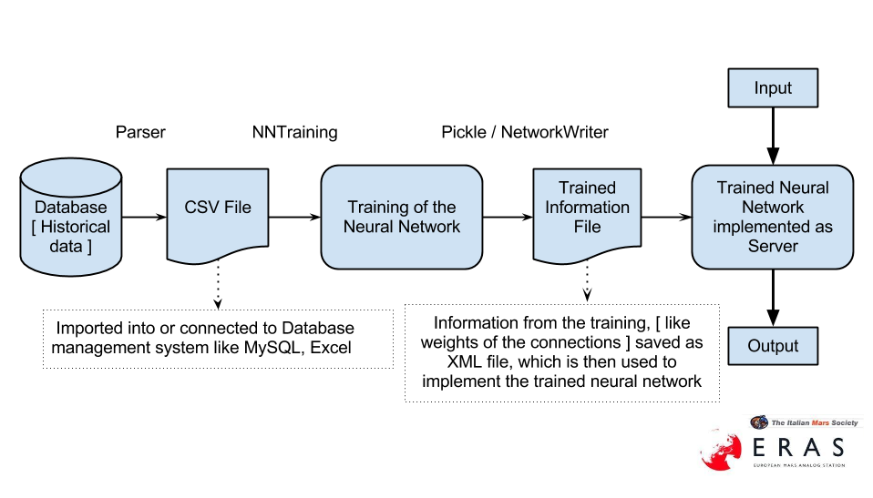

=====================================================
Software Design Study for the Solar Storm Forecasting
=====================================================

:Author: Simar Preet Singh

Change Record
=============

2013.07.23 - Document created.

Introduction
============

Purpose
-------

This document describes the software design study of the solar storm
forecasting server module.

Scope
-----

The scope of the Solar storm forecast server is to be able to issue
warning in case of an expected solar storm, to prevent disruption of
satellite communication and damage to space craft electronics.

Reference Documents
-------------------

- [1] -- `PyBrain Library. <https://github.com/pybrain/pybrain>`_
- [2] -- `GOES Data warehouse. <http://www.swpc.noaa.gov/ftpmenu/warehouse.html>`_
- [3] -- `Space Weather Prediction Center. <http://www.swpc.noaa.gov/index.html>`_
- [4] -- `Software Engineering Practices Guidelines. <https://eras.readthedocs.org/en/latest/doc/guidelines.html>`_
- [5] -- `PyTANGO - Python bindings for TANGO. <http://www.tango-controls.org/static/PyTango/latest/doc/html/index.html>`_

Glossary
--------

.. glossary::

    ``ERAS``
        European Mars Analog Station

    ``IMS``
        Italian Mars Society

    ``GOES``
        Geostationary Operational Environmental Satellite

    ``NGDC``
		National Geophysical Data Center

    ``SDO``
        Solar Dynamics Observatory

    ``SWPC``
		Space Weather Prediction Center

Overview
--------

The module attempts to forecast a solar storm event using Neural Network
implementation. A neural network architecture is trained offline on the
prepared dataset. This trained neural network can then be implemented
as a Tango server to issue warnings in case of relevant events.

Design Considerations
=====================

Assumptions and dependencies
----------------------------

Some of the dependencies for the module are PyBrain in [1] and PyTango
in [5]. The PyTango library is used for the Python bindings of the Tango
distributed control system. The PyBrain library is being used for the
construction of different possible neural network architectures. Please
note that the documentation of the PyBrain library has not been updated
for a long time. So there seem to be some differences in the documentation
and the actual code. Thus, it is highly recommended that the PyBrain code
be studied instead of just relying only on the documentation.

General Constraints
-------------------

A general constraint for the module is continued availability of the
satellite data. For instance the NASA's Solar Dynamics Observatory is
planned as 5 - 10 years mission of observing the sun. As the module
relies on the data from the satellites. So, the availability of such
satellite data feed acts as a constraint for the module.

Software Architecture
=====================

This section should provide a high-level overview of how the functionality
and responsibilities of the system were partitioned and then assigned to
subsystems or components. Don't go into too much detail about the individual
components themselves (there is a subsequent section for detailed component
descriptions). The main purpose here is to gain a general understanding of
how and why the system was decomposed, and how the individual parts work
together to provide the desired functionality.

At the top-most level, describe the major responsibilities that the software
must undertake and the various roles that the system (or portions of the
system) must play. Describe how the system was broken down into its
components/subsystems (identifying each top-level component/subsystem
and the roles/responsibilities assigned to it). Describe how the higher-level
components collaborate with each other in order to achieve the required
results. Don't forget to provide some sort of rationale for choosing this
particular decomposition of the system (perhaps discussing other proposed
decompositions and why they were rejected).

A brief software architecture diagram is presented here :

Software Design
===============

Unit 1 : Local Database Creation
--------------------------------

Definition
----------

This unit is a data retriever module that is used for the creation of
local database.

Responsibilities
----------------

The responsibility of this module is to retrieve files and data from
possibly different sources to create a common local database. The reason
for creating a local offline database is that, such local database can be
better managed and processed without any possible interruptions.

Constraints
-----------

The module is constrained on the correctness of the data retrieved.

Composition
-----------

The unit is composed of a Data retriever module that can be used to
retrieve data files from possibly different sources, and add those files
to the local database.

Uses/Interactions
-----------------

This is meant to be an automated module which needs to be provided the
local directory address. Additional methods can be implemented for
downloading the data files from different sources.

Unit 2 : Parser Unit
--------------------

Definition
----------

This a data parser unit for parsing the various data files and creating
a common database [ CSV file ].

Responsibilities
----------------

The responsibility of this module is to parse the formatting of the various
data files in the local database. It is responsible for creating a common
database in the form of a single CSV file. The advantage of having a single
CSV file is that it can be easily connected or imported to different
database management systems like MySQL, Excel.

Constraints
-----------

The correctness of the data files and their formatting is major constraint.
As an instance `such data file from the GOES warehouse
<http://www.swpc.noaa.gov/ftpdir/warehouse/2008/2008_DSD.txt>`_
seems to be highly inconsistent. Almost all of the entries in such file
have 0 as flare values. Such inconsistencies can harm the training of
the neural network.

Composition
-----------

The unit is composed of a Parser module that writes the CSV file based
on the formatting of the raw input data files.

Uses/Interactions
-----------------

This is meant to be a module which writes a CSV file based from the input
data files. It needs to be provided with the source directory address of
the local database. Additional methods can be implemented depending on
the formatting of the raw files.

Unit 3 : Neural Network training unit
-------------------------------------

Definition
----------

This is the unit that trains the Neural Network.

Responsibilities
----------------

The primary responsibility of this unit is to train the neural network
based on the CSV file generated from the Parser unit. The unit aims to
train the neural network on the target values, for the different input
features.

Constraints
-----------

The training of the neural network is constrained on the quality of the
the input dataset. AI techniques perform only as good as the quality of
the training dataset.

Composition
-----------

The unit is composed of the Neural Network architecture. Various network
architectures including Multiple output, or different Single output
networks can be attempted.

Uses/Interactions
-----------------
Various training techniques like backpropagation with different learning
rates, momentum can be used to achieve optimal results for the training.
Other classification techniques can also be used.

Unit 4 : Trained information file
---------------------------------

Definition
----------

This file contains the information retrieved [ i.e. results ] from the
training of the neural network.

Responsibilities
----------------

This file is responsible for providing the weights and other neural
features for the final trained network implementation.

Constraints
-----------

This is a static file which contains only the neural network information
from the training performed locally.

Composition
-----------

Two different methods can be used to create this file and the resulting
formats will depend on the choice. The use of NetworkWriter produces
an XML file. Also, the native Python Pickle can be used.

Uses/Interactions
-----------------

This file contains the results from the neural network training unit.
These results can then be used to implement the final trained neural
network. So, this will avoid the need to retrain the neural network
every time, as the training results are made available in this file.

Unit 4 : Trained neural network implementation
----------------------------------------------

Definition
----------

This is the final trained neural network implemented as a Tango server.

Responsibilities
----------------

This unit is responsible for the forecast and the issuing of relevant
warning in case of an identified storm.

Constraints
-----------

This unit is constrained on the availability of the data feed for the
input of the network.

Composition
-----------

This is composed of the trained neural network architecture. It also
contains the relevant implementations for the Tango integration.

Uses/Interactions
-----------------

This unit will interact with the Tango control system and provide the
relevant warning system.
