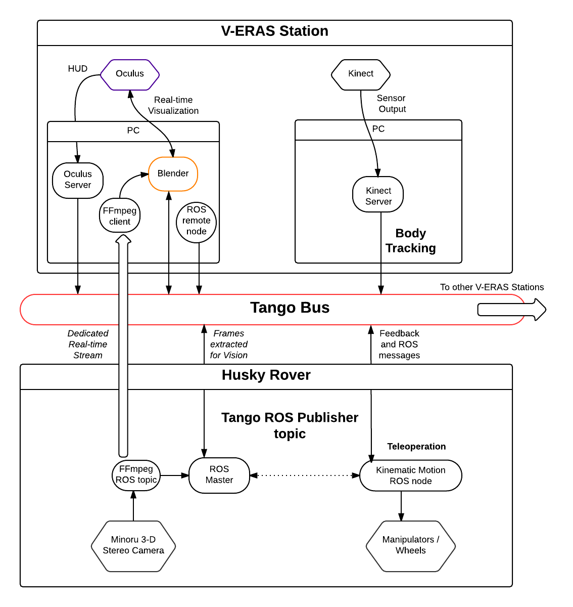
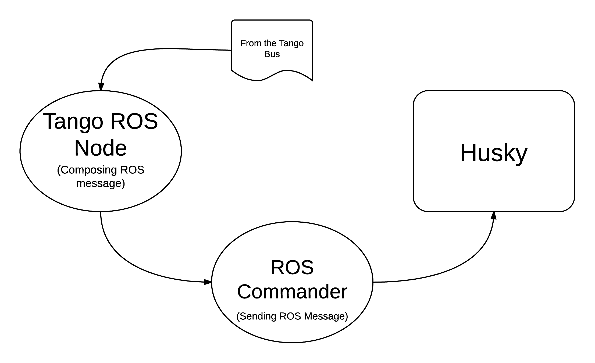
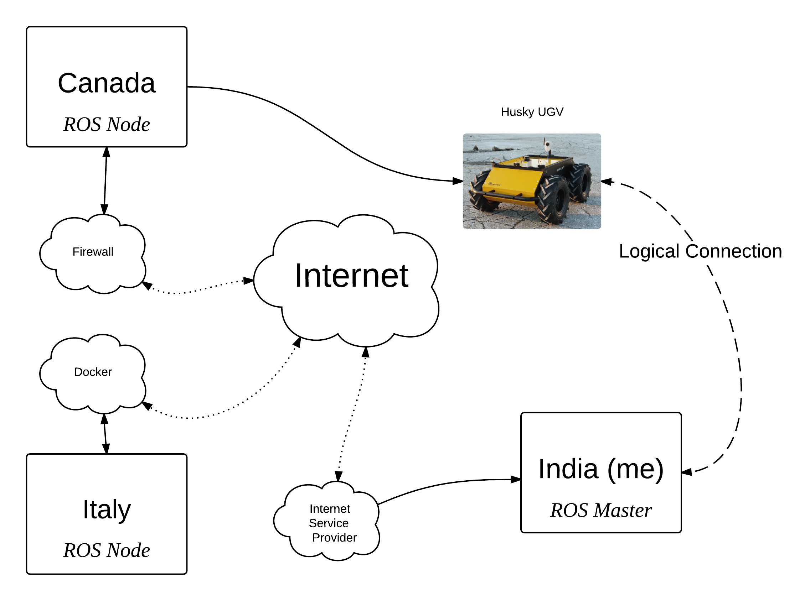
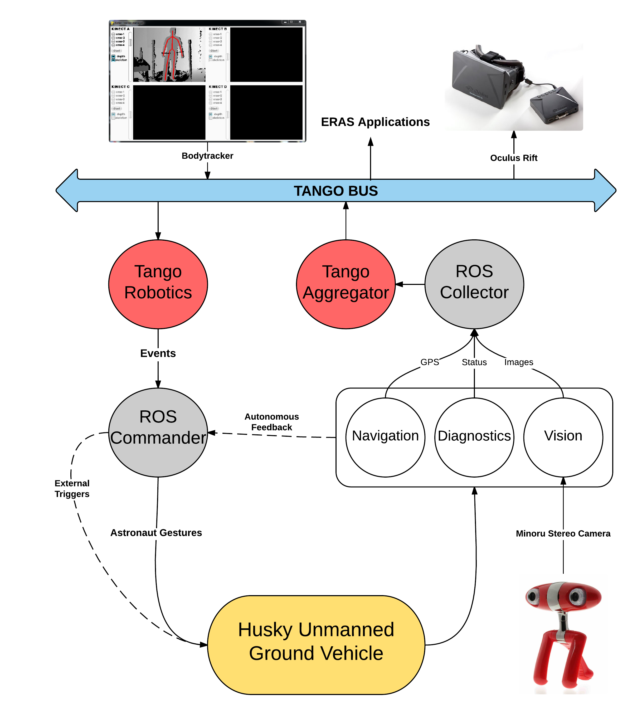
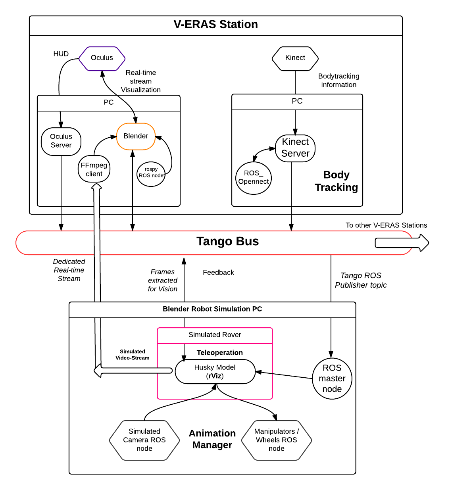

==========================================================
Software Architecture Document for Telerobotics
==========================================================

:Author: Siddhant Shrivastava

.. contents::
   :local:
   :depth: 2

Change Record
=============

.. If the changelog is saved on an external file (e.g. in servers/sname/NEWS),
   it can be included here by using (dedent to make it work):

25\ :sup:`th`\  May, 2015 - Document created.

26\ :sup:`th`\  May, 2015 - First Draft open for review.

14\ :sup:`th`\  June, 2015 - Added overall architecture diagrams and fixed links in the `Documents`_  section

18\ :sup:`th`\  June, 2015 - Added ROS-Tango Distributed System interaction diagram to the SAD.

21\ :sup:`st`\  July, 2015  - Updated with high-level diagrams, Limitations, and Interface descriptions.

	.. literalinclude:: ../../servers/servername/NEWS

Introduction
============

Purpose
-------

The current system describes the architecture for teleoperative control of a Mars Robot rover's motion via human body-tracking.
The robot dealt with in the current phase of the document is *Husky*, which is a rugged UGV (unmanned ground).

The purpose of this package is to provide a high-level Telerobotics interface for -

- Mapping Human body-tracking information to rover motion instructions
- Allowing real-time streaming of the rover's stereo camera-feed to the ERAS application
- Augmented reality interface obtained from the processing the rover sensor data

The following diagram describes the logical architecture of the Telerobotics system -

Scope
-----

It is aimed that this requirement specification presents a **correct, understandable, efficient, and maintanable** Telerobotics interface for ERAS. The **scope** of this *requirements specification* spans all the robots that may be used in the future for **Telerobotics applications** *i.e.* **"all applications involving remote control, command and communication** (*C3*) **with a robot and a human"**

.. _`Documents`:

Applicable Documents
--------------------

- [1] -- `C3 Prototype document`_
- [2] -- `Software Engineering Practices Guidelines for the ERAS Project`_
- [3] -- `Networking Subsystem of V-ERAS`_

Reference Documents
-------------------

- [1] -- `ERAS 2015 GSoC Telerobotics Proposal`__
- [2] -- `TANGO distributed control system`_
- [3] -- `PyTANGO - Python bindings for TANGO`_
- [4] -- `Tango Setup`_
- [5] -- `Adding a new Server in Tango`_
- [6] -- `Robot Operating System`_
- [7] -- `Husky Unmanned Ground Vehicle`_

..  _`C3 Prototype document`: http://erasproject.org/download/eras-command-control-and-communication-c3-prototype/
..  _`Software Engineering Practices Guidelines for the ERAS Project`:
   https://eras.readthedocs.org/en/latest/doc/guidelines.html
.. _`ERAS 2015 GSoC Telerobotics Proposal`:
   http://erasproject.org/2015-gsoc/#2
.. _`TANGO distributed control system`: http://www.tango-controls.org/
.. _`PyTANGO - Python bindings for TANGO`:
   http://www.tango-controls.org/static/PyTango/latest/doc/html/index.html
.. _`Tango Setup`: https://eras.readthedocs.org/en/latest/doc/setup.html
.. _`Adding a new Server in Tango`:
   https://eras.readthedocs.org/en/latest/doc/setup.html#adding-a-new-server-in-tango
.. _`Robot Operating System`:
	http://www.ros.org/
.. _`Networking Subsystem of V-ERAS`:
  http://erasproject.org/download/the-networking-sub-system-of-t-he-virtual-european-mar-s-analog-station-e-melotti-bachelors-thesis/
.. _`Husky Unmanned Ground Vehicle`:
  http://wiki.ros.org/Robots/Husky

Glossary
--------

.. To create a glossary use the following code (dedent it to make it work):

.. glossary::

``AR``
	Augmented Reality

``C3``
	Command, Control, Communication

``ERAS``
	European MaRs Analogue Station for Advanced Technologies Integration

``HUD``
	**Heads-Up Display** – A display within the viewer’s line of sight which indicates information. The Head-Mounted VR device acts as the HUD medium for this project

``Husky``
	Husky is a rugged, outdoor-ready **unmanned ground vehicle** (UGV), suitable for research and rapid prototyping applications. Husky fully supports ROS

``IMS``
	Italian Mars Society

``Kinect``
	Motion sensing input devices for movement, voice, and gesture recognition

``ROS``
	**Robot Operating System** - A collection of tools, libraries, and conventions that aim to simplify the task of creating complex and robust robot behavior across a wide variety of robotic platforms.

``RTSP``
	**Real-time Streaming Protocol**

``TBD``
	To be defined

``TBC``
	To be confirmed

``Telerobotics``
	Control of semi-autonomous robots from a distance

``UGV``
	Unmanned Ground Vehicle

``V-ERAS``
	Virtual European Mars Analog Station

``VR``
	Virtual Reality

.. Use the main :ref:`glossary` for general terms, and :term:`Term` to link
   to the glossary entries.

Overview
--------

`Functional Requirements`_ are of interest to **software testers**, **astronauts** and **users** planning to *interact with a robot* using this Telerobotics application of ERAS and add value to the **Telerobotics application** by giving feedback for individual features.

`Non-functional Requirements`_ are of interest to **Robotics researchers** and **Network Communication engineers** to improve the performance capabilities of the Telerobotics application.

`User Interfaces`_ are of interest to **UI/UX designers and users** of the **Telerobotics application**

Make an overview in which you describe the rest of this document the and which chapter is primarily of interest for which reader.

Architectural Requirements
==========================

This section describes the requirements which are important for developing the software architecture.

.. _`Functional Requirements`:

Functional requirements (Use Case View)
---------------------------------------

The **Telerobotics application** has the following requirements and use-cases -

- **Low-latency** transfer of information from the **Body-Tracking application** to the **Telerobotics application**
- **Fast and collision-free mapping** of bodytracking information to **rover's motion commands**
- **Account for variability and unreliability** in astronaut's body movements.
- **Outlier** body movements in a real-time stream of movements must be neglected.
- **Feedback** from the robot rover
- **Real-time** Streaming of rover information
- **Support for distributed and parallel architectures**
- **Semi-autonomous Teleoperation** - The rover navigates with a certain degree of automation which overrides manual commands in certain inconvenient circumstances.

.. _`Non-functional Requirements`:

Non-functional requirements
---------------------------

The following are the non-functional requirements -

- **Wireless Communication via WiFi**
- **Real-time Video Streaming protocols**
- **Robotics Operating System**
- **Tango distributed controls system**
- Blender Game Engine
- Clearpath Husky UGV
- Microsoft Kinect

These non-functional requirements are already in place.

The underlying architecture is realized using these requirements:

Interface Requirements
======================

.. _`User Interfaces`:

User Interfaces
---------------

GUI (Graphical User Interface)
~~~~~~~~~~~~~~~~~~~~~~~~~~~~~~

The real-time video streams are displayed in the Blender Game Engine application. The GUI therefore is inherited from the V-ERAS Application. There is no separate GUI for telerobotic control. The interface with the Oculus Rift device is minimal and displayed on the twin Oculus screens. This augmented reality interface is essential for blending in the rover's world with the astronaut's world.

CLI (Command Line Interface)
~~~~~~~~~~~~~~~~~~~~~~~~~~~~

- Telerobotics entails deployment of multiple servers from the command-line. The CLI for interactively creating and deleting servers looks like

    ``Register format: python setup-device.py <add,setup,register>``

    ``Unregister format: python setup-device.py <del,delete,unregister>``

- The command line interface is for accessing the ROS routines and override default application behaviour when needed.
- Command line interfaces are used to access the values of the individual Tango attributes of the Telerobotics server.

    ``clk = DeviceProxy("C3/Robot/Diagnostics")``

    ``clk.read_attribute("battery").value``

API (Application Programming Interface)
~~~~~~~~~~~~~~~~~~~~~~~~~~~~~~~~~~~~~~~

The Telerobotics API includes public functions for **selecting a robot** (generic API), Mapping bodytracking information to robot commands.

The **RobotSelect** function takes the **robot name** as an *argument* and returns the **robot identifier** corresponding to that robot.

The **Mapping** API maps the bodytracking information to a corresponding robot motion command.

The **RealTimeStereo** API enables real-time video streaming between an FFMPEG client and server.

The **AugmentedReality** API allows a user to display information on the ERAS Application and consequently on the Oculus device.

The specifics of the individual APIs are TBD.

Hardware Interfaces
-------------------

The Telerobotics hardware interfaces include -

- Husky robot
- Microsoft Kinect
- Minoru-3D Webcam
- Ubuntu Linux machine
- Microsoft Windows machine
- Graphical Processing Units

The robot can be extended to have a mobile manipulator arm for interacting with the environment.

Software Interfaces
-------------------

The Software Interface comprises of -

- Dictionary structures for mapping bodytracking information to robot motion
- Buffer structures for video streaming
- **FFmpeg** for high performance streaming and transcoding of data
- Basic Video Processing algorithms for the 3D stream
- Control structures for managing Tango and ROS messages
- Navigation structures for semi-autonomy for the rover
- Basic ROS structures (nodes, topics) for robot description and localization

Communication Interfaces
------------------------

Communication forms a major part of this **command-control-and-communication** application.

- The **Telerobotics** application communicates with the body-tracking application over a shared Tango data bus.
- The communication with the robot is **wireless communication** from the ERAS station.
- Real-time stereo video stream is wireless communication over a **dedicated physical channel**
- The communication with the Oculus VR device is *wired communication* from the ERAS station.
- The software structures communicate via the Tango bus.
- Flow control among different software interfaces is realized by *buffer control structures*
- Being a collaborative effort from all over the world, it is necessary to create a **Virtual Private Network (VPN)**. The requirement can be summarized in the following diagram -

Performance Requirements
========================

**Telerobotics** is a high-performance requirement application.

Real-time requirements need **at least soft-realtime guarantees* with **jitter** of the order of 100 microseconds. The 3D video streaming and AR applications are expected to be **hard-realtime** applications.

Logical View
============

Diagram
------
The entire ERAS project currently under development can be summarized logically in the following diagram  -

Layers
------
The ERAS software applications belong to the heterogeneous Distributed Control System (DCS) domain  which can be represented as a layered architecture. This is a common design pattern used when developing systems that consist of many components across multiple levels of abstraction as in ERAS case. Normally, you should be developing components that belong to the Application layer

A simulated robot model is used in the initial parts of the project to ensure correctness and provide transparency in results.

With a simulated rover, the architecture takes the form -

Development and Test Factors
============================

Hardware Limitations
--------------------

- The hardware of desktop machines are unsuitable for Stereoscopic Streaming applications.
- The Kernel is not configured to use multiple webcams. This results in memory-related errors.
- Currently, the Minoru 3D stereo camera is able to provide the feed at 24 frames per second at a scale of 320x240

Software validation and verification
------------------------------------

- The *unittest* library for **Python** will be used for all software testing.
- Unit testing for each individual module ensures correctness at the base level.
- Python's inbuilt *Profiler* will be used for estimating the areas which need optimization.
- Thorough Integration testing is planned since *Telerobotics* is a multi-component application.
- ffprobe is used to analyze the encoding and streaming performance of the Stereoscopic camera feed.
- roswtf is used to verify proper ROS behaviour

Planning
--------

 **12-week timeline (May 25 - Aug 24)**

**Week 1-2 (May 25 - June 8)**

**Teleoperative control of simulated Husky rover model**

- Week 1 (25 May - 1 June)
	Create basic interface for mapping Kinect bodytracking information to teleoperation commands
- Week 2 (1 June - 8 June)
	Write a Tango device server to act as a Publisher/Subscriber ROS node in order to communicate to the Husky rover model.
	Unit Tests. First bi-weekly report.

**Week 3-4 (8 June - 22 June)**

**Drive a real Husky model with the Telerobotics module**

- Week 3 (8 June - 15 June)
	Employ the parallelly developed generic gesture control interface in another project for the telerobotics module
- Week 4 (15 June - 22 June)
	Extend the Teleoperative control to a real Husky mobile robot. Second bi-weekly report

**Week 5 (22 June - 29 June)**

**Real-time Streaming from stereo camera to the V-ERAS application and Oculus**

- Field Tests for the developed modules
- Integrate 3-D camera stream from the Minoru 3-D webcam with Blender and the Oculus VR Device
- Configure high-performance ffmpeg servers to communicate video streams for different Quality of Service (QoS) requirements

**Week 6 (29 June - 6 July)**

- Buffer Week
- Visualize the stereo camera streams in the V-ERAS application.
- Field tests continued for the developed modules
- Unit Tests for body-tracking Husky rover
- Performance evaluation of Minoru 3-D camera, ROS, BGE, and Oculus working together in V-ERAS
- Commit changes to V-ERAS
- Third bi-weekly report + Midsem Evaluations

**Week 7 (6 July - 13 July)**

- Oculus Integration with the stereo camera stream
- Extend the existing Oculus-Blender interface to display and update the incoming stereo video stream

**Week 8-10 (13 July - 3 August)**

**Augmented Reality experience through a Heads-Up Display(HUD) for Oculus Rift using the Blender Game Engine**

- Week 8 (13 July - 20 July)
	Use the positional-tracking feature of Oculus VR DK2 to set rover camera angle. Complete any remaining part of teleoperative control of Husky Fourth bi-weekly report.
- Week 9 (20 July - 27 July)
	Integrate Augmented Reality with the work done in week 1-6. Commit changes to V-ERAS /HUD
- Week 10 (27 July - 3 August)
	Develop a generic HUD API for any future application to use. Fifth Bi-weekly report.

**Week 11-12 (3 August - 17 August)**

**Code cleaning, Testing, Documentation, Analysis, Commit, Polish existing functionalities**

- Week 11 (3 August - 10 August): Network Performance Analysis, PEP8 compliance
- Week 12 (10 August - 17 August): Integration Tests, Documentation. Final commits and merging. Final report
